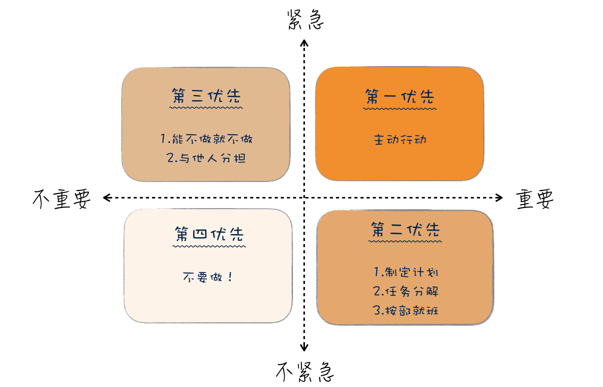

# 18 | 需求管理：太多人给你安排任务，怎么办？

## 笔记

### 最无脑的需求管理法: 老板说的

**就凭一句"老板说的", 我们就可以判断出, 产品经理缺乏对需求应用的理解**

### 需求的优先级

艾森豪威尔矩阵

* 重要且紧急的事情要立即做.
* 重要但不紧急的事情应该是我们重点投入精力的地方.
* 紧急但不重要的事情, 可以委托别人做.
* 不重要不紧急的事情, 尽量少做.

**如果不把经理放在重要的事情上, 到最后可能都变成紧急的事情**

### 站在老板面前

**当员工想不明白的事，换成老板的视角就全明白了**

### 总结

要有效地管理需求, 尤其是确定事情的重要程度, 一种方式是找回丢失的上下文. 如果我们自己无法判断上下文, 一种好的办法是, 引入外部更大的上下文.

**尽量做重要的事情**

## 扩展