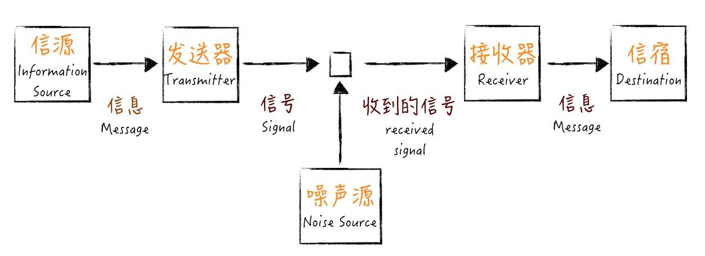

# 20 | 为什么世界和你的理解不一样

## 笔记

**我们努力地学习各种知识, 韦德就是更好地理解这个世界的运作方式, 而沟通反馈, 就是我们与真实世界互动的最好方式**

### 一个信息论视角的解释

* 信源(Information Source), 负责产生信息(Message)
* 发送器(Transmitter), 会对信息进行某些操作, 也就是对信息编码, 产生信号(Signal)
* 信道(Channel), 信号传送的媒介
* 接收器(Receiver), 对信号执行发送器的逆操作, 解码信号, 提取出信息
* 信宿(Destination), 负责接收信息
* 噪声(Noise), 削弱信号的东西

**每个人经历见识的差异, 造成了各自编解码器的差异**

通过定制"完成的定义"就可以帮助改善这个过程. **沟通双方都有了一个编解码手册**

**沟通反馈就是改善编码, 解码以及算法的方式**

提升解码(理解)效果:

* 打开自己的接收器, 把信号接纳进来, 让反馈进来
* 扩展见识, 提升自己解码器的效果, 更好地理解别人要表达的内容到底是什么

## 扩展