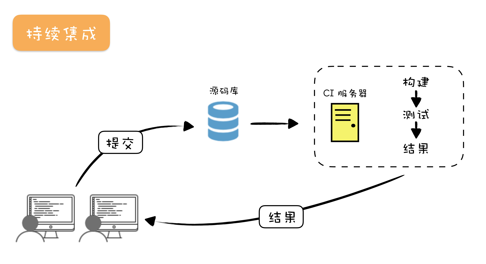
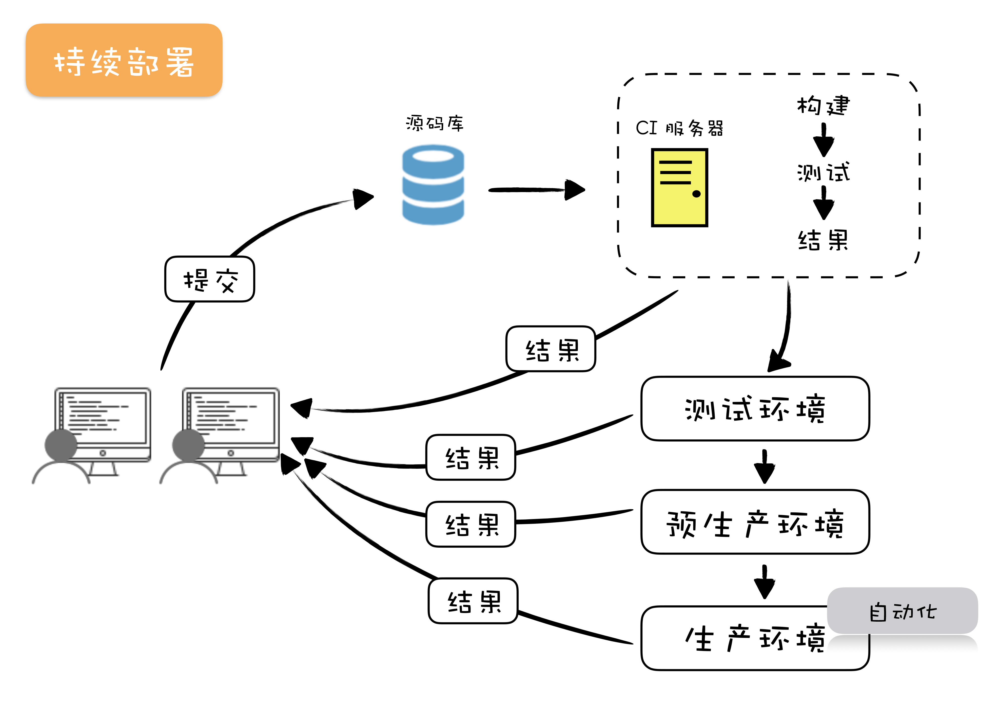

# 32 | 持续交付：有持续集成就够了吗？

## 笔记

### 持续交付

持续交付基础设施的不同环境:

* 持续集成环境, 持续集成是持续交付的前提, 这个过程主要是执行**基本的检查, 打出一个可以发布的包**.
* 测试环境(Test), 这个环境往往是单机的, **主要负责功能验证**, 这里运行的测试基本上都是验收测试级别的, 而**一般把单元测试和集成测试等执行比较快的测试放到持续集成环境中执行**.
* 预生产环境(Staging), 这个环境通常与生产环境配置相同, 只是机器数量会少一些, 主要**负责验证部署环境中, 多机带来的一些问题**.
* 生产环境(production), 真实的线上环境了.

 
 

每个环境作用是有差异的, 通常不会将所有的验证放在一起执行, 而是要分阶段的去执行, 一个阶段不通过, 是不能进入下一个阶段的. 按照不同阶段组织构建的方式, 称之为**构建流水线(Build Pipeline).

生产发布, 这个过程不是自动化的, 是由人来决定到底是不是要上线.

如果由人决定的是否上线编程自动化, 就是另外一个实践**持续部署**.

 

### DevOps

`DevOps`是一种软件交付的理念和方法, 目的是增强软件的可靠性. `DevOps`是将开发(Development)和运维(Operations)组合在了一起。

#### 基础设施即代码

`Infrastructure as code`, 将计算机的管理与配置变成了代码.

如`ansible, chef, puppet`

把更多的注意力用于思考把机器配置成什么样子.

#### Docker

通过配置工具将我们的发布包也部署到最终的镜像中. 最终生成的镜像就是包含了我们自己应用的镜像.

 

### 总结

让软件具备部署到生产环境的能力, 这里有两个关键点:

* 验证发布包
* 部署

**将部署纳入开发的考量**

## 扩展