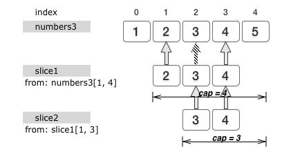

#第5章 高级数据类型1

[地址](http://www.imooc.com/learn/345 "地址")

###笔记

---

**数组类型** 

一个数组(Array)就是一个可以容纳若干类型相同的元素的容器.这个容器的大小(即数组的长度)是固定的,且是体现在数组的类型字面量之中的.

		type MyNumbers [3]int
		
* `[]`: 数组长度.
* `int`: 表示数组可以容纳的元素的类型.

		var numbers = [3]int{1,2,3}
		
		也可以
		
		var numbers = [...]int{1,2,3}
		
		
		numbers[0] // 会得到第一个元素
		numbers[1] // 会得到第二个元素
		numbers[2] // 会得到第三个元素
		
`修改数组值的某一个元素值`:

		numbers[1] = 4
	
`len` 可以获得数组长度:

		var length = len(numbers)
		
`默认值`:	

		var numbers2 [5]int
		
		值会是
		
		[5]int{0,0,0,0,0}
		
**切片类型(slice)**

与数组`不同`的是,无法通过切片类型来确定其值的长度.每个切片值会将数组作为期底层数据结构.

		[]int
		
		或
		
		[]string
		
		var number3 = [5]int{1,2,3,4,5}
		
`切片`:

		var slice1 = numbers3[1:4]
		
切片表达式一般由`字符串`、`数组`或`切片的值`以及由`方括号`包裹且由`英文冒号`“:”分隔的`两个正整数`组成.

`两个正整数`分别表示元素`下界`索引和元素`上界`索引.

		切片的值为:
		
		[]int{2,3,4}
		
切片表达式的求值结果相当于以元素`下界`索引和元素`上界`索引作为依据从被操作对象上“`切下`”而形成的新值(被“切下”的部分`不包含`元素`上界索引`指向的元素,`只是不包含上界索引指向元素,但是包含下界索引指向元素`).切片表达式的求值结果会是切片类型的,且其元素类型与被“切片”的值的元素类型一致
		
		var slice2 = slice1[1:3]
		
		slice2 的值为 []int{3,4}
		

`cap`内建函数,获取数组,切片或通道类型的值的容量(一个切片值的容量即为它的第一个元素值在其底层数组中的索引值与该数组长度的差值的绝对值).

		var cpapcity2 int = cap(slice2)
		
切片类型属于`引用`类型.它的零值即为nil,即空值.

只声明一个切片类型的变量而不为它赋值,那么该变量的值将会是nil:

		var slice3 []int
		
		值是
		
		nil
		
**切片的更多操作方法**

`容量`上界索引(限制我们通过这个切片值对其底层数组中的更多元素的访问): 

		number3[1:4:4]

`举例`:

		var numbers3 = [5]int{1, 2, 3, 4, 5}
		var slice1 = numbers3[1:4]  
		
变量slice1的值是[]int{2, 3, 4}。但是我们可以通过如下操作将其长度延展得与其容量相同:
		
		slice1 = slice1[:cap(slice1)]   
		
变量slice1的值变为了[]int{2, 3, 4, 5}，且其长度和容量均为4.现在,numbers3的值中的索引值在[1,5)范围内的元素都被体现在了slice1的值中.这是`以numbers3的值是slice1的值的底层数组`为前提的.这意味着,我们可以轻而易举地`通过切片值访问其底层数组中对应索引值更大的更多元素`.(会通过这种技巧访问到本不应该暴露给它的元素)

		var slice1 = numbers3[1:4:4]   
		
无论我们怎样做都无法通过slice1访问到numbers3的值中的第五个元素.因为这`超出了我们刚刚设定的slice1的容量`.

`append`会对切片值进行扩展并返回一个新的切片值
		
		slice1 = append(slice1, 6, 7)
		
		slice1的值变为了[]int{2, 3, 4, 6, 7}

`copy`接受两个类型相同的切片值作为参数,并会把`第二个`参数值中的元素`复制`到`第一个`参数值中的相应位置(索引值相同)上.

* 这种复制遵循`最小复制原则`,即:被复制的元素的个数总是等于长度较短的那个参数值的长度.
* 与append函数不同,copy函数`会直接对其第一个参数值进行修改`.

		var slice4 = []int{0,0,0,0,0,0,0}
		copy(slice4,slice1)
		
		slice4会变为[]int{2, 3, 4, 6, 7, 0, 0}

**字典类型**

字典用于存储键-值对的无序集合.同一个字典中的每个键都是唯一的.如果我们在向字典中放入一个键值对的时候其中已经有相同的键的话,那么与此键关联的那个值会被新值替换.

`map[K]T`

* `K`: 为键的类型
* `T`: 为元素(值)的类型

		如果我们要描述一个键类型为int、值类型为string的字典类型的话:
		
		map[int]string 
		
		map[int]string{1: "a", 2: "b", 3: "c"}
		
		赋值:
		
		mm := map[int]string{1: "a", 2: "b", 3: "c"}
		
		
		e, ok := mm[5]
		第二个求值结果是bool类型的.它用于表明字典值中是否存在指定的键值对.
		
`delete`删除键值对:

		delete(mm,4)

**通道类型**

于在不同Goroutine之间传递类型化的数据,并且是并发安全的(之前的数据类型都不是并发安全的).

`Goroutine`是承载可被并发执行的代码块的载体,由Go语言的运行时系统调度，并依托操作系统线程(又称内核线程)来并发地执行其中的代码块.

`通道类型`:

		chan T 
		
* 道类型的关键字`chan`.
* 代表该通道类型允许`传递`的`数据的类型`.

`通道类型赋值`:

* `无法`用字面量来为通道类型的变量赋值.
* 只能通过调用内建函数`make`来赋值.

`make`(可接受2个参数):

1. 第一个参数代表了将被初始化的值的`类型`的字面量
2. 第二个参数则是值的`长度`
	
		初始化一个长度为5且元素类型为int的通道值:
		
		make(chan int, 5)
		
`通道值的长度`: 缓存的尺寸,代表着通道值中可以暂存的数据的个数.暂存在通道值中的数据是先进先出的(FIFO,越早被放入(或称发送)到通道值的数据会越先被取出(或称接收)).

		h1 := make(chan string, 5) 

`<-`接收操作符: 

* 向通道`发送`数据

		向通道ch1发送字符串"value1"
		ch1 <- "value1"  

* 向通道`接收`数据

		接收到的字符串赋给一个变量
		value := <- ch1    
		
		value, ok := <- ch1   
		
		ok的值同样是bool类型的.它代表了通道值的状态,true代表通道值有效,而false则代表通道值已无效(或称已关闭)		

`close`关闭通道:
	
		close(ch1) 
		
`总结`:		
		
* 对通道值的`重复关闭`会引发运行时恐慌.
* 在通道值有效的前提下，针对它的发送操作会在通道值已满(其中缓存的数据的个数已等于它的长度)时被`阻塞`.
* 向一个已`被关闭的通道值发送数据`会引发运行时恐慌
* 针对有效通道值的接收操作会在它已空(其中没有缓存任何数据)时被阻塞

**通道的更多种类**

`缓冲通道和非缓冲通道`:

* `缓冲通道`: 缓冲通道中可以缓存N个数据.我们在初始化一个通道值的时候必须指定这个N(上一节所说的数据).
* `非缓冲通道`: 不会缓存任何数据.发送方在向通道值发送数据的时候会立即被阻塞,直到有某一个接收方已从该通道值中接收了这条数据.

		make(chan int ,0)
		
		注意 make 寒素的第二个参数值是0
		
`单向通道和双向通道`:

* 数据只能在通道中单向传输,那么该通道就被称作单向通道.

		接收通道:
		type Receiver <-chan int 
		
		发送通道:
		type Sender chan<- int 

* 单向通道的主要作用是约束程序对通道值的使用方式.

###整理知识点

---

**切片slices**

与数组相比切片的长度是不固定的,可以追加元素,在追加时可能使切片的容量增大.切片中有两个概念:

1. 一是len长度,长度是指已经被赋过值的最大下标+1,可通过内置函数len()获得.
2. 二是cap容量,容量是指`切片目前可容纳的最多元素个数`,可通过内置函数cap()获得。