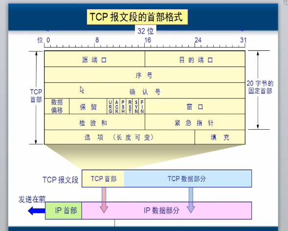
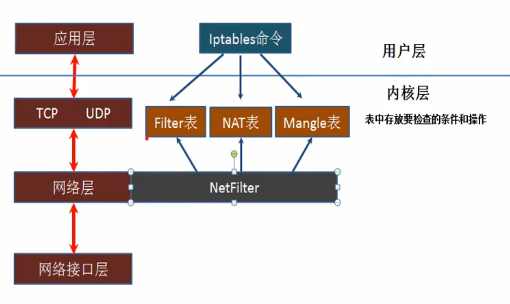
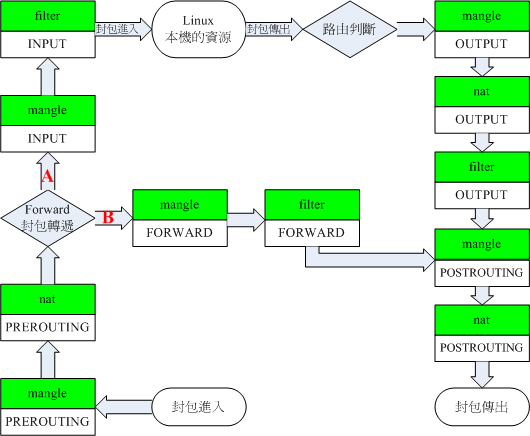

# iptables

---
[参考连接](http://edu.51cto.com/course/course_id-4422.html "参考连接")

#### OSI和DoD模型

**OSI**

* 应用层
* 表示层
* 会话层
* 传输层
* 网络层
* 数据链路层
* 物理层

**DoD**

* 应用层(对应`OSI`的`应用层`,`表示层`,`会话层`):
	* `Telnet`
	* `FTP`
	* `SMTP`
	* `DNS`
	* `HTTP` = `TCP`+`80(端口)`
    * `...`
    
* 传输层(对应`OSI`的`传输层`):
	* `TCP`: `可靠`传输 ,丢了的包重发,需要建立会话,传完以后释放连接(会话)
	* `UDP`: `不可靠`传输,一个数据包就能搞定

* 网络层(对应`OSI`的`数据链路层`,`物理层`):
	* `IP`
	* `ARP`
	* `RARP`
	* `ICMP`
	
* 网络接口:
	* 各种通信网络接口(以太网等),物理网络 
	
**表示应用程序**

`协议` + `端口` = `应用程序`

* `TCP` + `3389` = `RDP`
* `TCP` + `21` = `FTP`
* `TCP` + `23` = `TELNET`
* `TCP` + `25` = `SMTP`
* `UDP` + `53` = `DNS`(DNS 也可以使用`TCP`)
* `UDP` + `69` = `TFTP`
* `UDP` + `161` = `SNMP`
* `UDP` + `520` = `RIP`

用`端口`来`区分`服务.

**服务**

`服务`使用`应用层协议`(HTTP)和客户端通信.HTTP是应用层协议,主要解决`如何包装数据`.

`应用层协议`(HTTP)使用`传输层协议`(TCP)+`端口`标识.`TPC/IP`协议是传输层协议,主要解决数据如何在网络中传输.

**理解`应用层协议`和`传输层协议`**

"我们在传输数据时,可以只使用(传输层)TCP/IP协议,但是那样的话,如果没有应用层,便无法识别数据内容,如果想要使传输的数据有意义,则必须使用到应用层协议,应用层协议有很多,比如HTTP、FTP、TELNET等,也可以自己定义应用层协议.WEB使用HTTP协议作应用层协议,以封装HTTP文本信息,然后使用TCP/IP做传输层协议将它发到网络上."

**理解socket**

TCP/IP只是一个协议栈,就像操作系统的运行机制一样,必须要具体实现,同时还要提供对外的操作接口.这个就像操作系统会提供标准的编程接口,比如win32编程接口一样,`TCP/IP也要提供可供程序员做网络开发所用的接口`,这就是`Socket编程接口`.

Socket的出现只是使得程序员更方便地使用TCP/IP协议栈而已,是`对TCP/IP协议的抽象`,从而形成了我们知道的一些最基本的函数接口,比如create、 listen、connect、accept、send、read和write等等.

**总结**

传输层的TCP是基于网络层的IP协议的,而应用层的HTTP协议又是基于传输层的TCP协议的,而Socket本身不算是协议,就像上面所说,它只是提供了一个`针对TCP或者UDP编程的接口`.socket是对端口通信开发的工具,它要更底层一些.

**TCP报文段首部格式**

发送大文件:

1. 分成小的数据包
2. 加传输层`首部`
3. 加网络层首部
4. 加(DoD网络接口层)数据链路层首部

#### TCP连接控制

传输连接有三个阶段:

1. 连接建立
2. 数据传送
3. 连接释放

TCP连接的建立都是采用`客户服务器方式`.

主动发钱连接建立的应用进程叫`客户`(client)  
被动等待连接建立的应用进程叫`服务`(server)

文档:`IP/tcp协议中的三次握手和四次握手.md`

#### ICMP协议

`ping` 使用 `ICMP`协议

a - echo-request -> b

b - echo-reply -> b

#### Linux防火墙和NAT配置

**NetFilter框架**

`NetFilter`在网络层注册钩子函数,拦截数据包.

* `Filter`表: 用于过滤数据包,哪些数据报可以通过,哪些数据报不可以通过.
* `NAT`表: 修改数据包`地址`,源地址,目标地址,源端口,目标端口.
* `Mangle`表: 修改数据包`值`

都是使用`iptables`命令创建.

`tables`: `Filter`表,`NAT`表,`Mangle`表.

**NetFilter/iptables框架**

`钩子函数`:

* `LOCAL_IN`
* `PRE_ROUTING`
* `FORWARD`
* `LOCAL_OUT`
* `POST_ROUTING`

##### 链表

**Filter表:数据包过滤**

* `INPUT`链,什么样的数据包可以`进入`.
* `OUTPUT`链,什么样的数据包可以`发出去`.
* `FORWARD`链,什么样的数据包可以`转发`.

`FORWARD`链,`INPUT`链和`OUTPUT`链的区别如下:

1. 如果数据包的`目的地址是本机`,则系统将数据包送往`INPUT`链.如果通过规则检查,则该包被发给相应的本地进程处理;如果没有通过规则检查,系统就会将这个包丢掉.
2. 如果数据包的`目的地址不是本机`,也就是说,这个包将被转发,则系统将数据包送往`FORWARD`链.如果通过规则检查,则该包被发给相应的本地进程处理;如果没有通过规则检查,系统就会将这个包丢掉.
3. 如果数据包是`由本地系统进程产生的`,则系统将其送往`OUTPUT`链.如果通过规则检查,则该包被发给相应的本地进程处理;如果没有通过规则检查,系统就会将这个包丢掉.

**NAT表**

网络地址转换(Network Address Translation)

如果第一个数据包允许经行NAT或Masquerade,那么其它数据包都会被做相同的动作,也就是其他数据包不会被一个一个地NAT(属于一个流的包只会经过这个表一次)任何时候都不要在这个表任何一条链经行过滤.

`包含三个动作`:

* `DNAT`: 改变数据包的目的地址使包能重路由到某台机器(使公网能够访问局域网的服务器)
* `SNAT`: 改变数据包的源地址(使局域网能访问公网)
* `MASQUERADE`: 和SNAT一样使局域网能访问公网,无固定IP使用PPP.PPPoE等拨号上网接入Internet.

`NAT表包含3条链`:

* `PREROUTING`链,数据包到达防火墙时改变包的目的地址.目标地址转换必须在`PREROUTING`链上做。
* `OUTPUT`链,改变本地产生数据包的目标地址.
* `POSTROUTING`链,在数据包离开防火墙时改变数据包的源地址.源地址转换必须在`POSTROUTING`链上做。

**Mangle表:修改数据包,改变包头中内容(TTL,TOS,MARK)**

* `TOS`: 设置改变数据包的服务类型,不要使用TOS设置发往Internet的包除非打算依赖TOS来路由,不能在表中配置任何过滤.SNAT、DNAT
* `TTL`: 改变数据包的生存时间,可以让数据包只有一个特殊的`TTL`,欺骗ISP,有些ISP并不希望多台计算机共享一个连接访问Internet,ISP通过检查一台计算机所发出的数据包是否含有不同的TTL来判断
* `Mask`: 给数据包设置特殊的标记,通过标记配置带宽限制和基于请求分类

`Mangle表的5条链`:

* `PREROUTING`链,数据包进入防火墙后,路由判断之前改变数据包.
* `FORWARD`链,第一次路由判断之后,最后一次路由判断前改变数据包.
* `INPUT`链,在数据包进入本机后,应用程序接受之前改变数据包.
* `OUTPUT`链,在数据包被确定目的地址前改变数据包.
* `POSTROUTING`链,数据包确定了目标地址后,即路由判断后改变数据包.

#### IPtables规则

**理解IPtables规则**

* Rules包括一个条件和一个目标(target)
* 如果满足条件,就执行目标(target)中的规则或者特定值
* 如果不满足条件,就判断下一条Rules.

#### IPtables实现网络安全

**iptables命令**

`iptables` `-t 表 命令 链 规则 -j target`

* `table`: 
	* `filter` 默认
	* `nat`
	* `mangle`
* `命令`:
	* `-P --policy`: 定义默认策略
			
			...
			Chain OUTPUT (policy ACCEPT)
			target     prot opt source               destination
			...
			
			修改上面的 policy
			
	* `-A --append`: 追加,规则列表最后一条增加规则,顺序会影响结果(匹配最上层)
	* `-I --insert`: 插入,在指定位置插入一条规则,如果不指定位置则在最上面添加
	* `-D --delete`: 删除一个规则
	
			删除input链第一条规则
			
			iptables -t filter -D INPUT 1
			
	* `-R --replace`: 替换规则列表中的某个规则
			
			修改INPUT链第2条	
			iptables -t filter -R INPUT 2 -p icmp -j DROP
			
	* `-F --flush`: 删除表(链)中的所有规则,不指定链则清楚所有链
			
			清楚filter表INPUT链所有规则
			
			iptables -t filter -F INPUT
* `target`:
	* `ACCEPT`: 允许防火墙接收数据包
	* `DROP`: 防火墙丢弃包
	* `QUEUE`: 防火墙将数据包移交到用户空间
	* `RETURN`: 防火墙停止执行当前链中的后续Rules,并返回到调用链(the calling chain)中.
 
**详解匹配标准**

`通用匹配:源地址目标地址的匹配`:

* `-s`: 指定作为源地址匹配,不能指定主机名称,必须是`IP`.地址可以取反,加一个"`!`",表示除了哪个IP之外
* `-d`: 表示匹配目标地址
* `-p`: 用于匹配协议(通常为 `TCP/UDP/ICMP`)
* `-i eth0`: 从这块网卡流入的数据,流入一般用在`INPUT`和`PREROUTING`上
* `-o eth0`: 从这块网卡流出的数据,流出一般用在`OUTPUT`和`POSTROUTING`上

`扩展匹配-对协议的扩展`:

* `-p tcp`: TCP协议的扩展.
	* `--dport XX-XX`: 指定目标端口,不能指定多个非连续端口,只能指定单个端口
			
			--dport 21 或者 --dport 21-23 (表示21,22,23)
	
	* `--sport`: 指定源端口
	* `--tcp-fiags`: TCP的标志位（SYN,ACK，FIN,PSH，RST,URG）,一般要跟2个参数:
		* 检查的标志位
		* 必须为1的标志位
		
				--tcpflags syn,ack,fin,rst syn   =    --syn
				表示检查这4个位,这4个位中syn必须为1,其他的必须为0.用于检测三次握手的第一次包的.
				
* `-p udp`:UDP协议的扩展
	* `--dport`
	* `--sport`

* `-p icmp`: icmp数据报文的扩展
	* `--icmp-type`: echo-request(请求回显),一般用8来表示.echo-reply (响应的数据包)一般用0来表示
	
			--icmp-type 8 匹配请求回显数据包 	
			
`扩展匹配-显式扩展`:

* `-m multiport`: 表示启用多端口扩展,之后我们就可以启用比如 --dports 
21,23,80

* `-m`: extended match(may load extension)

iptables可以使用扩展模块来进行数据包的匹配,语法就是 `-m module_name`,所以
`-m tcp` 的意思是使用 `tcp` 扩展模块的功能 (tcp扩展模块提供了 --dport, --tcp-flags, --sync等功能）

其实只用 -p tcp 了话,iptables也会默认的使用 -m tcp 来调用 tcp模块提供的功能.但是 -p tcp 和 -m tcp是两个不同层面的东西，一个是说当前规则作用于 tcp 协议包，而后一是说明要使用iptables的tcp模块的功能 (--dport 等) 

**详解 -j ACTION**

* `DROP`: 悄悄丢弃
* `REJECT`: 明示拒绝
* `ACCEPT`: 接受
* `MASQUERADE`: 源地址伪装(动态伪装),它可以实现自动寻找到外网地址,而自动将其改为正确的外网地址.MASQUERADE会自动读取eth0现在的ip地址然后做SNAT出去.(和`SNAT`的区别是,使用`SNAT`的时候,出口`ip`的地址范围可以是一个,也可以是多个.而`MASQUERADE`是从服务器的网卡上,自动获取当前ip地址来做SNAT)
	
		#把所有10.8.0.0网段的数据包SNAT成192.168.5.3的ip然后发出去
		iptables -t nat -A POSTROUTING -s 10.8.0.0/255.255.255.0 -o eth0 -j SNAT --to-source 192.168.5.3
		
		#把所有10.8.0.0网段的数据包SNAT成192.168.5.3/192.168.5.4/192.168.5.5等几个ip然后发出去
		iptables -t nat -A POSTROUTING -s 10.8.0.0/255.255.255.0 -o eth0 -j SNAT --to-source 192.168.5.3-192.168.5.5
		
		#不用指定SNAT的目标ip了，不管现在eth0的出口获得了怎样的动态ip，MASQUERADE会自动读取eth0现在的ip地址然后做SNAT出去，这样就实现了很好的动态SNAT地址转换
		iptables -t nat -A POSTROUTING -s 10.8.0.0/255.255.255.0 -o eth0 -j MASQUERADE

* `REDIRECT`: 重定向:主要用于实现端口重定向
* `MARK`: 打防火墙标记的
* `RETURN`: 返回,在自定义链执行完毕后使用返回,来返回原规则链
* `DNAT`
* `SNAT`

**状态监测**

* `NEW`: 该包想要开始一个连接,第一次握手(TCP协议)
* `ESTABLISHED`: 只要发送并接到应答,一个数据连接从NEW变为ESTABLISHED,而且该状态会继续匹配这个连接的后续数据包.第二次和第三次握手,叫做已建立的连接(ESTABLISHED)
* `INVALID`: `无法识别的`.数据包不能被识别属于哪个连接或没有任何状态比如内存溢出,收到不知属于哪个连接的ICMP错误信息,一般应该DROP这个状态的任何数据.
* `RELATED`: 该包是属于某个已经建立的连接所建立的新连接,FTP的数据传输连接就是控制连接所 RELATED出来的连接.FTP这种古老的拥有的特征,每个端口都是独立的,21号和20号端口都是一去一回,他们之间是有关系的,这种关系被称之为`RELATED`

**SNAT基于源地址的转换**

基于原地址的转换一般用在我们的`许多内网用户通过一个外网的口上网`的时候,这时我们将我们内网的地址转换为一个外网的IP,我们就可以实现连接其他外网IP的功能.

		比如我们现在要将所有192.168.10.0网段的IP在经过的时候全都转换成172.16.100.1这个假设出来的外网地址
		iptables -t nat -A POSTROUTING -s 192.168.10.0/24 -j SNAT --to-source 172.16.100.1
		
`示例:解释为什么SNAT可以实现局域网连接外网`:

假设内网主机A(192.168.2.8)要和外网主机B(61.132.62.131)通信,A向B发出IP数据包,如果没有SNAT对A主机进行源地址转换,A与B主机的通讯会不正常中断,因为当路由器将内网的数据包发到公网IP后,公网IP会给你的私网IP回数据包,这时,公网IP根本就无法知道你的私网IP应该如何走了.所以问它上一级路由器,当然这是肯定的,因为从公网上根本就无法看到私网IP,因此你无法给他通信.为了实现数据包的正确发送及返回,网关必须将A的址转换为一个合法的公网地址,同时为了以后B主机能将数据包发送给A,这个合法的公网地址必须是网关的外网地址,如果是其它公网地址的话,B会把数据包发送到其它网关,而不是A主机所在的网关,A将收不到B发过来的数据包,所以内网主机要上公网就必须要有合法的公网地址,而得到这个地址的方法就是让网关进行SNAT(源地址转换),将内网地址转换成公网址(一般是网关的外部地址),所以大家经常会看到为了让内网用户上公网,我们必须在routeros的firewall中设置`snat`,俗称IP地址欺骗或伪装(`masquerade`)

**DNAT目标地址转换**

对于目标地址转换,数据流向是从外向内的,外面的是客户端,里面的是服务器端通过目标地址转换,我们可以让外面的ip通过我们对外的外网ip来访问我们服务器不同的服务器,而我们的服务却放在内网服务器的不同的服务器上.

**iptables-save**
	
		PREROUTING ACCEPT [3792:206716]

中括号[]里记录的就是通过该规则的数据包和字节总数.
		

		

