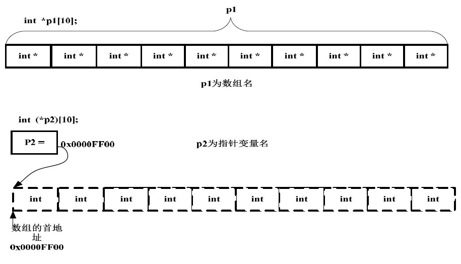

#Linux C语言结构体

[地址](http://www.imooc.com/learn/409 "地址")

###预处理那些事

---

####笔记

**编译**

编译分为4个步骤:

1. `预处理`: `.c` 文件 -> `.i` 文件
2. `编译`: `.i`文件 -> `.s` 文件
3. `汇编`: `.s`文件 -> `.o` 文件
4. `连接`: `.o`文件 -> `可执行` 文件

**预处理**

1. `展开`头文件,头文件直接写入`.i` 文件内.
2. `宏替换`, 预处理阶段单纯的`字符串`替换. `宏`不考虑C的语法.

gcc -o xxxx.i xxx.c `-E` (`-E`: 只执行预处理)

**宏定义**

`#define 宏的名字 宏的值` (宏下面的函数都可以使用)
		
		示例1:
		
		#define R 10
		程序使用R, 会使用到10
		
		示例2:
		
		$define M int main(
		
		M){
			..
		}
		程序可以执行(M 替换成字符串 "intmain(")

**宏函数**

		#define N(n) n*10
		定义一个宏"N", 传递参数"n", 
		
		int b = N(10)//会被替换成 int b = 10*10
		输出 b = 100

`示例宏函数:求和函数`:

1. 正常的求和函数:

		int add(int a, int b){
			return a+b;
		}
		
		调用:
		
		c = add(10,10);

2. 宏函数

		#define ADD(a,b) a+b
		
		调用:
		
		d = ADD(10,10);
		
		int e = ADD(a,b) * ADD(a,b)
		输出结果不是 (a+b)*(a+b) //假设 a=10, b=10 结果不是 400,而是220		
		
		因为"运算"是要等"编译后" "执行"的时候才会执行的.预处理阶段不会执行"运算"
		所以替换后为
		
		int e = ADD(a,b) * ADD(a,b)
		预处理后:
		a + b * a + b //假设 a=10, b=10 结果是220
		解决方案:
		修改宏函数: #define ADD(a,b) (a+b)//添加括号,括号优先级高
		
`宏函数`和`正常函数`区别:

* `正常函数`有返回值类型要求,传参类型要求, `宏函数`没有类型要求,不考虑类型(因为不考虑C的语法)

**typedf**

`typedf` 给一个变量类型起`别名` (预处理不会替换)

		typedf int tni; （是C语句,所以要有分号结尾）		
		
		typedf int *p; (给int* 类型起别名为p)
		p q = NULL; 
		等同于
		int *q = NULL;

`typedf` 通常给自己定义的类型起别名

		size_t 全称是 typedf unsigned long size_t
		
		结构体:
		
		struct stu{
		};
		struct stu xxx; (写起来不方便)
		起别名:		
		typedf struct stu{
		}stu_t;
		stu_t xxx; (创建起来方便)
		
`typedf`有作用域.

		int add(int a, int b){
			//typedf 起别名, 函数外不能使用
			//#define 定义宏, 函数外(宏后面)可以使用
		}
		
####整理知识点

**条件编译**

按照不同的条件,编译不同的程序部分.

`后续整理...`

###结构体

---

####笔记

**结构体的声明和定义**

`结构体`: 不同类型变量的集合.(`数组`是相同类型变量的集合)
		
`声明定义分离形式`:
	
		//创建了一个结构体类型,暂时还没有分配任何内存空间,用于声明变量
		struct weapon{
			char name[20];
			int atk;
			int price;
		};
		
		//定义一个结构体
		//struct weapon weapon_1;
		
`全局`:
		
		struct weapon{
			char name[20];
			int atk;
			int price;
		}weapon_1;
			
`不指定结构体类型名字,直接定义`:			
		
		struct{
			char name[20];
			int atk;
			int price;
		}weapon_1;
		
**结构体的初始化和引用**
		
		//初始化武器结构体对象
		strcut weapon weapon_1 {"weapn_name",100,200};		
		//访问对象成员
		printf("%s\n",weapon_1.name);
		
		//结构体数组
		struct weapon weapon_2[2] = {{"weapn_name1",50,100},{"weapn_name2",100,200}}
		
**结构体指针**

`指向结构体变量的指针变量`:

	struct weapon *w;//指向结构体变量的指针
	w = &weapon_1;
	
	printf("name=%s\n",(*w).name);// w->name 替代 (*w).name
	
	
	struct weapon *p;
	p = weapon_2;//指向数组第一个元素的起始地址, p->name = weapn_2[0].name
	p++;//weapon_2 + 1 , weapn_2[1]
		
####整理知识点

**指针和指针数组**

`int a[3]` 数组名是a, a(数组)就相当于指针, 存的数组的`首地址`.

* `指针数组`: array of pointers, 即用于存储指针的数组, 也就是数组元素都是指针.

		int *a[4] 
		表示: 数组a中的元素都为int型指针
		元素表示: *a[i] ([]优先级高于*)
		
		实际应用:
		typedef int* pInt;
		pInt a[4];

* `数组指针`: a pointer to an array, 即指向数组的指针.
		
		int(*a)[4]
		表示: 指向数组a的指针
		元素表示: (*a)[i]
		
`示例`:

		A:
		int *p1[10];
		
		B:
		int (*p2)[10];
		
"`[]`"的优先级比"`*`"要高.p1先于`[]`结合,构成一个数组的定义, 数组名为p1,int *修饰的是数组的内容(数组的每个元素).这是一个数组,其包含10个指向int类型数据的指针,即`指针数组`.

"`()`"的优先级比"`[]`"高, `*`和p2构成一个指针的定义, 指针变量名为p2, int 修饰的是数组的内容.数组在这里并没有名字,是个匿名数组.那现在我们清楚p2是一个指针,它指向一个包含10个int 类型数据的数组,即`数组指针`.

**a和&a**

		char a[5] = {'A','B','C','D'};
		
* `a`: 数组首元素的首地址
* `&a`: 整个数组的首地址

`a` 和 `&a` 值相同意义不同.假如:
		
		//这个定义的"="号两边的数据类型完全一致
		char (*p3)[5] = &a;
		
		//这个定义的"="号两边的数据类型就不一致了。左边的类型是指向整个数组的指针,右边的数据类型是指向单个字符的指针
		char (*p4][5] = a;//不要这么写会发出警告

###共用体

---

####笔记

**共用体**

也被称为`联合体`, 使用关键字`union`. 作用是让几个不同类型的变量,共享同一个内存地址.

		union data{
			int a;
			char b;
			int c;
		};//a,b,c 可以存放到同一个内存单位中, 可以节省开销. 但是同一时刻只能存储一个成员
		
		int main(){
		
			union data data_1;
			data_1.b = 'c';//无效
			data_1.a = 10;//后边的起作用的成员,覆盖掉前边的数据
			
			//初始化,只能初始化一个成员
			union data data_1 = {10};
		}

`共用体`和`结构体`占的内存长度不一样:

* `共用体`占用内存长度,是其所有成员中所占内存长度最长的成员的长度
		
		union data{ //占4个字节
			int a; //4个字节
			char b; //1个字节
			int c;
		};
		
* `结构体`所占用空间大小涉及字节对齐(目的是让计算机快去读写,空间换取时间),`结构体`的大小等于`最后`一个成员的`偏移量`+`最后`一个成员的`大小`+末尾的`填充字节数`.

	* `偏移量`: 就是某一个成员的实际地址,和结构体首地址之间的距离. 
	
			struct data{ 
				int a; //偏移量0
				char b; //字节1,偏移量4. 4是1的整数倍. a,b 之间不会填充字节
				int c;//字节4, 偏移量5 (4+1). 5不是4的整数倍, 编译器在b后面做字节填充,让c的偏移量变成8字节(是4的整数倍), 结构体总大小现在是 4+3+4+1 = 12
				
				//编译器在判断现在结构体总大小是不是结构体中最宽的节本类型成员的整数倍(例子是 int 4,4 可以被 12整除), 如果不是整数倍, 在给c的后面做字节填充.
			};
			
	* `结构体字节对齐准则`: 每个成员相对结构体首地址的偏移量,都必须是当前成员所占内存大小的整数倍,如果不是编译器会加上`填充字节`.
	
**共用体大小示例**

		struct data{ 
			int a; 
			char b; 
			int c;
		}
		printf("%lu",sizeof(struct data));//打印类型占控件大小
		输出: 12
		
		union data{ 
			int a; 
			char b; 
			int c;
		};
		printf("%p\n,%p\n,%p\n", &data_1.a, &data_1.b, &data_1.c);
		输出:
		0x7fff9970e790
		,0x7fff9970e790
		,0x7fff9970e790
		
		三个地址相同
		
####整理知识点

###动态数据结构

---

####笔记

**静态数据结构**

* 整型
* 浮点型
* 数组

`有系统分配固定大小存储控件,之后运行不会改变`。

**动态数据结构**

动态分配空间存储数据结构

**链表**

`头指针`, 存放地址, 指向第一个元素.

`节点`包含两个部分:

* 用户的实际数据
* 下一个节点的地址

`各个元素地址不一定连续`(数组各个元素地址是连续的,整个的是一块连续的内存空间).

链表中访问每一个元素,必须通过上一个元素提供的下一个元素的地址.

**动态数据结构-静态链表**

		struct weapon{
			int atk;
			int price;
			struct weapon * next;//用于存放下一个节点的地址
		};
		//声明
		staruct a,b,c,*head;
		//赋值
		a.price = 100;
		a.atk = 100;
		b.price = 200;
		b.atk = 200;
		c.price = 300;
		c.atk = 300;
		//链表操作
		head = &a;//头指针
		a.next = &b;
		b.next = &c;
		c.next = NULL;
		
		//访问静态链表节点
		struct weapon *p;
		p = head;
		while(p!=NULL){
			printf("%d,%d\n", p->atk,p->price);
			p=p->next;
		}
		
		输出:
		100,100
		200,200
		300,300
		
		所有节点都是在程序中定义的,不是临时开辟的.
		
**动态数据结构-动态链表**

`单向动态链表`:

		struct weapon{
			int atk;
			int price;
			struct weapon * next;//用于存放下一个节点的地址
		};
		
		struct weapon * create(){
			struct weapon *head;//头指针
			
			//每当把current所指的新开辟的节点连接到表尾后,end便移向这一新的表尾节点.这时又可以用current去指向下一个新开辟的节点.链表最后一个节点的指针域中置'\0'(NULL值)作为单向链表的结束标志.
			struct weapon *current, *end;//指向新创建的节点(current),指向上一个节点(end:指向链表当前的尾节点)
			int n=0;//当前链表的节点函数
			
			//malloc分配内存块的函数
			//sizeof判断数据类型长度符
			current=end=(struct weapon*)malloc(sizeof(struct weapon));
			
			scanf("%d,%d", &current->price,&current->atk);
			head = NULL;
			
			//设定结束
			//如果price为0,节点不连接到链表. 如果不为0, 连接到链表.
			while(p1->price!=0){
				n++;
				if(n==1) head=p1;
				else end->next = current;//新节点连到表尾
				
				end = current;//end指向当前表尾
				
				//开辟新的动态存储区
				current=(struct weapon*)malloc(sizeof(struct weapon));
				scanf("%d,%d", &current->price,&current->atk);
			}
			end->next = NULL;
			return(head);
		}

####整理知识点

###位运算

---

####笔记

**位**

二进制数中的1位, 值是`0`(false)或`1`(true).

**按位与 &**

`位与`: 参与运算的2个数据,按照对应的2进制数逐位的进行逻辑`与`运算. 参与运算的2个数必须是`整型`(int)或者`字符型`(char). 必须要以`补码`的方式出现.
		
		//占4个字节, 4的补码
		int a = 4;//00000000 00000000 00000000 00000100
		
		int b = 7;//00000000 00000000 00000000 00000111
		
		//按照对应的2进制数,进行逻辑"与" 运算,都为1才为1
		int c = a&b;//00000000 00000000 00000000 00000100
	
`作用`:
		
1. 任何一个数与 "`0`"做按位与运算 结果是0.
2. 保留指定位置.(比如保留a的后8位,则让b的后8位都为1. 然后 a&b)
3. 判断`奇偶`性

		int d = a&1; //结果1 奇数, 结果0 偶数
		

**按位或 |**

`位或`: 参与运算的2个数据,按照对应的2进制数逐位的进行逻辑`或`运算.

		int a = 9;//00000000 00000000 00000000 00001001
		
		int b = 5;//00000000 00000000 00000000 00000101
		
		//逻辑"或"运算,有一个为1就为1
		int c = a|b;//00000000 00000000 00000000 00001101

`作用`:

1.设定数据的指定位置.( a|0xFF(255),现在a的低8位都是1)

**按位异或 ^**

`位异或`: 参与运算的2个数据,按照对应的2进制数逐位的进行逻辑`异或`运算.

		int a = 9;//00000000 00000000 00000000 00001001
		
		int b = 5;//00000000 00000000 00000000 00000101
		
		//逻辑"异或"运算,2个数互斥的时候才为真(1)
		int c = a^b;//00000000 00000000 00000000 00001100
		
`作用`:

1. 定位反转.(a里面所有的0变为1,1变为0. a&0xFF(255))
2. 数值交换.(a = a^b; b = b^a; a = a^b;)

**按位取反 ~**

取反操作.

		~(00001001) = 11110110 

**左移(<<)右移(>>)**

* `左移`: 将数据对应的二进制逐位`左移`若干位.左移是在后面补0.左移始终是在右边补,不会产生符号问题.

		int a = 3;// 00000000 00000000 00000000 00000011
		a = a << 4;// 00000000 00000000 0000000 001100000
		
		int i = 1;// 00000000 00000000 00000000 00000001
		
		// 1 * 2^1
		i = i << 2;// 00000000 00000000 00000000 00000100
		
		
		需要注意问题: int 有符号类型, 如果把最左边符号移出去,会发生溢出.
		常用功能: 实现 2倍乘 运算.速度较快
		
* `右移`: 将数据对应的二进制逐位`右移`若干位.右移是在前面边补1或0,看最高位是0还是1,是0就补0,是1就补1(取决于数的前面的第一位是0还是1).右移是会产生到底补1还是0的问题.

		// n/(2^2)
		//整除运算
		//注意带符号的整数

####整理知识点

**单目运算符**

运算所需变量为一个的运算符叫`单目运算符`,又叫`一元运算符`.

`!`,`~`,`++`,`--`,`-`(负号)...

**负数 & 左移右移**

* `右移`: 负数右移的话,由于要保持它是负数,所以负数的二进制的右边补1.

		如果一直右移的话,最后就就变成0xFFFFFFFF 即-1.
		-4>>1 为-2; -4>>2为-1

* `左移`: 左移不分正负高位舍去,低位补0.负数左移<<首位的1是不变的,末尾用0补齐.

###递归

---

####笔记

**递归调用**

`递归调用`: 在调用函数过程中被调用的函数调用它本身的过程.

		void func(){
			printf("1\n");
			fun();
		}
		
		调用func(),无终止输出"1"

**递归原理**

`函数调用`:
		
		int functionB(int a,int b){
			return (a+b);
		}
		
		//a,b 形参.函数没有被调用的时候,不会分配存储单元
		int functionA(){
			...
			//10,10 实参
			//还要传入 functionA的返回地址
			functionB(10,10);//
			...
			return 0;
		}
	

	
####整理知识点

**形参和实参**

* `形参`:  比如你定义一个函数void add(int a, int b),这里的a和b就是形参.
* `实参`: 当你进行函数调用的时候，add(1, 2),这里的1和2就是实参.

**递归和递推**

* `递归`(recursive): 将一个规模为`n`的问题,转换成规模为`n-1`,然后依次降解,直到问题规模可求,将低规模的接代入高阶问题,最后求出规模为`n`的解.
* `递推`(iterative): 构造一个低阶的规模,根据规模为`1`推到`i+1`直到推出`n`.

		int function(n){
			
			int r=1,i;
			
			for(i=1;i<=n;i++){
				r=r*i;
			}
			
			return (r);
		}