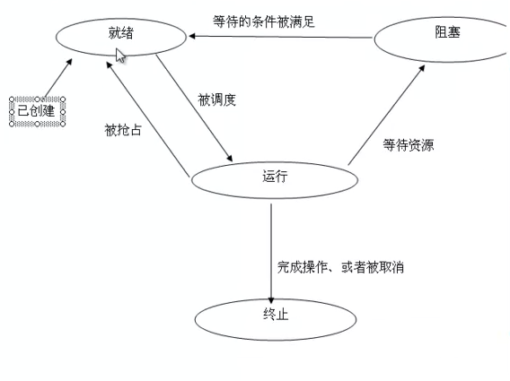

#Linux多线程编程

[地址](http://www.maiziedu.com/course/qrsqd/478-6055/ "地址")

###01什么是线程:线程的概念

---

####笔记

**进程(Process)**

一个正在执行的程序, 是`资源分配`的最小单位. 按照一定的`顺序`逐个执行. (进程就是用来拿资源的)

`进程的弊端`:

* 进程是资源拥有者, 创建, 撤销与切换存在较大的时空开销, 因此需要引入`轻型进程(线程)`
* 由于对称处理机(SMP)出现, 可以满足多个运行单位, 而多个进程并行开销过大.

**线程（thread）**

`轻量级进程`, `程序执行`的最小单位, `系统独立调度`和`分派CPU`的基本单位, 是进程中的一个`实体`.  

`一个`进程可以有`多个`线程. 这些线程`共享`进程的所有资源. (执行的时候都是从线程开始执行的)

`多线程模式`: 所有线程共享进程的资源, 不会造成资源浪费. 线程之间通信比较简单,因为资源共享.

`多进程模式`(子进程): 子进程的创建会复制父进程的资源, 会造成资源的浪费. 进程之间通信比较麻烦.

**并发**

`并发`是指在`同一`时刻, 只能有`一条`指令执行, 但多个进程指令被`快速乱换`, 是的宏观上具有多个进程同时执行的效果.

`看起来同时发生, 针对单核处理器`.

**并行**

`并向`是指在`同一`时刻, 有`多条`指令在`多个`处理器上同时执行.

`真正的同时发生, 针对多核处理器`.

**同步**

`同步`: 彼此`有依赖关系`的调用不应该"`同时发生`", 而同步就是要`阻止`哪些"`同时发生`"的事情.

**异步**

`异步`: 两个彼此独立的操作是异步的, 它表明事情`独立的`发生.

很多东西`开始`是`异步`的, 但是因为随着外部条件的约束, 变成`同步`的.

**多线程的优势**

1. 在多处理器中开发程序的`并行`性.(真正意义的同时发生,提高效率,缩短程序运行时间)
2. 在`等待慢速IO`操作时, 程序可以执行其他操作, 提高`并发性`.
3. 模块的编程, 能更清晰的表达程序中`独立事件的关系`.
4. 占用较少的系统资源. （相对于多进程来说,子进程浪费资源）

`多线程不一定要多处理器` (多处理器提高`并行性`, 单处理器提高`并发性`)

####整理知识点

**进程**

`进程` 是具有一定独立功能的程序关于某个数据集合上的`一次运行活动`,进程是系统进行`资源分配`和`调度`的`一个独立单位`.

`进程` 是计算机中已运行程序的`实体`(`线程` 是进程的一个`实体`). 进程本身`不会`运行,是线程的`容器`.

`程序本身只是指令的集合`,进程才是程序(那些指令)的`真正运行`.

进程为现今分时系统的`基本运作单位`(分时系统: `一个`系统可以同时为`两个`或`两个以上`的账户服务).

**线程**

`线程` 是进程的一个`实体`,是CPU`调度`和`分派`的`基本单位`(是操作系统能够进行运算调度的最小单位),它是比进程更小的能独立运行的基本单位.

`线程` 自己基本上不拥有系统资源,只拥有一点在运行中必不可少的`资源`(如程序计数器,一组寄存器和栈),但是它可与同属一个进程的其他的线程`共享` `进程所拥有的全部资源`.

**进程与程序的联系与区别**

1. `程序`是`指令`的`有序集合`,其本身`没有任何运行的含义`，是一个`静态的`概念. `进程`是程序在处理机上的`一次执行过程`,它是一个`动态`的概念.
2. 程序是`永久`的,进程是`暂时`的(进程是有一定`生命期`).

		注: 程序可看作一个菜谱,而进程则是按照菜谱进行烹调的过程.
		
3. 进程是由`程序`,`数据`和`进程`控制块三部分组成的. 
4. 通过多次`执行`,`一个`程序可对应`多个`进程. `调用`关系,`一个`进程可包括`多个`程序.

**进程和线程的区别**

`最小单位`:

* 进程是`资源分配`的最小单位
* 线程是`CPU调度`的最小单位

`数据空间`:

* `子`进程和`父`进程有`不同的`代码和数据空间
* 多个线程则`共享`数据空间,每个线程有`自己的` `执行堆栈` 和 `程序计数器`为其执行上下文

**多进程**

`进程`是程序在计算机上的一次执行活动.当你运行一个程序,你就启动了一个进程.显然,程序是`死`的(静态的),进程是`活`的(动态的).进程可以分为系统进程和用户进程.凡是用于完成操作系统的各种功能的进程就是系统进程,它们就是处于运行状态下的操作系统本身;所有由用户启动的进程都是用户进程.`进程是操作系统进行资源分配的单位`. 

`进程`又被细化为`线程`,也就是`一个进程下有多个能独立运行的更小的单位`.

`在同一个时间里,同一个计算机系统中如果允许两个或两个以上的进程处于运行状态`,这便是`多任务`.

现代的操作系统几乎都是多任务操作系统,能够同时管理多个进程的运行. 多任务带来的好处是明显的,比如你可以边听mp3边上网,与此同时甚至可以将下载的文档打印出来,而这些任务之间丝毫不会相互干扰. 那么这里就涉及到并行的问题,俗话说,一心不能二用,这对计算机也一样,原则上`一个CPU只能分配给一个进程`,以便运行这个进程.我们通常使用的计算机中只有一个CPU,也就是说只有一颗心,要让它一心多用,同时运行多个进程,就必须使用`并发`技术.实现并发技术相当复杂,最容易理解的是“`时间片轮转进程调度算法`”.

`时间片轮转进程调度算法`: 在操作系统的管理下,所有正在运行的进程轮流使用CPU,每个进程允许占用CPU的时间非常短(比如10毫秒),这样用户根本感觉不出来 `CPU是在轮流为多个进程服务`,就好象所有的进程都在不间断地运行一样.但实际上在任何`一个时间内有且仅有一个进程占有CPU`.

如果一个计算机有多个CPU,不同的进程可以分配给不同的CPU来运行,这便是`并行`.

###02线程的创造和生命:线程id和创造线程

---

####笔记

**线程ID**

`线程`:

* `标识符类型`: pthread_t

	* (FreeBSD5.2, MAC OS10.3): 结构体
	* (linux) unsigned long int (无符号整数) 位置: /usr/include/bits/pthreadtypes.h

* `获取id`: pthread_self()
* `创建`: pthread_create()

`进程`:

* `标识符类型`:pid_t
* `获取id`: getpid()
* `创建`: fork(), 创造一个子进程, 同时复制父进程的所有资源

`pthread_self`: 参数为空,返回值为`pid`. 编译的时候需要 `-pthread`

**线程ID:linux环境代码示例**

`获取进程id和线程id`:
		
		文件名:thread_id.c
		
		#include <stdio.h>
		#include <pthread.h>
		#include <stdlib.h>
		#include <string.h>
		
		int main(){
		
			pid_t pid; //进程id
			pthread_t tid;//线程id
			
			pid = getpid();
			tid = pthread_self();
			
			printf("pid is %u, tid is %x\n", pid, tid);//pid 10进制, tid 16进制
			
			return 0;
		}
		
		编译:
		
		# gcc -lpthread thread_id.c -o thread_id
		
		输出结果:
		
		pid is 7620, tid is b77666c0

**创造线程**

`int pthread_create(pthread_t *restrict tidp, const pthread_attr_t *restrict attr, void *(*start_routine)(void *), void *restrict arg)`:

* 第一个参数: 新线程的id, 如果成功则新线程的id回填到tidp指向的内存
* 第二个参数: 线程属性 (调度策略, 继承性, 分离性...)
* 第三个参数: 回调函数 (新线程要执行的函数)
* 第四个参数: 回调函数的参数 (多个参数用`结构体`)
* 返回值: 成功返回`0`, 石板返回`错误码`

编译时需要连接 lib pthread. `-pthread`

**创造线程:示例**

		文件名:thread_create.c
		
		#include <stdio.h>
		#include <pthread.h>
		#include <stdlib.h>
		#include <string.h> 
		
		void print_id(char *s){
			
			pid_t pid;
			pthread_t tid;
			
			pid = getpid();//获取进程id, 获取父进程id getppid();
			tid = pthread_self();
			
			printf("%s pid is %u, tid is 0x%x\n", s, pid, tid);//pid 10进制, tid 16进制
		}
		
		void *thread_fun(void *arg){
		
			print_id(arg);
			
			return (void *)0;
		}
		
		int main(){
		
			pthread_t ntid;
			int err;
			
			err = pthread_create(&ntid, NULL, thread_fun, "new thread:");
			
			if(err != 0){
				printf("create new thread fail");
				return 0;
			}
			
			print_id("main thread");
			sleep(2);
			
			return 0;
		}
		
		编译:
		
		# gcc -lpthread thread_create.c -o thread_id
		
		输出结果:
		
		main thread: pid is 20849, tid is oxb77656c0
		new thred: pid is 20849, tid is 0xb7764b70
		
		
		进程id一样,验证了: 一个进程有多个线程, 多个线程共享进程id. 
		线程id 出了进程 没有任何意义.
		
####整理知识点

###02线程的创造和生命:主线程

---

####笔记

**主线程**

1. 当c程序运行时, 首先运行main函数. 在线程代码中,这个特殊的执行流被称作`初始线程`或者`主线程`.
2. 主线程的特殊在于, 它在`main函数返回时, 会导致进程结束`, `进程内所有的线程也将会结束`. 可以在主线程中调用`pthread_exit`函数(主线程有这个函数退出,其他线程可以保证运行结束才退出), 这样进程就会等待所有线程结束时才终止.
3. 主线程接受参数的方式是通过`argc(参数的个数)`和`argv(参数存放的地方)`, 而普通的线程只有一个参数`void*`
4. 在绝大多数情况下, 主线程在`默认堆栈`上运行, 这个堆栈可以增长到足够的长度. 而普通线程的堆栈是受限制的, 一旦溢出就会产生错误.

**线程的创建**

1. 主线程是随着进程的创建而创建(内核来处理)
2. 其他线程可以通过调用函数来创建, 主要调用pthread_create
3. 新线程可能在当前线程从函数pthread_create返回之前就已经运行了.
4. 新线程可能在当前线程从函数pthread_create返回之前就已经运行完毕了.
5. `3`和`4`的理解如下, 当前线程用`pthread_create`创造新的线程, 函数运行需要时间, 可能在这个时间段内, 线程已经运行甚至运行结束了.

**示例:验证主线程的特殊性**

		文件名:main_thread.c
		
		#include <stdio.h>
		#include <pthread.h>
		#include <stdlib.h>
		#include <string.h> 

		struct student {
			int age;
			char name[20];
		};
		
		//新线程的启动
		void *thread_fun(void *stu){
			
			pintf("student age is %d, name is %s\n", ((struct student*)stu)->age, ((struct student*)stu)->name);//强制转换成结构体
			
			return (void *)0;
		}
		
		int main(int argc, char *argv[]){
			
			pthread_t tid;
			int err;
			
			struct student stu;
			stu.age = 20;
			memcpy(stu.name, "zhangsan", 20);//面向对象string赋值才能=,这里使用memcpy函数
			
			err = pthread_create(&tid, NULL, thread_fun, (void *)(&stu));// (void*)(&stu) 结构体使用通用格式来传递:void*
			
			if(err != 0){
			
				printf("create new thread failed\n");
				return 0;
			}
			
			int i;
			pintf("main thread have %d args\n", argc);
			for(i=0; i<argc; i++){
				
				printf("main thread args is %s\n", argv[i]);
			}
			
			sleep(1);//让主线程睡眠1s,保证让新线程运行
			
			return 0;
		}
		
		输出结果:
		# ./main_thread 12
		
		main thread have 2 args
		main thread args is ./main_thread
		main thread args is 12
		student age is 20, name is zhangsan
		
`验证主线程return,其他线程结束`:

		...
		//新线程的启动
		void *thread_fun(void *stu){
			
			sleep(1);
			pintf("student age is %d, name is %s\n", ((struct student*)stu)->age, ((struct student*)stu)->name);//强制转换成结构体
			
			return (void *)0;
		}
		
		int main(int argc, char *argv[]){
			
			...
			
			//sleep(1);主线程去掉睡眠
			
			return 0;
		}

		输出结果:
		# ./main_thread 12
		
		main thread have 2 args
		main thread args is ./main_thread
		main thread args is 12
		
		新线程没有打印
		
`使用pthread_exit()`:

		...
		
		int main(int argc, char *argv[]){
			
			...
			
			//sleep(1);主线程去掉睡眠
			
			//return 0;//return 替换成 pthread_exit
			
			pthread_exit(rval);//rval 是自动回填的
		}
				
		输出结果:
		# ./main_thread 12
		
		main thread have 2 args
		main thread args is ./main_thread
		main thread args is 12
		student age is 20, name is zhangsan

####整理知识点

**memcpy**

* `strcpy` 只能复制字符串, `memcpy` 可以复制任意内容.
* `strcpy` 不需要指定长度,它遇到被复制字符的串结束符`"\0"`才结束,所以`容易溢出`.
* 通常在复制字符串时用`strcpy`,而需要复制其他类型数据时则一般用`memcpy`.

###02线程的创造和生命:线程状态和回收

---

####笔记

**线程的4个基本状态**

* `就绪`: 线程`能够`运行, 但是在等待可用的处理器.

	当线程`刚被创建时`就处于就绪状态, 或者当线程`被解除阻塞`以后也会处于就绪状态. 就绪的线程在`等待一个可用的处理器`, 当一个运行的线程被`抢占`(遵循cpu执行时间片轮)时, 它立刻回到就绪状态.

* `运行`: 线程`正在`运行, 在多核系统中, 可以同时有多个线程在运行.

	当处理器选中一个就绪的线程执行时, 它立刻变成运行状态.

* `阻塞`: 线程在`等待`处理器以外的其他条件.

	线程会在以下情况发生阻塞(缺乏处理器以外的其他条件):
	* 试图`加锁`一个已经`被锁住`的互斥量
	* 等待某个条件变量
	* 调用`singwait`等待`尚未发生的信号`
	* 执行无法完成的`I/O`信号
	* 内存页错误

* `终止`: 线程从启动函数中`返回`, 或者调用 `pthread_exit` 函数, 或者`被取消`.
	
	线程通常启动函数中`返回`来终止自己, 或者调用`pthread_exit`退出, 或者`取消`线程.

`状态图`:

**线程的回收**

线程的`分离`属性:

分离一个正在运行的线程并不影响它,仅仅是通知当前系统该线程结束时, 其所属的资源可以回收. 一个没有被分离的线程在终止时会保留它的虚拟内存, 包括他们的堆栈和其他系统资源, 有时这种线程被称为"僵尸线程"(所有的资源没有被回收). `创建线程默认是非分离的`.

如果线程具有分离属性, 线程被终止时会被立刻回收, `回收将释放掉所有在线程终止时未释放的系统资源和进程资源`, 包括保存线程返回值的内存空间,堆栈,保存寄存器的内存空间等.

终止被分离的线程会释放所有的系统资源,但是`你必须释放由该线程占有的程序资源(程序资源:程序动态生成的东西)`.由`malloc`或者`mmap`分配的内存可以在`任何时候由任何线程释放`,条件变量,互斥量,信号灯可以由任何线程销毁, 只要他们被解锁了或者没有线程等待. 但是只有互斥量的主人才能解锁它,所以在线程终止前,你需要解锁互斥量.

####整理知识点

**线程的分离和非分离属性**

* `分离`状态(`PTHREAD_CREATE_DETACHED`): 分离线程没有被其他的线程所等待,自己运行结束了,线程也就终止了,马上释放系统资源.
* `非分离`状态(`PTHREAD_CREATE_DETACHEDAD _CREATE_JOINABLE`): 线程的默认属性是非分离状态,这种情况下,原有的线程等待创建的线程结束.只有当pthread_join()函数返回时,创建的线程才算终止,才能释放自己占用的系统资源.

###03线程基本控制:线程退出

---

####笔记

**exit是危险的**

如果`进程`中的任意一个`线程`调用了`exit`, `_Exit`, `_exit`, 那么整个`进程`就会终止.

exit函数是专门退出进程的.

**不终止进程的退出方式**

普通的单个线程有以下3种方法退出,这样不会终止进程

1. 从启动例程中返回(调用`return`), 返回值是线程的退出码.
2. 线程可以被同一进程中的其他线程取消.
3. 线程调用`pthread_exit(void *rval)`函数, `rval`是退出码.

**示例:验证几种退出方法**

		文件名:thread_exit.c
		
		#include <stdio.h>
		#include <pthread.h>
		#include <stdlib.h>
		#include <string.h> 
		
		void *thread_fun(void *arg){
			
			//如果传的参数是1,就采用return方式退出
			if(strcmp("1",(char *)arg)==0){
				
				printf("new thread return!\n");
				return (void *)1;
			}
			//如果传的参数是2,就采用pthread_exit方式退出
			if(strcmp("2",(char *)arg)==0){
				
				printf("new thread pthread_exit!\n");
				pthread_exit((void *)2);
			}
			//如果传的参数是3,就采用exit方式退出
			if(strcmp("3",(char *)arg)==0){
				
				printf("new thread exit!\n");
				exit(0);
			}
			
		}
		
		int main(int argc, char *argv[]){
			
			int err;
			pthread_t tid;
			
			err = pthread_create(&tid, NULL, thread_fun, (void *)argv[1]);
			if(err != 0){
			
				printf("create new thread failed\n");
			}
			
			sleep(1);//让新线程运行,主线程睡眠1s
			printf("main thread\n");
			return 0;
		}
		
		编译：
		# gcc -lpthread thread_exit.c -o thread_exit
		
		输出结果:
		# ./thread_exit 1
		new thread return!
		main thread
		
		# ./thread_exit 2
		new thread pthread_exit!
		main thread
		
		# ./thread_exit 3
		new thread exit!
		没有打印出主线程内容,说明exit函数导致整个进制程退出.
		
####整理知识点

###03线程基本控制:线程连接

---

####笔记

####整理知识点

