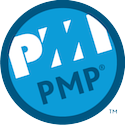
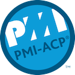

# 读书笔记

---

## 统计

* 原: 32
* 2017: 11
* 2018: 13
* 2019: 24
* 2020: 15

## 书单

### 基础知识

* 代码大全
* 从小工到专家
* HTTP权威指南 
* 图灵程序设计丛书:图解HTTP 
* 程序是怎样跑起来的 (2017)
* 图灵程序设计丛书:图解TCP/IP(第5版) (2017)
* 网络是怎样连接的 (2018)
* 图解性能优化 (2018)
* 程序员的数学 (2018)
* 代码整洁之道: 程序员的职业素养 (2019)
* 鸟哥的私房菜-基础篇(第三版) (2019) 
* 鸟哥的私房菜-基础篇(第四版) (2020)
* 鸟哥的私房菜-服务器架设篇(第三版)(2019)
* 大话数据结构 (2020)

### 程序设计

* 实现模式(修订版) 
* 架构整洁之道(2019)
* 重构:改善既有代码的设计 (2017)）
* 代码之髓(2017)
* 代码整洁之道 (2017)
* 编写可读代码的艺术 
* 演进式架构(2020)

### Linux

* RH124(2019)
* RH134(2019)
* Rh254(2019)
* Linux命令行与shell脚本编程大全(第2版) (2017)

### 产品

* 你的灯亮着吗
* 黑客与画家:硅谷创业之父Paul Graham文集 
* 设计原本
* 用户故事与敏捷方法(2018)
* 餐巾纸的背面:一张纸+一支笔,画图搞定商业问题(丹•罗姆)(2017)
* 用图秀演讲(丹•罗姆)(2018)
* 一页纸创意思考术(丹•罗姆)(2018)
* 用户故事地图(2018)
* 重来(2019)
* 一页纸工作整理术(丹•罗姆) (2019)
* 学会提问(2019)
* The Four Steps to the Epiphany (2019)
* 重来2 (2019)
* 金字塔原理1(2020)
* PMI-PBA认证与商业分析实战精析(2020)

### 项目管理

* 项目管理知识体系指南
* 人月神话
* 人件 (2017)
* ACP (2018)
* 解析极限编程--拥抱变化 (2020)

### CI/CD

* 第一本docker书
* docker容器与容器云
* 奔跑吧Ansible 
* 持续交付发布可靠软件的系统方法 (必读)
* 凤凰项目 (2019)
* 持续交付2.0 业务引领的DevOps精要 (2020)

### 微服务

* 微服务设计
* 生产微服务(2017)

### 工具

* Vim实用技巧 (2018)

### 技术

* 漫画区块链 (2020)

### 语言

* Head First C
* 从paxos到zookeeper:分布式一致性原理
* RESTful Web APIs
* 深入浅出java
* Headfirst Java 第二版 (2020)
* 深入浅出Python
* 深入浅出设计模式
* 深入浅出PHP&Mysql
* 构建高性能Web站点
* 实现领域驱动设计
* morden php 
* 松本行弘的程序世界 (2017)
* 代码的未来 (2017)

### 数据库

* SQL反模式
* MongoDB权威指南 
* mixi. memcached
* 高性能mysql(2018)

### 安全

* 白帽子讲Web安全(纪念版)

### 测试

* Google软件测试之道(2018)

### 非技术的有趣书籍

* 人类简史
* 论中国
* 秦谜(2018)
* 高效能人士的7个习惯(2018)
* 秦崩:从秦始皇到刘邦(2019)
* 必然(2019)
* 一万小时天才理论(2019)
* 异类(2019)
* 优秀到不能被忽视 (2019)
* 随机漫步的傻瓜 (2019)
* 影响力大师:如何调动团队力量(原书第2版) (2019)
* 会饮篇 (2020)
* 程序员进阶心法：快速突破成长瓶颈 (2020)
* 沉思录 (2020)
* 黑天鹅 (2020)
* 断舍离 (2020)
* 呼吸 (2020)

### 音频

* 10x程序员工作法(2019)
* 从0开始学架构(2019)
* 说透中台(2019)
* 趣谈网络协议(2019)

## 未读书单

### 技术

* 敏捷软件开发(原则模式与实践) 
* 图解网络硬件 
* 七周七并发模型
* 传世经典书丛:UNIX编程艺术 
* 经典原版书库：深入理解计算机系统（英文版·第2版） 
* 编译原理(英文版•第2版) 
* 哥德尔、艾舍尔、巴赫:集异璧之大成 
* 高可用性MySQL(影印版) 
* 编程珠玑
* 系统思考(白金版) 
* 计算机程序的构造和解释(原书第2版) 
* Web性能权威指南 
* SRE:Google运维解密 
* DNS与BIND(第5版) 
* 程序员的数学2:概率统计 
* 程序员的数学3:线性代数 
* Common LISP: A Gentle Introduction to Symbolic Computation 
* 码农·Lisp面面观
* RabbitMQ实战:高效部署分布式消息队列 
* 图灵程序设计丛书:自制编程语言 
* 领域驱动设计:软件核心复杂性应对之道 
* 金字塔原理2
* CDN技术详解(未买)
* 深入理解计算机系统(第三版)中文版
* 算法导论
* 计算机网络:自顶向下方法(原书第7版) 
* 重构 改善既有代码的设计 第2版 全彩精装版
* 算法设计与应用 
* 算法之美
* 程序员修炼之道：通向务实的最高境界
* 互联网企业安全高级指南 
* 大教堂与集市
* Effective Devops
* Effect Java
* 精通区块链编程：加密货币原理、方法和应用开发
* 社会网络分析：方法与实践
* 深入理解Java虚拟机：JVM高级特性与最佳实践

### 非技术

* 世界秩序
* 枪炮, 病菌与钢铁
* 自私的基因
* 国富论
* 全球通史
* 文明是副产品
* 理想国
* 耶路撒冷三千年
* 科技想要什么
* 失控：全人类的最终命运和结局
* 非暴力沟通
* 穷查理宝典
* 埃及四千年
* 卓有成效的管理者
* 古埃及死者之书
* 人性论(上, 下)

### 音频

* Go语言核心36讲
* 深入剖析Kubernetes
* 程序员的数学基础课
* Linux性能优化实战
* MySQL实战45讲
* 左耳听风
* 透视HTTP协议
* OpenResty从入门到实战
* 许式伟的架构课
* 深入浅出计算机组成原理
* 趣谈Linux操作系统
* MySQL实战45讲
* 数据结构与算法之美
* 代码精进之路

## badges

 