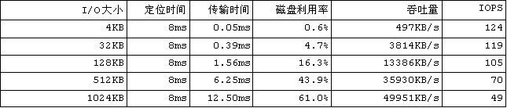

###预读

---

**三类基本的缓存管理和优化问题**

* 预取(`prefetching`)算法,从`慢速存储`中`加载数据到缓存`.
* 替换(`replacement`)算法,从`缓存`中`丢弃无用数据`.
* 写回(`writeback`)算法,把`脏数据`从`缓存中保存到慢速存储`.

**预取**

`因为`:

磁盘: `擅长` `顺序`读写, `不善于` `随机I/O`, `I/O延迟非常大`.

`所以`:

产生了两个方面的预读需求:

* `磁盘的需求`
* `程序的需求`

**预读:磁盘的需求**

`磁盘的一个典型I/O操作`:

1. 数据定位
2. 数据传输

I/O的粒度越大,传输时间在总时间中的比重就会越大,因而磁盘利用率和吞吐量就会越大.`预读算法`,尽一切可能`避免` `小尺寸`I/O.

`随机读大小与磁盘性能的关系`:

**预读:程序的需求**

应用程序处理数据的一个典型流程是这样的:

		while(!done){
			read();
			compute();
		}
		
假设这个循环重复5次,总共处理5批数据,则程勋运行的时序图如下所示:

磁盘和CPU是在交替忙碌:

* 当进行磁盘I/O的时候,CPU在等待
* 当CPU在计算和处理数据时,磁盘是空闲的

`预读的解决方案`:

当CPU在开始处理第1批数据的时候,由内核的预读机制预加载下一批数据,预读是后台异步进行的.

`我们并没有改变应用程序的行为`:程序的下一个读请求仍然是在处理完当前的数据之后才发出的.只是这时候的被请求的数据可能已经在内核缓存中了,无须等待,直接就能复制过来用.**`异步预读的功能是对上层应用程序"隐藏"磁盘I/O的大延迟.虽然延迟事实上仍然存在,但是应用程序看不到了,因而运行的更流畅`**

**预读的概念**

`预取的2种方案`:

* `启发性的(heuristic prefetching)`: 自发的进行`预读`决策,对上层应用透明,对算法要求较高,存在`命中率`问题.
* `知情的(informed prefetching)`: 提供`API`,由上层程序给予明确的预读指示:
	* `posix_fadvise(2)`
	* `readahead(2)`
	* `madvise(2)`

`它们主要的任务和功能`:

* `批量`: 把小I/O聚集为大I/O,以改善磁盘的利用率,`提升系统的吞吐量`.
* `提前`: 对应用程序隐藏磁盘的I/O延迟,`加快程序运行`.
* `预测`: 预读算法的核心任务,前两个功能的达成都有赖于准确的预测能力.

**预读算法的核心任务:预测**

遵循了一个简单有效的原则:`读模式分为随机读和顺序读两大类,并只对顺序读进行预读`.这一原则相对保守,但是可以保证很高的预读命中率,同时有效率/覆盖率也很好.因为顺序读是最简单而普遍的,而随机读在内核来说也确实是难以预测的.

**Linux的预读架构**

Linux内核会将它最近访问过的文件页面缓存在内存中一段时间,这个文件缓存被称为`pagecache`.

一般的read()操作发生在应用程序提供的缓冲区与pagecache之间.预读算法则负责`填充`这个pagecache.应用程序的读缓存一般都比较小,比如文件拷贝命令cp的读写粒度就是4KB.内核的预读算法则会以它认为更合适的大小进行预读I/O,比如16-128KB.

把mmap缺页I/O的预取算法单独列出,形成了read-around/read-ahead两个独立算法.

`read-around`算法适用于那些以mmap方式访问的程序代码和数据,它们具有很强的局域性(locality of reference)特征.当有缺页事件发生时,它以当前页面为中心,`往前往后`预取共计128KB页面.

`readahead`算法主要针对read()系统调用,具有很好的顺序特性.

**预读算法概要**

`顺序性检测`:
	* 这是文件被打开后的第一次读,并且读的是文件首部.
	* 当前的读请求与前一(记录的)读请求在文件内的位置是连续的.
`流水线预读`

Linux用两个预读窗口来跟踪当前顺序流的预读状态:

* `current窗口`
* `ahead窗口`

其中的ahead窗口便是为流水线准备的:当应用程序工作在current窗口时,内核可能正在 ahead窗口进行异步预读;一旦程序进入当前的ahead窗口,内核就会立即往前推进两个窗口,并在新的ahead窗口中启动预读I/O.

`预读的大小`: 

预读窗口的初始值是读大小的二到四倍,后续的预读窗口将逐次倍增,直到达到系统设定的最大预读大小,其缺省值是128KB.
