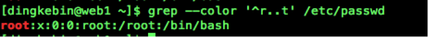
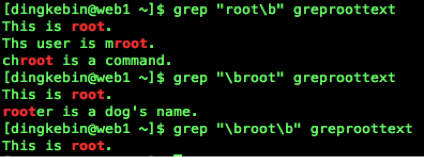

#04_04 grep及正则表达式

###笔记

---

**grep,egrep,fgrep**

`grep` `[options]` `PATTERN` `[FILE…]`

* `grep`: 根据模式,搜索文本,并将符合模式的文本行显示出来.  
* `Pattern`: 文本字符和正则表达式的元字符组合而成匹配条件.

		$ grep 'root' /etc/passwd
		root:x:0:0:root:/root:/bin/bash
		operator:x:11:0:operator:/root:/sbin/nologin
		
`-i`: 忽略大小写  
`--color`: 关键词加颜色  
`-v`: 显示没有被漠视匹配到的行  
`-o`: 只显示被漠视匹配到的字符串  

**正则表达式**

Regular EXPression, REGEXP

`元字符`:

* `.`(点): 匹配任意单个字符
* `*`: 匹配其前面的字符任意次

		a, b, ab, aab, acb, adb, amnb
		a*b => b, ab, aab
		a.*b => ab,aab,acb,adb, amnb
* `.*`: 任意`长度`的`任意`字符
* `\?`: 匹配其前面的字符1次或0次.('\'转义字符)
* `\{m,n\}`: 匹配其前面的字符`至少m`次,`至多n`次.

		\{1,\}: 至少1次
   		\{0,3\}: 最多3次

**位置锚定**

* `^`: 锚定行首, 此字符后面的任意内容必须出现在行首.

* `$`: 锚定行尾,此字符前面的任意内容必须出现在行尾.

* `^$`: 空白行
(图片为一个空白行)

* `\<` 或 `\b`: 锚定词首,其后面的任意字符必须作为单词的首部出现

* `\>` 或 `\b`: 锚定词尾,其前面的任意字符必须作为单词的尾部出现

		
		`\<root\>`: 寻找作为一个整个root单词的出现

###整理知识点

---