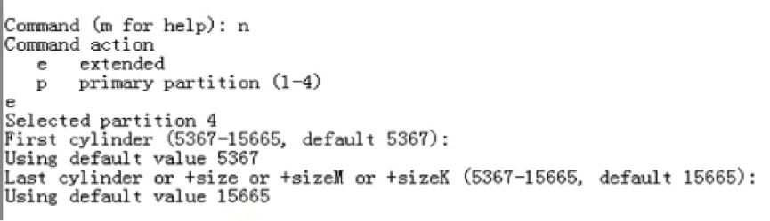
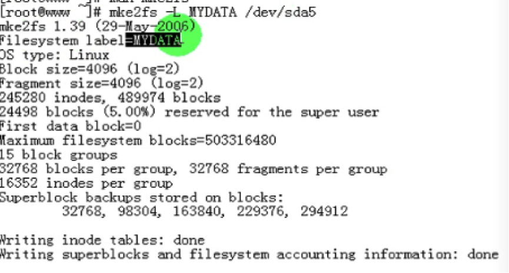
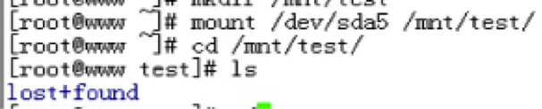
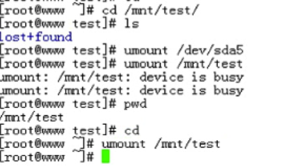

#09_02 磁盘及文件系统管理详解之五

###笔记

---

**文件系统管理**

重新创建文件系统会损坏原有文件.

1. 创建扩展分区

	
		

2. 创建分区

	
	
3. 保存退出

	
	
4. 更新内核
	
	
	
**创建文件系统**

`mkfs`: make file system

* `-t FSTYPE`	

	

mkfs -t ext2 = mkfs.ext2
mkfs -t ext3 = mkfs.ext3

`ext3`: 支持日志

`cat /proc/filesystems`: 查看当前内核所支持的文件系统

`mke2fs`:

* `-j`: 创建`ext3`类型文件系统
* `-b BLOCK_SIZE`: 指定块大小,默认为`4096`: 可用取值为 1024,2048 和 4096
		
	 
	
* `-L LABEL`: 指定分区卷标

	 

* `-m #`: 指定预留给超级用户的块数百分比
	
	 

* `-i #`: 用于指定为多少字节的控件创建一个inode, 默认为 8192. 这里给出的数值应为块大小的`2^n`倍.
* `-N #`: 指定inode个数
* `-F`: 强制创建文件系统
* `-E`: 用于指定额外文件系统属性

**blkid**

查询或查看磁盘设备的相关属性

		# blkid /dev/sda5
		/dev/sda5: UUID="63b22d97-ca4a-4a6d-8f2c-126cbab50dc6" TYPE="ext2"
		
* `UUID`: 文件系统的唯一id
* `TYPE`: 文件系统类型
* `LABEL`: 卷标

**e2lable**

用户查看或定义卷标

`e2label` `设备文件` `卷标:设定卷标`

**tune2fs**

调整文件系统的相关属性

* `-j`: 不损坏原有数据,将 `ext2` 升级为 `ext3`
* `-L LABEL`: 设定或修改卷标
* `-m #`: 调整预留百分比
* `-r #`: 指定预留块数
* `-o`: 设定默认挂载选项
* `-o acl`: 永久支持`ACL`功能
* `-c #`:指定挂载次数达到`#次`之后进行`自检`, `0`或`-1`表示`关闭`此功能 
* `-i #`:每挂载使用数达到`#天`之后进行`自检`, `0`或`-1`表示`关闭`此功能
* `-l`: 显示`超级块`中的信息	
	
	
**dumpe2fs**

显示文件系统属性信息

**fsck**

检查并修复linux文件系统

* `-t FSTYPE`: 指定文件系统类型
* `-a`: 自动修复

**e2fsck**

专用于修复 `ext2/ext3/ext4` 文件系统

* `-f`: 强制检查
* `-p`: 自动修复

**挂载&&卸载**

`挂载`: 将新的文件系统`关联`至`当前根`文件系统.  
`卸载`: 将某文件系统从与`当前根`文件系统的`关联关系`予以`移除`.

`mount` `设备` `挂载点`

`设备`:

* `设备文件`: /dev/sda5
* `卷标`: LABEL="xxxx"
* `UUID`: UUID+""

`挂载点`: `目录`

* 要求:
	* 此目录`没有`被其他进程`使用`
	* 目录得`事先存在` 
	* 目录中的原有文件将会暂时隐藏,除非卸载才能看见
	
挂载完成后,要通过`挂载点`访问对应文件系统上的文件.

* `/mnt`: 挂载其他额外的分区系统
* `/media`: 挂载移动设备

`umount`: 卸载某文件系统

* `umount` `设备`
* `umount` `挂载点`

卸载注意事项: 挂载的设备`没有进程使用`.

`mount`: 显示当前系统已经挂载的设备及挂载点

`mmount` `[options]` `[-o options]` `DEVICE MOUNT_POINT`

* `-a`: 表示挂载`/etc/fstab`文件中定义的所有文件系统(开机时已经挂载了)  
* `-n`: 默认情况下,mount命令每挂载一个设备,都会把挂载的信息保存至`/etc/mtab`文件，使用-n选项意味着挂载设备时`不把信息写入此文件`  
* `-t FSTYPE`: 指定正在挂载设备上的文件系统的类型. 不使用此选项时, mount会调用`blkid`命令获取对应文件系统的类型
* `-r`: `只读挂载`, 挂载`光盘`时常用此选项
* `-w`: `读写`挂载
* `-o`: 指定`额外的`挂载选项,也即指定文件系统启用的属性.
	* `remount`: 重新挂载当前文件系统
	* `ro`: 挂载为只读
	* `rw`: 读写挂载

示例:

1. `准备挂载`

		
	
2. `挂载`
	
		
	
3. `卸载`

	
	
###整理知识点

---