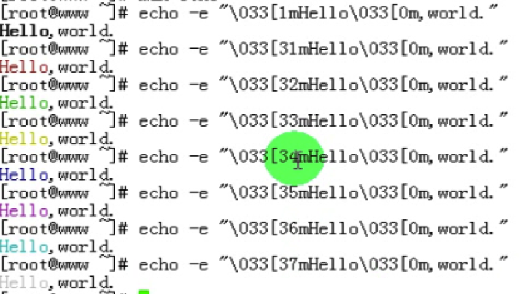
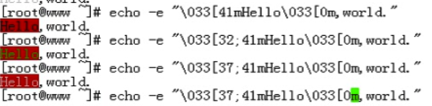
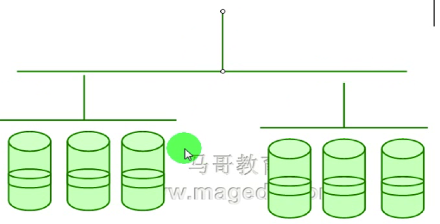
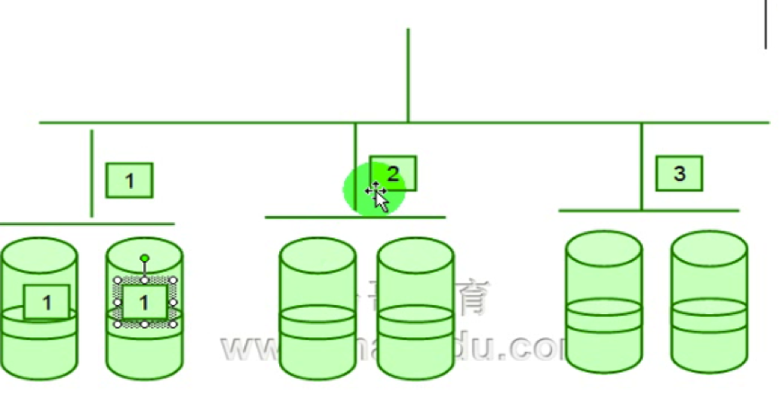

#10_01 Raid及mdadm命令之一

###笔记

---

**用echo前景色**

**用echo显示背景色**

**用echo显示前景色+背景色**

**MB和Mb的区别**

M`b` * 8 = M`B` (1`B` = 8`b`)

MB(全称MByte):计算机中的一种储存单位 读作“兆”.数据单位`MB`与`Mb`(注意B字母的大小写)常被误认为是一个意思,其实

* `MByte`含义是"`兆字节`"
* `Mbit`的含义是"`兆比特`".

`MByte`是指`字节数量`,`Mbit`是指`比特位数`.MByte中的"Byte"虽然与Mbit中的"bit"翻译一样,都是`比特`,也都是数据量度单位,但二者是`完全不同`的.`Byte`是"`字节数`", `bit`是"位数",在计算机中每八位为一字节,也就是`1Byte＝8bit`,是`1:8`的对应关系.因此在书写单位时一定要注意B字母的大小写和含义.

####RAID

`RAID`: Redundant Arrays of Inexpensive Disks. 廉价冗余磁盘阵列. 后来改名为 
`Redundant Arrays of Independent Disks.(独立磁盘阵列)`.

`RAID level`: 级别仅代表磁盘的`组合方式不同`,没有上下之分.

* `0`: 条带: 性能表现: 读,写. `没有冗余能力`(容错能力). 空间利用率: nS (n:盘数, s:一块盘的存储空间能力). `至少`2块盘.
* `1`: 镜像: 性能表现: 写性能下降, 读性能提升. 有冗余能力. 空间利用率: 1/2 (50%). 至少2块盘.
* `2`
* `3`
* `4`: 校验码 (只能坏一块盘)
* `5`: 校验码: `轮流`做校验盘(只能坏一块盘). 性能表现: 读,写提升. 有冗余能力. 空间利用率: n-1/n* . 至少需要3块盘.
* `10`: 性能表现: 读,写提升. 用冗余能力. 空间利用率 1/2. 至少需要4块盘.
* `01`: 性能表现: 读,写提升. 用冗余能力. 空间利用率 1/2. 至少需要4块盘.
* `50`: 2块盘做校验盘. 性能表现: 读,写提升. 有冗余能力.空间利用率 (n-2)/n.至少需要6块盘.
* `jobd`: 性能表现:无提升. 无冗余能力. 空间利用率: nS. 至少需要2块盘.

考虑数据`速度`, 还要考虑数据`可用性`.

**数据条带化**

把`连续`的数据`分割`成`相同大小的数据块`,把`每段`数据分别写入到`阵列中不同磁盘`上的方法.

`RAID 0`提高存储性能的原理是把连续的数据分散到多个磁盘上存取,这样,系统有数据请求就可以被多个磁盘并行的执行,每个磁盘执行属于它自己的那部分数据请求.

**磁盘镜像技术**

保证数据可用性. 2块硬盘, 数据2块硬盘都保存一份.

**校验码技术**

比如4块盘, 数据评分分在 4-1块上. 1,2,3 盘数据的校验码放在第4块盘上. 但是坏了2块盘解决不了. 优点:速度和可用性都提升. (利用校验码,可以在坏一块盘的基础上用好的盘去推算坏掉的盘的数据)

**条带加镜像**

* `RAID 0+1`: `先条带在镜像`. 坏一块盘,如果要恢复数据,会影响全局的盘. 因为2边条带可能不一致.

	

* `RAID 1+0`: `先镜像在条带`. 坏一块盘,如果要恢复数据.只是影响自己内部.

	
	
**RAID 1+0 和 RAID 0+1**	
	
RAID `1+0` 性能`优于`(在磁盘坏需要修复的时候) RAID `0+1`

**JDOB**

实现将多个小盘组合成一块大盘. `不能提升速度`,`不能保证安全性`.

但是,`Haddop` `会用到`. 因为Haddop 内有`HDFS`(冗余)来保证文件的安全性.

###整理知识点

---