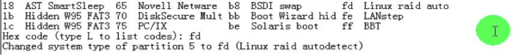
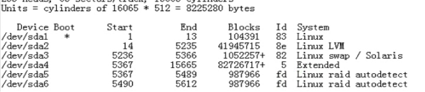
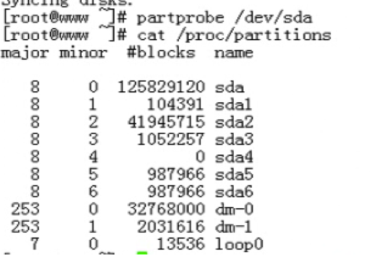
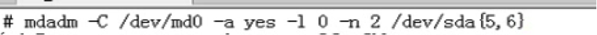
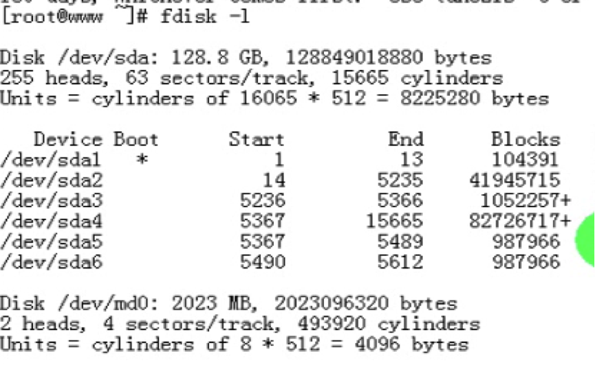
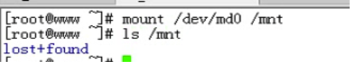
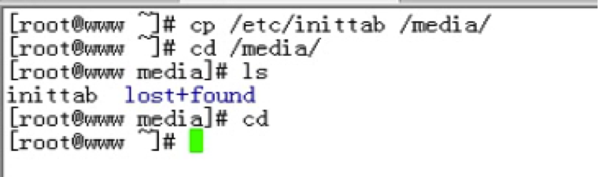
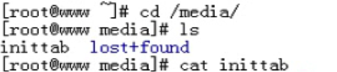
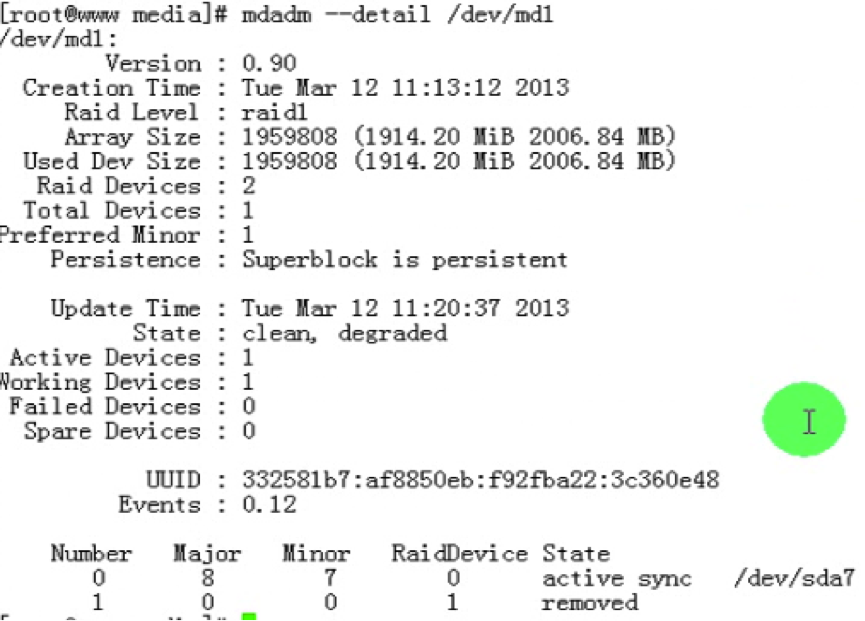

#10_02 Raid及mdadm命令之二

###笔记

---

* `IDE`: 并行, 一个控制器可以连接2个盘 (主,从)
* `SATA`: 串行, 一个控制器可以连接一个盘
* `USB`: 串行
* `SCCI`: 并行总线

SAS,SCSI与SATA接口,IDE接口不同点: 一根线可以接多块硬盘 。

**LUN**

`Logic Unit Number`. 每个盘都有一个`逻辑单元号`.

数据传输过来,在数据首部需要包含传输到哪个`target`下的哪个`LUN`.

**RAID实现方式**

* 硬件RAID
* 软件RAID

**软件RAID**

通过内核中的`md`(multi disks).

首先通过`md`模拟一个RAID(逻辑RAID).

`/dev/md#`(#只是表述不同的radi设备).

所有信息存储是通过`/dev/md#`(模拟出的设备),然后再有`md模块`根据`radi level`分发信息到各个真实硬盘.

**mdadm**

`md` 管理器. 将任何块设备做成RAID.

`模式化的命令`:

* 创建模式 `-c`
	* `-l`: 级别
	* `-n`: 设备个数 
	* `-a (yes|no)`: 是否自动为其创建设备文件
	* `-c`: CHUNK 大小, 2^n, 默认为64k
	* `-x #`: 制定空闲盘个数
* 管理模式 `-add,--del,--fail`
		
		mdadm /dev/md# --fail /dev/sda# 
		磁盘阵列(md#)中的sda#盘模拟损坏
* 监控模式 `-F`
* 增长模式 `-G`
* 装配模式 `-A`: 当操作系统坏了, 重新识别为raid, 并组装起来. 

**查看RAID阵列的详细信息**

`mdadm -D /dev/md#`

* `--detail`

**停止阵列**

`mdadm -S /dev/md#`

* `--stop`

**将当前RAID信息保存至配置文件,以便以后进行装配**

`mdadm –D –scan > /etc/mdadm.conf`

**举例:创建raid0 2G**

1. 创建新的分区

	
	

2. 通知内核更新
	
	
	
3. 开始创建

	
	

4. 检查创建情况

   `/proc/mdstat 当前系统上所有启用状态的设备的情况`
   
	
  
5. 启用raid设备(格式化,挂载)

	 
	
   
6. md0 为 2G 设备

	

7. 挂载

	
		
**举例:创建RAID1 2G**

1. 镜像在做数据同步

	`resync = ??% (表示镜像在做数据同步)`
	
		
2. 复制文件

	
	
3. 检查 MD1 情况
	
	
	
4. 模拟磁盘损坏
	
	

5. 查看md1

		
	
6. 文件还是可以正常访问

	
	
7. 移除坏掉的盘
	
	
	

8. 替换新的盘上去

		
**WATCH命令**

`watch -n # 'COMMAND'`

周期性的执行指定命令,并以全屏方式显示结果.

* `-n #`: 指定周期长度,单位为秒,默认为2.	

**举例:保存配置文件到mdadm.conf,读取这个配置文件**

1. 保存配置文件到`mdadm.conf`
	
	
	
2. 装配模式读取`mdadm.conf`

	
	
**mke2fs -E 调优**

每次软raid 生成一个 chunk 都会计算相当于多少个 block

`-E`: 指定条带大小(chunk/block),会`对raid提升性能`.	
			
		# mke2fs -j -E stride=16 -b 4096 /dev/md0
	
###整理知识点

---