#10_03 LVM之一

###笔记

---

**mdadm**

用户空间工具, 管理工具. 软raid是靠内核的.

**DM**

Device Mapper 设备映射. 提供逻辑设备

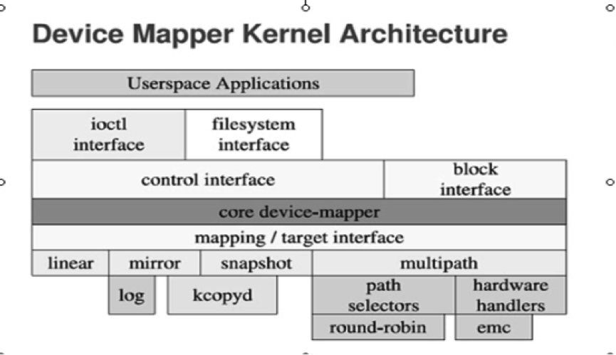

* 多路径
* 快照
* 逻辑设备动态增减可用空间

快照必须和逻辑卷在同一个卷组中.

物理卷加入卷组会被`分成` `pe: physical extend`,盘区.  
到了逻辑卷中叫`le: logical extend`.  
`扩展空间`就是`增加pe`.

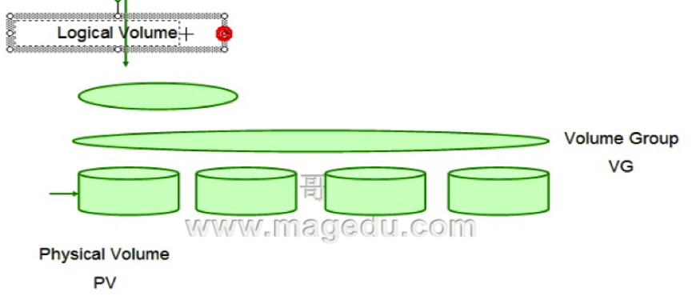

**pv,vg,lv一些常用命令**

* `pv`

	* pvcreate
	* pvremove
	* pvscan
	* pvdisplay
	* pvmove
	
* `vg`

	* vgcreate
	
			vgcreate VG_NAME /PATH/TO/PV
			-s #: PE大小,默认为4MB

	* vgremove
	
			删除VG(只有没创建lV才可以删除VG)
					
	* vgextend
	* vgreduce
	* vgdisplay
	* vgscan
	* vgs
	
* `lv`

	* lvcreate
			
			lvcreate –n LV_ANME –L 空间大小 VG_NAME
	
	* lvremove			
	* lvextend
	* lvreduce
	* lvresize
	* lvs
	* lvdisplay

**举例:创建10G pv**

1. 创建一个7G,3G的pv (一个额外的5G备用,注意类型 8e)

	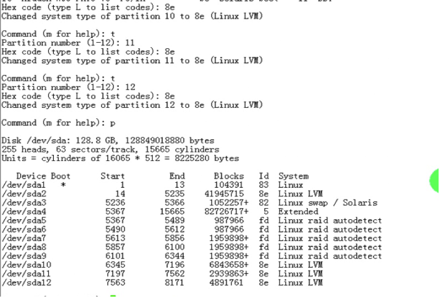	
	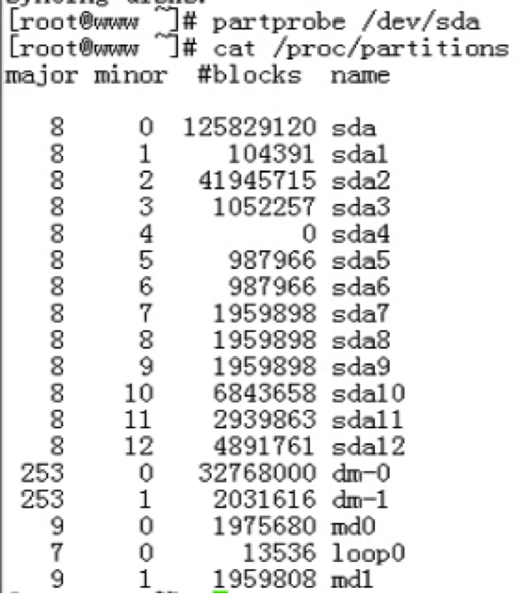	

2. 创建pv

	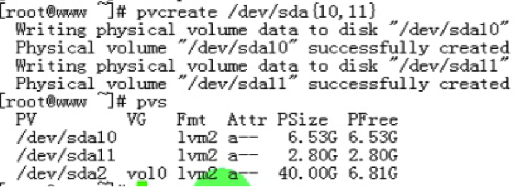
	
3. 创建vg
 
	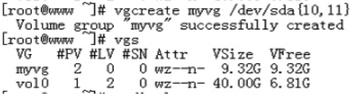	

4. 删除VG(只有没创建lV才可以删除VG)

		

5. 重新创建 PE 为 8MB 的 VG

	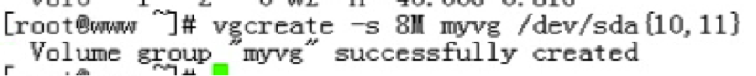
	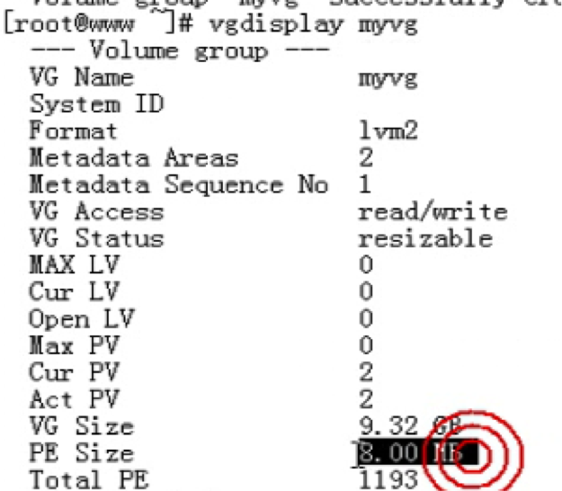		
	
**移除一个pv**

1. 检查pv

	

2. 挪走 sda11 的数据

	

3. 挪走 sda11(pv)

		
	
4. 删除pv(sda11)	
	
		

**增加一个pv到vg**

1. 创建pv

	

2. 加入到vg
	
	
	
**创建lv**

`lvcreate –n LV_ANME –L 空间大小 VG_NAME`

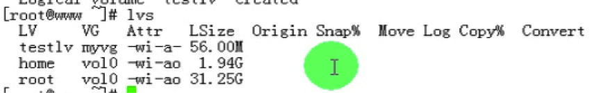

**格式化**

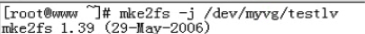

**挂载**

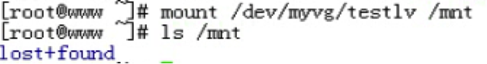

**挂载后的名字不同**

**testlv只是一个连接,连接到/dev/mapper/xxx**

**移除一个逻辑卷**

1. 移除一个逻辑卷提示错误,需要先卸载

	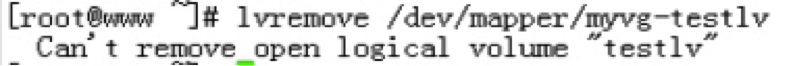

2. 卸载

	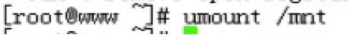
	
3. 移除lv

	
	
###整理知识点

---