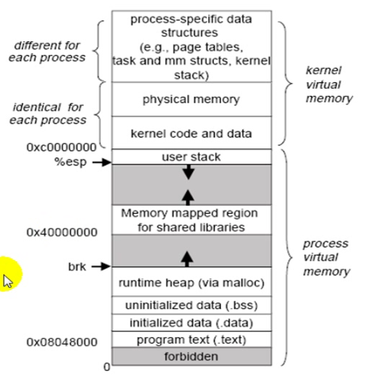
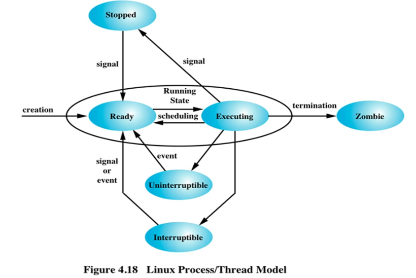

#13_03_Linux进程管理之一

###笔记

---

**OS**

* Kernel
* process

**内存**

* 线性地址
* 物理地址

`线性地址`:

以32位系统举例,每一个进程上来都认为自己有`4G`内存可用.其中的`1G`给内核用.每个进程看当前系统,都只有`2`个进程:自己和内核.这个是逻辑上的假象.在真正物理内存看来是有`多个进程`和`1个内核`共处一起.

CPU将`除了内核`的内存划分为一个一个`页框`(物理内存),每个都是固定大小的存储单元.当任何一个进程启动起来,内核启动进程,找到符合进程内存需求的n个`页面`(可能是不连续的),但是对于每一个进程自己看来是`连续`的,因为进程看到的是在内核中的`task structrue`. `页面`映射到`页框`.

内核负责管理`页面`,在`task structure`还有一个`子结构`,定义了每一个`页面数据`(进程自己看见的)和`页框`(物理内存)的对应关系.

**MMU**

Memory Management Unit: 内存管理单元.

任何一个进程的`页面`数据需要找到对应的物理`页框`时(其实就是`映射`关系),由`MMU`负责转换.

`TLB`: 每次转换都需要相当的时间,会把`映射关系`缓存在CPU中的缓存中.当缓存空间填满了以后,会清空最少使用到的.把新的填入进来.

`MMU`是`CPU`的一个`子芯片`.

**进程上下文切换**

CPU轮询进程切换就是`进程上下文切换`.

上下文可以理解为进程自己的执行环境.就是进程的`环境切换`.

* 将一个要退出的进程的`现场`保存在内核的`task structture`文件中.
* 将要上场的进程的`现场`从内核的`task structture`文件`载入`进去.

**内核空间和用户空间**

内核分为2段:

* 内核空间
* 用户空间: 有多个`用户进程`,`进程的相关信息,在内存中的位置`,状态信息(上一次运行在哪个位置)都保存在内核的`task structture`中(内核空间).

**恢复现场**

CPU通过寄存器载入`task structrue`的信息(进程的信息,进程的状态:这个进程上次运行到哪个步骤),就是`恢复现场`.因为CPU轮询,进程可能还没运行结束就退出CPU了.

**硬盘**

硬盘属于`I/O`设备,计算机所有运行都在`内存`和`cpu`中完成.

**内核**

内核负责追踪每一个进程的执行信息.

`task structure`(任务结构),保存每一个进程的数据结构(进程的描述信息).

* PPID
* PID
* 上一次指令执行到第几条
* ...

内核数据结构,在CPU轮询后,让进程能够从上一次退出的步骤继续运行.

**进程的内存地址空间**

* `.txt`: 文本段,存储`指令`,不允许修改只读.
* `.data`: 初始化的数据.全局变量.
* `.bss`: 未初始化的数据.
* `heap`: 堆内存.内核如果发现了堆增长了,内核会动态申请`页面`(空间).比如读一个文本,只有加载到内存才可以使用,所以需要动态的申请内存.
* `stack`:栈内存.存储`本地变量`.
* `Memory mapped region for shared libraries`: `共享库`.一个库文件只有载入到内存才能被程序调用.把库所在的位置的页面`映射`进来.多个进程共同使用.

`内核空间`是连续的,`用户空间`是分成各个`页面`的(被映射进来的).

**进程查看**

* 进程号
* 占用的内存空间
	* `rss(resident size)`: 常驻内存集,位于物理内存当中.不能被交换(`swap`)出去.(打开的文件可以被交换出去,指令和变量不能被交换出去).
	* `vsz`: 虚拟内存大小,算上`Memory mapped region for shared libraries`段.
* 用户(进程以用户的身份运行)
* 父进程
* CPU运行了多长时间
* ...

**CPU的计算能力**

是随着时间的流逝而提供的.

**指令怎么在CPU上执行**

* `单核`: 一个时刻只能在cpu上执行一条指令.
* `双核`: 指令可以运行在2个CPU上,不能`同时`执行.可以2个进程运行在2个CPU上.

**进程实现多个执行流**

`并行编程模型`,`thread`多线程.一个进程可以运行在多个cpu上.

**并行编程模型**

* 多进程模型
* 多线程模型(启动一个进程)

**进程的状态**

* `Stopped`: 停止,不会再被调度到CPU上运行
* `Ready`: 就绪,排队等待调度
* `Execyting`: 正在运行,获得CPU
* `Zombie`: 僵尸进程,进程运行结束,没有删除`task structure`,不能正常退出,僵死状态.
* `Uninterruptible`: 睡眠态(`sleep`),不可中断的睡眠.比如需要等待外部I/O,读取一个文件读完才能被唤醒.
* `Interruptible`: 睡眠态(`sleep`),可中断的睡眠.空闲状态.

**init**

`kernel`创建`init`进程: 第一个进程,所有进程的父进程.通过clone的方式做出子进程.

###整理知识点

---