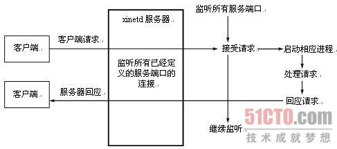

#14_03_bash脚本编程之十一(Linux启动流程之三) SysV服务脚本

###笔记

---

####服务类脚本

遵循`SysV`风格.

每一个脚本至少接受4个参数:

1. `start`
2. `stop`
3. `restart`
4. `status`

**`checkconfig`**

用来定义接受另外一个命令的控制,并自动在对应的`RC#.d`下创建一个连接.

通过命令`chkconfig`.

		# chkconfig: 345 95 5
		
`chkconfig` `runlevels`(在哪些级别下默认是启动) `SS`(启动的优先次序) `kk`(关闭的优先次序)
		
`runlevels`为`-`表示,没有级别默认为`S*`开头的链接.		
当`chkconfig`命令来为此脚本在`rc#.d`目录创建链接时.`runlevels`表示默认创建为`S*`开头的连接,除此之外的级别默认创建为`K*`开头的连接.并且S后面的启动优先级为`SS`所表示的数字.同理的K后面的关闭优先级为`KK`所表示的数字.

**`description`**

用于说明此脚本的简单功能,\,续行.
		
		# description
		

**`chkconfig`**

虽然上面两个命令在文件里面是注释的,但是`chkconfig`会自动分析这两行.

`chkconfig --list`: 查看所有独立守护服务的启动设定(独立守护进程).

`chkconfig --list SERVICE_NAME`: 服务名,查看一个特定的服务.

`chkconfig --add SERVICE_NAME`: 添加服务,只是决定系统下一次重新启动时启动对应的服务,对当前没有影响.

`chkconfig --del SERVICE_NAME`: 删除服务

`chkconfig --level RUNLEVELS(级别) SERVICE_NAME on/off` 如果省略级别指令,默认为(2345)级别.

		chkconfig --level 25 myservice off

**示例**

`myservice`:

		[root@dev-server-1 init.d]# cat myservice
		#!/bin/bash
		#
		# chkconfig: 2345 77 22
		# description: Test Service
		#
		LOCKFILE=/var/lock/subsys/myservice
		
		status(){
		  if [ -e $LOCKFILE ]; then
		    echo "Running..."
		  else
		    echo "Stopped."
		  fi
		}
		
		usage(){
		  echo "`basename $0` {start|stop|restart|status}"
		}
		
		case $1 in
		start)
		  echo "Starting..."
		  touch $LOCKFILE ;;
		stop)
		  echo "Stopping..."
		  rm -f $LOCKFILE &> /dev/null ;;
		restart)
		  echo "Restarting...";;
		status)
		  status ;;
		*)
		  usage ;;
		esac

		[root@dev-server-1 init.d]# chkconfig --add myservice
		[root@dev-server-1 rc.d]# find ./ -name "*myservice"
		./rc5.d/S77myservice
		./rc3.d/S77myservice
		./rc6.d/K22myservice
		./rc1.d/K22myservice
		./rc4.d/S77myservice
		./rc0.d/K22myservice
		./rc2.d/S77myservice
		./init.d/myservice
		
		[root@dev-server-1 init.d]# chkconfig --del myservice
		[root@dev-server-1 init.d]# cd ..
		[root@dev-server-1 rc.d]# find ./ -name "*myservice"
		./init.d/myservice

**`/etc/rc.d/rc.local`**

系统最后启动的一个服务,准确说应该执行的一个脚本.

**`/etc/inittab`(红帽5)的任务**

1. 设定默认运行级别
2. 运行系统初始化脚本
3. 运行指定运行级别对应的目录下(`Rc#.d`)的脚本(`S*`和`K*`开头的文件)
4. 设定`Ctrl+Alt+Del`组合键的操作
5. 定义UPS电源在电源故障/恢复时执行的操作
6. 启动虚拟终端(2,3,4,5)
7. 启动图形终端,对应级别下(5)

**守护进程类型**

* 独立守护进程.需要关联至运行级别.
* 短暂(瞬时)守护进程,所有的瞬时守护进程都由独立的守护进程`xinetd(超级守护进程)`管理.不需要设定(关联至)运行级别.超级守护进程(`xinetd`)是瞬时守护进程的`代理人`.

`xinetd`默认没有安装

###整理知识点

---

####xinetd

**守护进程**

守护进程是生存期长的一种进程.它们独立于控制终端并且周期性的执行某种任务或等待处理某些发生的事件.他们常常在系统引导装入时启动,在系统关闭时终止.

守护进程,也就是指`daemon`和`service`.

**Linux守护进程的分类**

可以分为`独立启动守护进程`和`超级守护进程`两类.

独立启动(`stand_alone`):该类进程启动后就常驻内存,所以会一直占用系统资源.其最大的优点就是它会一直启动,当外界有要求时相应速度较快,像`httpd`等进程.

`超级守护进程`: 系统启动时由一个统一的守护进程`xinet`来负责管理一些进程,当相应请求到来时需要通过xinet的转接才可以唤醒被xinet管理的进程.这种进程的优点时最初只有xinet这一守护进程占有系统资源,其他的内部服务并不一直占有系统资源,只有数据包到来时才会被xinet管理员来唤醒.并且我们还可以通过xinet来对它所管理的进程设置一些访问权限,相当于多了一层管理机制.

**示例**

`独立启动`: 银行里有一种单服务的窗口,像取钱,存钱等窗口,这些窗口边上始终会坐着一个人,如果有人来取钱或存钱,可以直接到相应的窗口去办理,这个处理单一服务的始终存在的人就是`独立启动的守护进程`.

`超级守护进程`: 银行里还有一种窗口,提供综合服务,像汇款,转账,提款等业务;这种窗口附近也始终坐着一个人(`xinet`),她可能不提供具体的服务,提供具体服务的人在里面闲着聊天啊,喝茶啊,但是当有人来汇款时他会大声喊一句,小王,有人汇款啦,然后里面管汇款的小王会立马跑过来帮忙办完汇款业务.其他的人继续聊天,喝茶.这些负责具体业务的人我们就称之为超级守护进程.当然可能汇款人会有一些规则,可能不能往北京汇款,他就会提早告诉xinet,所以如果有人来汇款想汇往北京的话,管理员就直接告诉他这个我们这里办不到的,于是就根本不会去喊汇款员了,相当于提供了一层管理机制.针对这种窗口还存在多线程和单线程的区别:

* `多线程`: 将所有用户的要求都提上来,里面的人都别闲着了,都一起干活吧.
* `单线程`: 大家都排好队了,一个一个来,里面的人同一时间只有一个人在工作.

超级守护进程的管理员`xinet`也是一个守护进程,只不过它的任务就是传话.

当然每个守护进程都会监听一个端口(银行窗口),一些常用守护进程的监听端口是固定的,像httpd监听80端口,sshd监听22端口等;我们可以将其理解为责任制,时候等待,有求必应.具体的端口信息可以通过`cat /etc/services`来查看.

**独立运行(stand-alone)的守护进程**

独立运行的守护进程由`init`脚本负责管理,所有独立运行的守护进程的脚本在`/etc/rc.d/init.d/`目录下.系统服务都是独立运行的守护进程,包括`syslogd`和`cron`等.独立运行的守护进程的工作方式称做`stand-alone`,它是UNIX传统的`C/S`模式的访问模式.

**`xinetd`模式运行独立的守护进程**

从守护进程的概念可以看出,对于系统所要通过的每一种服务,都必须运行一个监听某个端口连接所发生的守护进程,这通常意味着资源浪费.为了解决这个问题,Linux引进了"`网络守护进程服务程序`"的概念.xinted(eXtended InterNET daemon)能够同时监听多个指定的端口,在接受用户请求时,它能够根据用户请求的端口不同,启动不同的网络服务进程来处理这些用户请求.可以把`xinetd`看做一个管理启动服务的管理服务器,它决定把一个客户请求交给哪个程序处理,然后启动相应的守护进程.xinetd无时不在运行并监听它所管理的所有端口上的服务.当某个要连接它管理的某项服务的请求到达时,xinetd就会为该服务启动合适的服务器.

`xinetd`和`stand-alone`工作模式相比,系统不想要每一个网络服务进程都监听其服务端口,运行单个xinetd就可以同时监听所有服务端口,这样就降低了系统开销,保护系统资源.但是由于访问量大,经常出现并发访问的情况,xinetd则要频繁启动相应的网络服务进程,反而会导致系统性能下降.
