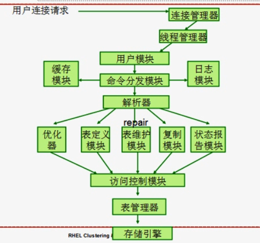

# 32_02_mysql系列之二关系型数据库基础理论

---

## 笔记

---

### `SQL`查询语句

早期叫做`sequel`, 应用于`IBM`的`SystemR`.

`ANSI`发布`SQL`标准:

* SQL-86
* SQL-92
* SQL-99
* SQL-03
* SQL-08

### 使用程序设计语言如何跟`RDBMS`交互

动态`SQL`: 程序设计语言使用函数(mysql_connect())或者方法与`RDBMS`服务器建立链接, 并进行交互: 通过建立链接向`SQL`服务器发送查询语句, 并将结果保存至变量中而后进行处理.

* JDBC (java)

嵌入式`SQL`: 与动态`SQL`类似. 其语言必须程序编译时完全确定下来.

* ODBC (C语言)

### MySQL组成部分

#### 链接管理器

用于接收并处理用户请求, 将用户请求转交给==解析器==. 如果**缓存层**有缓存也直接返回.

可以再次划分为:

* 链接管理器: 监听在某个套接字上, 并接收用户请求.
* 线程管理器: 一个请求需要一个线程去响应. 跟踪用户请求. 用户退出后, 回收该线程.
* 用户模块: 验证用户身份(`username@主机`). 管理用户是否有权限链接. 只是看是否能链接.
* 命令分发模块: 
	* 检查缓存是否存在, 和缓存模块交互.
	* 如果缓存没有看是什么类型命令分发到对应的解析器上(DDL,DML,DCL). 
	* 记录日志, 和日志模块交互.

链接管理器就是一个侦听器, 让`MySQL`服务器处于被动打开状态, 可以接收用户请求.

#### 解析器

词法分析, 语法分析. 如果用户语句以前查询过, 转交给**缓存层**. 如果没有缓存, 则交给**优化器**.

**解析器**用来将语句生成执行树,将解析树交给下列:

* 如果是`SELECT`语句要交给**优化器**.
* 如果是`INSERT,UPDATE,DELETE`语句要交给**表定义(修改)模块**(检查表中是否有对应的逻辑).
* 表维护模块(`repair`语句), 响应用户的修复请求.
* 状态报告模块, 存储`MySQL`执行过程中的状态信息(状态变量).
* 复制模块, 定期主从同步

并不是所有`SQL`语句都要交给解析器, 如果用户只是请求一些状态变量, 就不用交给解析器.

##### 优化器

执行树有`N`条,一个SQL语句执行逻辑有很多种(三个索引,三个索引查询消耗的代价不动). 由**优化器**选择最佳执行逻辑.

优化后交给`MySQL`存储引擎完成操作.

##### 表定义(修改)模块

表创建,删除,重命名,移除,更新或插入之类的操作.

##### 表维护模块

表检查,修改,备份,恢复,优化(碎片整理等)及解析.

#### 访问控制模块

上面解析器所有的请求都要交给**访问控制模块**, 用于检查用户是否有权限执行所请求的操作.

==和用户模块的区别是, 用户模块只是检查用户链接权限==.

#### 缓存

#### 表管理器

**访问控制模块**交给表管理器, 再由**表管理器**交给存储引擎接口.

表管理器, 将表的定义传给存储引擎.

##### 表结构定义文件

负责 创建,读取,修改 **表结构定义文件**.

表结构需要一个特殊文件来保存(**表结构定义文件**), 和表数据是两个不同文件.

##### 表描述符高速缓存

还要维护**表描述符高速缓存**. 很多操作都是对表来进行的, 要保证表随时可以访问到. 表是存储到磁盘上的, 要是每次访问都从磁盘载入太慢了. 需要把表的定义和表的名称都缓存在内存当中.

##### 管理表锁

#### `MySQL`存储引擎

**插件式**存储引擎.

负责将**表示层**转换为**物理层**

`事务`和`锁`都是在存储引擎完成的.

##### `MyISAM` 5.5.8之前

* 不支持事务
* 性能好, 适用于查询多, 修改少. 适用于数据仓库.

##### `InnoDB` 5.5.8之后

* 支持事务
* 工作类似于`ORACLE`机制
* 适用于在线事务处理系统

#### 图示



### 数据如何存储在磁盘上

行数据如果存储在文件系统的数据块上.

磁盘是块设备. 数据是按块加载. 无论`MySQL`读多少行数据, 哪怕这个数据块只有1行符合要求, 也要把这个数据块加载进去. 不是字符设备, 不能按照字符读取.

行有的是变长的, 有的是定长的. 定长的查询速度快.

如果删除旧的行, 会产生空隙, 就会产生碎片导致装载速度慢.

为了管理这些数据, 每个块都有一个块头(记录有多少行,中间是否有空白). 

存储引擎在磁盘块的基础上实现了数据块(多个磁盘块(`disk block`)组成数据块(`data block`)). 存储引擎负责管理数据块.

#### 文件中记录的组织

* 堆文件组织: 一条记录可以放在文件中的任何地方. 只要有空闲空间就往里面放.
* 顺序文件组织: 按照某个字段(搜索码,排序码)值顺序存放. 使用链表解决存储不便(因为按顺序)问题, 所以存储位置可以和行位置不一致.
* 散列文件组织: 人为的将整个表分成N个片, 根据行的某个(些)字段做散列(`hash`)运算, 把结果对应到每个"桶"中.

#### 表空间`table space`

将多个表的数据组织在一个数据文件中的逻辑管理组件.

优点类似于逻辑卷.可以按需要增长, 用多个不同的表空间文件存储与之数目不对应的表的数据文件.

#### 数据字典

关系的元数据存储.

和数据本身没有关系.

元数据:

* 表名
* 属性名(字段名)
* 字段域(类型)和长度
* 视图
* 完整性约束
* 用户名字
* 权限
* 用户密码
* ...

安装`MySQL`后有一个`mysql`数据库, 就是`MySQL`的数据字典.

```shell
mysql> show databases;
...
mysql
...

```

#### 缓冲区管理器

对任何一行数据操作, 都要把数据先加载到内核上. 如果操作的数据大于内存空间(内存塞满空间,加载新的块),根据置换策略(类似`LRU`算法)去掉旧的, 加载新的. 

可以把一个块标记为不允许置换出去.(被钉住的块).

置换策略:

1. 什么时候置换
2. 怎么置换
3. ...


## 整理知识点

---