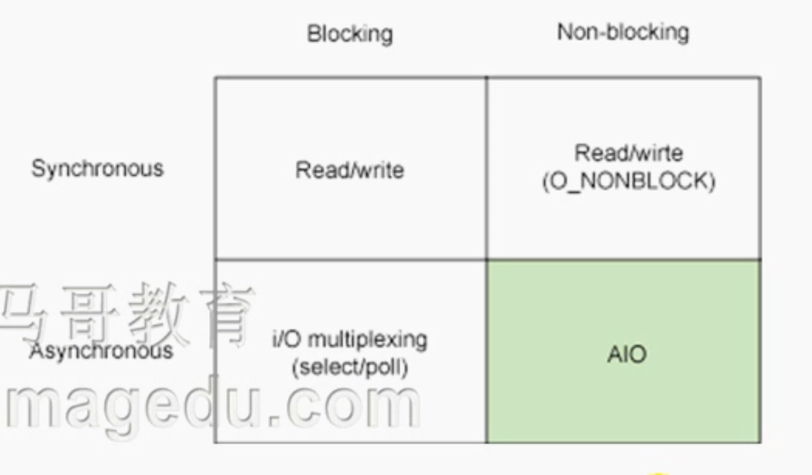
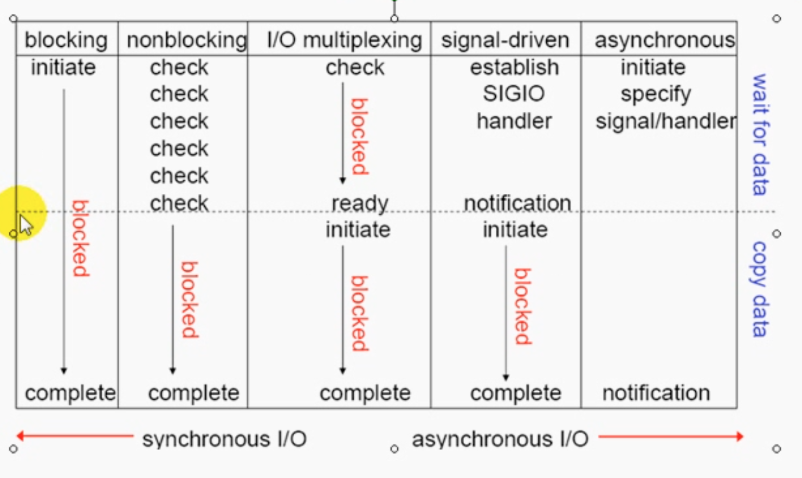

# 43_02_IO复用详解及高并发系统设计初步

---

## 笔记

### I/O动作如何执行?

* 进程无法直接操作I/O设备, 其必须通过系统调用请求`kernel`来协助完成I/O动作.
* 内核会为每个I/O设备维护一个`buffer`.


```
I/O Device  <-- wait -- > Kernel's buffer <-- copy --> Process
```

* 对于输入而言, 等待(wait)数据输入至`buffer`需要时间, 而从`buffer`复制(copy)数据至进程也需要时间.
* 等待需要分成2段
	* `I/O`设备等待`Kernel's buffer`.
	* 进程等到`Kernel's buffer`复制到进程.
* 根据等待模式不同, I/O动作可分为五种模式.
	* blocking I/O: 阻塞I/O
	* nonblocking I/O: 非阻塞I/O
	* I/O multiplexing (select and poll): 
		* I/O复用(一个进程同时处理多个I/O, 必须使用I/O复用).
		* 处理一个请求也需要
			* 交互式I/O(用户输入数据)
			* 网络I/O
	* signal driven I/O(SIGIO): 信号驱动I/O
	* asynchronous I/O(aio_): 异步I/O



* Synchronous I/O: 引起请求进程阻塞, 之道I/O完成.
* Asynchronous I/O: 不导致请求进程阻塞.


### 阻塞模型


blocking I/O.

### 非阻塞模型(异步阻塞)

```
o--------o
|------->| 
|------等待数据
|------->|
|        |
|      等待复制完成
|        |
o--------
```

* 等待数据过程是**非阻塞**的, 需要一遍一遍的去问.
* 等待复制完成是**阻塞的**

nonblocking I/O.

### I/O复用


发起两次系统调用. 每一段都是阻塞的.

异步, 2段阻塞.

I/O multiplexing

### 事件驱动I/O


后半段阻塞

类似`I/O`复用, 但是前半段不轮训阻塞了, 而是好了后发送信号通知.

* 通知水平触发: 隔一段事件就通知一次.
* 边缘触发: 只通知一次.

### 异步IO


两段都不阻塞.

数据复制完成以后信号通知.

### 总结



### web服务器请求

* 用户链接`I/O`分为2段
	* 网络`I/O`
	* 磁盘`I/O`
* 用户在网络`I/O`上一定是阻塞的.
* 用户请求进来之后, 本地进程响应.

#### epoll

事件驱动I/O复用.

一个线程, 响应多个请求. 在一个线程内部维持多个请求.

**缺点**, 一个线程崩溃了, 多个请求都会崩溃.

### mmap 内存映射

访问文件, 数据流 -> 缓冲区 -> 进程缓冲区.

文件从硬盘到内核缓冲区(复制), 内存映射是指不用复制. 直接映射(建立关联关系)过去(数据不用复制一遍).

### httpd

MPM:

* prefork: 一个进程响应一个请求, 1024
* worker: 一个线程响应一个请求, 多进程, 一个进程生成多个线程.
* event: 基于事件驱动`epoll`

## 整理知识点

---

### 缓存 

缓存: 因为数据**局部性**