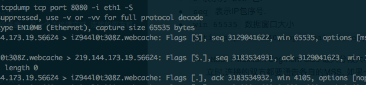

# tcpdump

---

#### flags 标志

* `S` 表示 `SYN`
* `F` 表示 `FIN`
* `P` 表示 `PUSH`
* `R` 表示 `RST`

Flags are some combination  of  `S`(SYN),  `F`(FIN), `P`(PUSH), `R`(RST), `U`(URG), `W`(ECN CWR), `E`(ECN-Echo) or `.` (ACK), or `none` if no flags are set. 

#### 示例

php监听8080端口, tcpdump抓包

```shell
tcpdump tcp port 8080 -i eth1

17:07:45.003272 IP 219.144.173.19.55223 > iZ944l0t308Z.webcache: Flags [S], seq 1767716287, win 65535, options [mss 1440,nop,wscale 5,nop,nop,TS val 1570048891 ecr 0,sackOK,eol], length 0
17:07:45.003318 IP iZ944l0t308Z.webcache > 219.144.173.19.55223: Flags [S.], seq 1567211201, ack 1767716288, win 14480, options [mss 1460,sackOK,TS val 427811518 ecr 1570048891,nop,wscale 7], length 0
17:07:45.070766 IP 219.144.173.19.55223 > iZ944l0t308Z.webcache: Flags [.], ack 1, win 4105, options [nop,nop,TS val 1570048943 ecr 427811518], length 0
17:07:45.097332 IP 219.144.173.19.55223 > iZ944l0t308Z.webcache: Flags [P.], seq 1:367, ack 1, win 4105, options [nop,nop,TS val 1570048943 ecr 427811518], length 366
17:07:45.097358 IP iZ944l0t308Z.webcache > 219.144.173.19.55223: Flags [.], ack 367, win 122, options [nop,nop,TS val 427811612 ecr 1570048943], length 0
17:07:46.097793 IP iZ944l0t308Z.webcache > 219.144.173.19.55223: Flags [P.], seq 1:130, ack 367, win 122, options [nop,nop,TS val 427812613 ecr 1570048943], length 129
17:07:46.168996 IP 219.144.173.19.55223 > iZ944l0t308Z.webcache: Flags [.], ack 130, win 4101, options [nop,nop,TS val 1570050037 ecr 427812613], length 0
17:07:46.169036 IP iZ944l0t308Z.webcache > 219.144.173.19.55223: Flags [P.], seq 130:132, ack 367, win 122, options [nop,nop,TS val 427812684 ecr 1570050037], length 2
17:07:46.229930 IP 219.144.173.19.55223 > iZ944l0t308Z.webcache: Flags [.], ack 132, win 4101, options [nop,nop,TS val 1570050107 ecr 427812684], length 0
17:07:48.098076 IP iZ944l0t308Z.webcache > 219.144.173.19.55223: Flags [P.], seq 132:134, ack 367, win 122, options [nop,nop,TS val 427814613 ecr 1570050107], length 2
17:07:48.197940 IP 219.144.173.19.55223 > iZ944l0t308Z.webcache: Flags [.], ack 134, win 4101, options [nop,nop,TS val 1570052032 ecr 427814613], length 0
17:07:50.098343 IP iZ944l0t308Z.webcache > 219.144.173.19.55223: Flags [P.], seq 134:136, ack 367, win 122, options [nop,nop,TS val 427816613 ecr 1570052032], length 2
17:07:50.247560 IP 219.144.173.19.55223 > iZ944l0t308Z.webcache: Flags [.], ack 136, win 4101, options [nop,nop,TS val 1570054091 ecr 427816613], length 0
17:07:52.098676 IP iZ944l0t308Z.webcache > 219.144.173.19.55223: Flags [P.], seq 136:138, ack 367, win 122, options [nop,nop,TS val 427818614 ecr 1570054091], length 2
17:07:52.169847 IP 219.144.173.19.55223 > iZ944l0t308Z.webcache: Flags [.], ack 138, win 4101, options [nop,nop,TS val 1570056019 ecr 427818614], length 0
17:07:54.098921 IP iZ944l0t308Z.webcache > 219.144.173.19.55223: Flags [P.], seq 138:140, ack 367, win 122, options [nop,nop,TS val 427820614 ecr 1570056019], length 2
17:07:54.152012 IP 219.144.173.19.55223 > iZ944l0t308Z.webcache: Flags [.], ack 140, win 4101, options [nop,nop,TS val 1570058011 ecr 427820614], length 0
17:07:55.099208 IP iZ944l0t308Z.webcache > 219.144.173.19.55223: Flags [F.], seq 140, ack 367, win 122, options [nop,nop,TS val 427821614 ecr 1570058011], length 0
17:07:55.155195 IP 219.144.173.19.55223 > iZ944l0t308Z.webcache: Flags [.], ack 141, win 4101, options [nop,nop,TS val 1570059011 ecr 427821614], length 0
17:07:55.155820 IP 219.144.173.19.55223 > iZ944l0t308Z.webcache: Flags [F.], seq 367, ack 141, win 4101, options [nop,nop,TS val 1570059011 ecr 427821614], length 0
17:07:55.155847 IP iZ944l0t308Z.webcache > 219.144.173.19.55223: Flags [.], ack 368, win 122, options [nop,nop,TS val 427821671 ecr 1570059011], length 0
```

#### 握手

前三条是握手.

```shell
17:07:45.003272 IP 219.144.173.19.55223 > iZ944l0t308Z.webcache: Flags [S], seq 1767716287, win 65535, options [mss 1440,nop,wscale 5,nop,nop,TS val 1570048891 ecr 0,sackOK,eol], length 0
```

* `S`表示为`SYN`包.
* `seq` 表示IP包序号.
* `win 65535` 数据窗口大小
* `options [mss 1440,nop,wscale 5,nop,nop,TS val 1570048891 ecr 0,sackOK,eol]`
	* `MSS`: Maxitum Segment Size 最大分段大小, MSS表示TCP传往另一端的最大块数据的长度. 当一个连接建立时,连接的双方都要通告各自的MSS. 如果一方不接收来自另一方的MSS值, 则MSS就定为默认的536字节.

**第一条**

`219.144.173`主机发送序号为`1767716287`的`SYN`包到主机, 同时带有自身的`WIN`和`MSS`大小.

**第二条**

```shell
17:07:45.003318 IP iZ944l0t308Z.webcache > 219.144.173.19.55223: Flags [S.], seq 1567211201, ack 1767716288, win 14480, options [mss 1460,sackOK,TS val 427811518 ecr 1570048891,nop,wscale 7], length 0
```

主机收到后, 发送`SYN+ACK`的返回包到A, 带自身的WIN和MSS大小, 同时为为上一个包的应答包(ack)`1767716288(1767716287:第一次主机的seq+1)`

**第三条**

```shell
17:07:45.070766 IP 219.144.173.19.55223 > iZ944l0t308Z.webcache: Flags [.], ack 1, win 4105, options [nop,nop,TS val 1570048943 ecr 427811518], length 0
```

A主机返回ACK, 包序号为1(相对序号,如果需要看绝对序号,可以在tcpdump命令中加`-S`)
 
可见加了`-S`后最后一次的`ack`等于上一次主机返回的`seq+1` 
 


#### 挥手

我一直以为四次挥手是客户端先发`FIN`包, 后来查了文档之后发现:

对`TCP`链接的终止过程的解释如下:

1. 某个应用进程首先调用`close`, 我们称这一端执行主动关闭`active close`. 这一端的`TCP`于是发送一个`FIN`, 表示数据发送完毕.
2. 接收到`FIN`的另一端执行被动关闭(`passive close`). 这个`FIN`由`TCP`确认. 它的接收也作为文件结束符传递给接收方应用进程(放在已排队等待该应用进程接收的任何其他数据之后), 因为`FIN`的接收意味着应用进程在相应的连接上再也接收不到额外数据.
3. 一段时间后, 接收到文件结束符的应用进程将调用`close`关闭它的套接口.这导致它的`TCP`也发送一个`FIN`.
4. 接收到这个`FIN`的原发送方`TCP`(即执行主动关闭的那一端)对它进行确认.

每条一次对应下面的每条抓包.

**第一条**

```shell
17:07:55.099208 IP iZ944l0t308Z.webcache > 219.144.173.19.55223: Flags [F.], seq 140, ack 367, win 122, options [nop,nop,TS val 427821614 ecr 1570058011], length 0
```

**第二条**

```shell
17:07:55.155195 IP 219.144.173.19.55223 > iZ944l0t308Z.webcache: Flags [.], ack 141, win 4101, options [nop,nop,TS val 1570059011 ecr 427821614], length 0
```

**第三条**

```shell
17:07:55.155820 IP 219.144.173.19.55223 > iZ944l0t308Z.webcache: Flags [F.], seq 367, ack 141, win 4101, options [nop,nop,TS val 1570059011 ecr 427821614], length 0
```

**第四条**

```shell
17:07:55.155847 IP iZ944l0t308Z.webcache > 219.144.173.19.55223: Flags [.], ack 368, win 122, options [nop,nop,TS val 427821671 ecr 1570059011], length 0
```