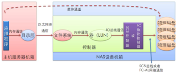
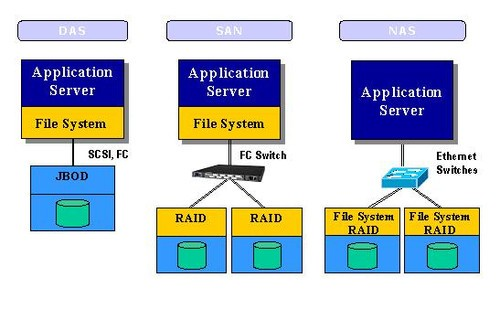
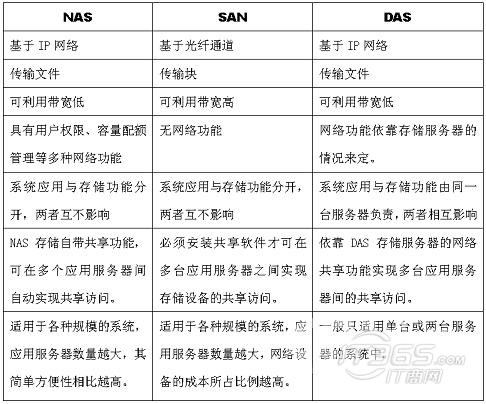

# DAS SAN和NAS的区别

## DAS(Direct-attached Storage) 直连存储

直连式存储与服务器主机之间的连接通常采用`SCSI`连接, SCSI通道是IO瓶颈.

服务器主机SCSI ID资源有限, 能够建立的SCSI通道连接有限.

无论直连式存储还是服务器主机的扩展, 从一台服务器扩展为多台服务器组成的群集(Cluster), 或存储阵列容量的扩展, 都会造成业务系统的停机.

## NAS(Network Attached Storage)网络附加存储 - 是一个网络上的**文件系统**

存储设备通过标准的网络拓扑结构(以太网)添加到一群计算机上. 应用: 文档图片电影共享, 云存储. NAS即插即用, 支持多平台.

NAS有一关键问题, 即备份过程中的带宽消耗, NAS仍使用网络进行备份和恢复. NAS的一个缺点是它将存储事务**由并行SCSI连接转移到网络上**, 也就是说LAN除了必须处理正常的最终用户传输流外, 还必须处理包括备份操作的存储磁盘请求.

NAS需要服务器自己搜索它的硬盘

## SAN(Storage Area Network) 存储区域网络——是一个网络上的**磁盘**

通过**光纤通道交换机**连接存储阵列和服务器主机, 最后成为一个专用存储网络. SAN提供了一种与现有LAN连接的简易方法, 并且通过同一物理通道支持广泛使用的SCSI和IP协议. SAN允许企业独立地增加它们的存储容量. SAN的结构允许任何服务器连接到任何存储阵列, 这样不管数据放在哪里, 服务器都可以直接存取所需的数据. 因为采用了光纤接口, SAN还具有更高的带宽.

#### 优点

将存储和服务器隔离, 简化了存储管理, 能够统一、集中的管理各种资源.

使存储更为高效. 通常网络中, 可能一个服务器可用空间用完了, 另一个服务器还有很多可用空间. SAN把所有存储空间有效的汇集在一起, 每个服务器都享有访问组织内部的所有存储空间的同等权利. 这一方法能降低文件冗余度.

SAN能屏蔽系统的硬件, 可以同时采用不同厂商的存储设备.

#### 不足

跨平台性能没有NAS好, 价格偏高, 搭建SAN比在服务器后端安装NAS要复杂的多.

### NAS、SAN、DAS特性对比 

DAS存储一般应用在中小企业, 与计算机采用**直连方式**, SAN存储使用FC接口, 供性能更佳的存储, **NAS存储则通过以太网添加到计算机上**, **SAN和NAS的区别主要体现在操作系统在什么位置**.

