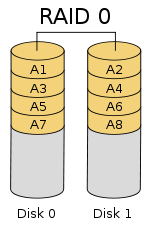
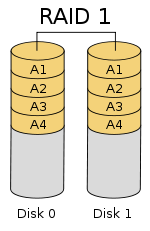
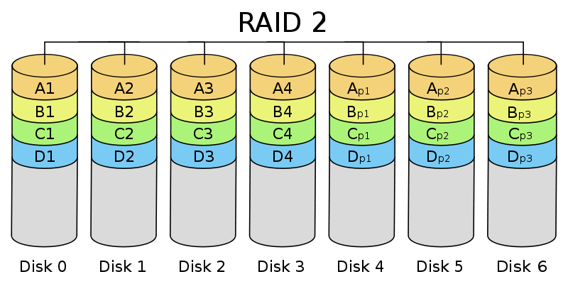
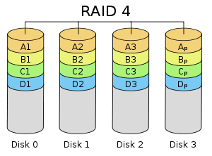
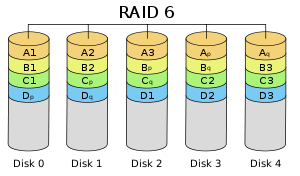
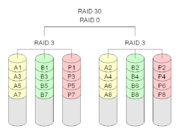

# RAID

## 概述

廉价冗余磁盘阵列(Redundant Array of Inexpensive Disks).

由于当时大容量磁盘比较昂贵, **RAID**的基本思想是将多个容量较小, 相对廉价的磁盘进行有机组合, 从而以较低的成本获得与昂贵大容量磁盘相当的容量, 性能, 可靠性.

后续**RAID**变成了独立磁盘冗余阵列(Redundant Array of Independent Disks).

实现角度

* 软**RAID**
* 硬**RAID**
* 软硬**RAID**

### 软RAID

所有功能均由操作系统和CPU来完成, 没有独立的RAID控制(处理)芯片和I/O处理芯片. **效率最低**.

### 硬RAID

配备了专门的**RAID**控制(处理)芯片和I/O处理芯片以及阵列缓冲, 不占用**CPU**资源. **成本最高**.

### 软硬RAID

剧本RAID控制(处理)芯片, 但没有I/O处理芯片, 需要 CPU 和驱动程序来完成, 性能和成本在软RAID和硬RAID之间.

## 基本原理

在整个系统中, RAID 被看作是由两个或更多磁盘组成的存储空间, 通过并发地在多个磁盘上读写数据来提高存储系统的 I/O 性能. 大多数 RAID 等级具有完备的数据校验, 纠正措施, 从而提高系统的容错性, 甚至镜像方式, 大大增强系统的可靠性, Redundant 也由此而来.

### JBOD

Just a Bunch of Disks. 最初 JBOD 用来表示一个没有控制软件提供协调控制的磁盘集合, 这是 RAID 区别与 JBOD 的主要因素. 目前 JBOD 常指磁盘柜, 而不论其是否提供 RAID 功能.

### 备份

RAID 不可作为数据备份的替代方案, 它对非磁盘故障等造成的数据丢失无能为力, 比如病毒、人为破坏、意外删除等情形. 此时的数据丢失是相对操作系统、文件系统、卷管理器或者应用系统来说的, 对于 RAID 系统来身, 数据都是完好的, 没有发生丢失. 所以，数据备份、灾 备等数据保护措施是非常必要的, 与 RAID 相辅相成, 保护数据在不同层次的安全性, 防止发生数据丢失.

### 关键概念和技术

* 镜像(Mirroring)
* 数据条带(Data Stripping)
* 数据校验(Data parity)

#### 镜像

将数据复制到多个磁盘, 一方面可以**提高可靠性**, 另一方面可并发从两个或多个副本读取数据来**提高可读性**.

镜像的写性能要稍低, 确保数据正确地写到多个磁盘需要更多的时间消耗.

#### 数据条带

将数据分片保存在多个不同的磁盘, 多个数据分片共同组成一个完整数据副本, 这与镜像的多个副本是不同的, 它通常用于性能考虑. 数据条带具有更高的并发粒度, 当访问数据时, 可以同时对位于不同磁盘上数据进行读写操作, 从而获得非常可观的 I/O 性能提升.

#### 数据校验

利用冗余数据进行数据错误检测和修复, 冗余数据通常采用海明码、异或操作等算法来计算获得. 利用校验功能, 可以很大程度上提高磁盘阵列的可靠性、鲁棒性(健壮和强壮)和容错能力. 不过, 数据校验需要从多处读取数据并进行计算和对比, 会影响系统性能.

### RAID 优势

* 大容量
* 高性能
	* 通过数据条带化, RAID 将数据 I/O 分散到各个成员磁盘上, 从而获得比单个磁盘成倍增长的聚合 I/O 性能.
* 可靠性
	* RAID 冗余技术大幅提升数据可用性和可靠性, 保证了若干磁盘出错时, 不会导致数据的丢失, 不影响系统的连续运行.
* 可管理性
	* 一种虚拟化技术, 它对多个物理磁盘驱动器虚拟成一个大容量的逻辑驱动器.

## 关键技术

### 镜像

镜像是一种冗余技术, 为磁盘提供保护功能, 防止磁盘发生故障而造成数据丢失. 对于 RAID 而言, 采用镜像技术典型地将会**同时在阵列中产生两个完全相同的数据副本**, **分布在两个不同的磁盘驱动器组上**. 镜像提供了完全的数据冗余能力, 当一个数据副本失效不可用时, 外部系统仍可正常访问另一副本, 不会对应用系统运行和性能产生影响. 而且, 镜像不需要额外的计算和校验, 故障修复非常快, 直接复制即可. 镜像技术可以**从多个副本进行并发读取数据, 提供更高的读 I/O 性能, 但不能并行写数据, 写多个副本会会导致一定的 I/O 性能降低**.

镜像技术提供了非常高的数据安全性, 其代价也是非常昂贵的, 需要至少双倍的存储空间. 高成本限制了镜像的广泛应用, 主要应用于至关重要的数据保护, 这种场合下数据丢失会造成巨大的损失. 另外, 镜像通过"拆分"能获得特定时间点的上数据快照, 从而可以实现一种备份窗口几乎为零的数据备份技术,

### 数据条带

磁盘存储的性能瓶颈在于磁头寻道定位, 它是一种慢速机械运动, 无法与高速的 CPU 匹配. 再者, 单个磁盘驱动器性能存在物理极限, I/O 性能非常有限. RAID 由多块磁盘组成, 数据条带技术**将数据以块的方式分布存储在多个磁盘中**, 从而可以**对数据进行并发处理**. 这样**写入和读取数据就可以在多个磁盘上同时进行**, 并发产生非常高的聚合 I/O, 有效提高了整体 I/O 性能, 而且**具有良好的线性扩展性**. 这对大容量数据尤其显著, 如果不分块, 数据只能按顺序存储在磁盘阵列的磁盘上, 需要时再按顺序读取. 而通过条带技术, 可获得数倍与顺序访问的性能提升.

数据条带技术的分块大小选择非常关键. 条带粒度可以是一个字节至几 KB 大小, **分块越小, 并行处理能力就越强, 数据存取速度就越高, 但同时就会增加块存取的随机性和块寻址时间**. 实际应用中, 要根据数据特征和需求来选择合适的分块大小, 在数据存取随机性和并发处理能力之间进行平衡, 以争取尽可能高的整体性能.
数据条带是基于提高 I/O 性能而提出的, 也就是说它只关注性能, 而对数据可靠性、可用性没有任何改善. 实际上, 其中任何一个数据条带损坏都会导致整个数据不可用, **采用数据条带技术反而增加了数据发生丢失的概念率**.

### 数据校验

镜像具有高安全性、高读性能, 但冗余开销太昂贵. 数据条带通过并发性来大幅提高性能, 然而对数据安全性、可靠性未作考虑. 数据校验是一种冗余技术, 它用校验数据来提供数据的安全, 可以检测数据错误, 并在能力允许的前提下进行数据重构. 相对镜像, 数据校验大幅缩减了冗余开销, 用较小的代价换取了极佳的数据完整性和可靠性. 数据条带技术提供高性能, 数据校验提供数据安全性, RAID 不同等级往往同时结合使用这两种技术.

采用数据校验时, RAID 要**在写入数据同时进行校验计算**, 并将得到的校验数据存储在 RAID 成员磁盘中, **校验数据可以集中保存在某个磁盘或分散存储在多个不同磁盘中**, 甚至校验数据也可以分块, 不同 RAID 等级实现各不相同. **当其中一部分数据出错时, 就可以对剩余数据和校验数据进行反校验计算重建丢失的数据**. 校验技术相对于镜像技术的优势在于节省大量开销, 但由于每次数据读写都要进行大量的校验运算, 对计算机的运算速度要求很高, 必须使用硬件 RAID 控制器. 在数据重建恢复方面, 检验技术比镜像技术复杂得多且慢得多.

海明校验码 和 异或校验是两种最为常用的数据校验算法. 海明校验码是由理查德.海明提出的, 不仅能检测错误, 还能给出错误位置并自动纠正. 海明校验的基本思想是: 将有效信息按照某种规律分成若干组, 对每一个组作奇偶测试并安排一个校验位, 从而能提供多位检错信息, 以定位错误点并纠正. 可见海明校验实质上是一种多重奇偶校验. 异或校验通过异或逻辑运算产生, 将一个有效信息与一个给定的初始值进行异或运算, 会得到校验信息. 如果有效信息出现错误, 通过校验信息与初始值的异或运算能还原正确的有效信息.

## RAID 等级

### JBOD

JBOD(Just a Bunch Of Disks)不是标准的 RAID 等级, 它通常用来表示一个没有控制软件提供协调控制的磁盘集合. JBOD 将多个物理磁盘串联起来, 提供一个巨大的逻辑磁盘. JBOD 的数据存放机制是由第一块磁盘开始按顺序往后存储, 当前磁盘存储空间用完后, 再依次往后面的磁盘存储数据. JBOD 存储性能完全等同于单块磁盘, 而且也不提供数据安全保护. 它**只是简单提供一种扩展存储空间的机制**, JBOD 可用存储容量等于所有成员磁盘的存储空间之和. 目前 JBOD 常指磁盘柜, 而不论其是否提供 RAID 功能.

### RAID0

**无冗错的数据条带**

RAID0是一种**简单的, 无数据校验的数据条带化技术**. 实际上不是一种真正的 RAID, 因为它并不提供任何形式的冗余策略. RAID0 将所在磁盘条带化后组成大容量的存储空间, 将数据分散存储在所有磁盘中, 以独立访问方式实现多块磁盘的并读访问. 由于可以并发执行 I/O 操作, 总线带宽得到充分利用. 再加上不需要进行数据校验, RAID0 的性能在所有 RAID 等级中是最高的. 理论上讲, 一个由 n 块磁盘组成的 RAID0, 它的读写性能是单个磁盘性能的 n 倍, 但由于总线带宽等多种因素的限制, 实际的性能提升低于理论值.

RAID0 具有低成本、高读写性能、 100% 的高存储空间利用率等优点, 但是它不提供数据冗余保护, 一旦数据损坏, 将无法恢复. 因此, RAID0 一般适用于对性能要求严格但对数据安全性和可靠性不高的应用，如视频、音频存储、临时数据缓存空间等.

### RAID1

**无校验的相互镜像**

RAID1 称为镜像，它将数据完全一致地分别写到工作磁盘和镜像磁盘, 它的**磁盘空间利用率为 50%**. RAID1 在数据写入时, 响应时间会有所影响, 但是读数据的时候没有影响. RAID1 提供了最佳的数据保护, 一旦工作磁盘发生故障, 系统自动从镜像磁盘读取数据, 不会影响用户工作. 

RAID1 与 RAID0 刚好相反, 是为了增强数据安全性**使两块磁盘数据呈现完全镜像**, 从而达到安全性好、技术简单、管理方便. RAID1 拥有完全容错的能力, 但实现成本高. RAID1 应用于对顺序读写性能要求高以及对数据保护极为重视的应用, 如对邮件系统的数据保护.

### RAID2

**海明码校验**

RAID2 称为纠错海明码磁盘阵列, 其设计思想是利用海明码实现数据校验冗余. 海明码是一种在原始数据中加入若干校验码来进行错误检测和纠正的编码技术, 其中第 2n 位（ 1, 2, 4, 8, … ）是校验码, 其他位置是数据码. 因此在 RAID2 中, 数据按位存储, 每块磁盘存储一位数据编码, 磁盘数量取决于所设定的数据存储宽度, 可由用户设定. 图所示的为数据宽度为 4 的 RAID2, 它需要 4 块数据磁盘和 3 块校验磁盘. 如果是 64 位数据宽度, 则需要 64 块 数据磁盘和 7 块校验磁盘. 可见, RAID2 的数据宽度越大, 存储空间利用率越高, 但同时需要的磁盘数量也越多.

海明码自身具备纠错能力, 因此 RAID2 可以在数据发生错误的情况下对纠正错误, 保证数据的安全性. 它的数据传输性能相当高, 设计复杂性要低于后面介绍的 RAID3,RAID4 和 RAID5.

但是, 海明码的数据冗余开销太大, 而且 RAID2 的数据输出性能受阵列中最慢磁盘驱动器的限制. 再者, 海明码是按位运算, RAID2 数据重建非常耗时. 由于这些显著的缺陷, 再加上大部分磁盘驱动器本身都具备了纠错功能, 因此 RAID2 在实际中很少应用, 没有形成商业产品, 目前主流存储磁盘阵列均不提供 RAID2 支持.

### RAID3

**带有专用位校验的数据条带** 可以理解为 RAID3 的大数据版

RAID3 是使用专用校验盘的并行访问阵列, 它采用**一个专用的磁盘作为校验盘, 其余磁盘作为数据盘**, 数据按位可字节的方式交叉存储到各个数据盘中. RAID3 至少需要三块磁盘, 不同磁盘上同一带区的数据作 XOR 校验, 校验值写入校验盘中. RAID3 完好时读性能与 RAID0 完全一致, 并行从多个磁盘条带读取数据, 性能非常高, 同时还提供了数据容错能力. 向 RAID3 写入数据时, 必须计算与所有同条带的校验值,并将新校验值写入校验盘中. 一次写操作包含了写数据块、读取同条带的数据块、计算校验值、写入校验值等多个操作, 系统开销非常大, 性能较低.

如果 RAID3 中某一磁盘出现故障, 不会影响数据读取, 可以**借助校验数据和其他完好数据来重建数据**. 假如所要读取的数据块正好位于失效磁盘, 则系统需要读取所有同一条带的数据块, 并根据校验值重建丢失的数据, 系统性能将受到影响. 当故障磁盘被更换后, 系统按相同的方式重建故障盘中的数据至新磁盘. 

RAID3 只需要一个校验盘, 阵列的存储空间利用率高, 再加上并行访问的特征, 能够为高带宽的大量读写提供高性能, 适用大容量数据的顺序访问应用, 如影像处理、流媒体服务等. 目前, RAID5 算法不断改进, 在大数据量读取时能够模拟 RAID3, 而且 RAID3 在出现坏盘时性能会大幅下降, 因此常使用 RAID5 替代 RAID3 来运行具有持续性、高带宽、大量读写特征的应用.

### RAID4

**带有专用块级校验的数据条带**

RAID4 与 RAID3 的原理大致相同, 区别在于条带化的方式不同. RAID4 按照**块**的方式来组织数据, 写操作只涉及当前数据盘和校验盘两个盘, 多个 I/O 请求可以同时得到处理, 提高了系统性能. RAID4 按块存储可以保证单块的完整性, 可以避免受到其他磁盘上同条带产生的不利影响.

RAID4 在不同磁盘上的同级数据块同样使用 XOR 校验, 结果存储在校验盘中. 写入数据时, RAID4 按这种方式把各磁盘上的同级数据的校验值写入校验盘, 读取时进行即时校验. 因此, 当某块磁盘的数据块损坏, RAID4 可以通过校验值以及其他磁盘上的同级数据块进行数据重建.

RAID4 提供了非常好的读性能, 但单一的校验盘往往成为系统性能的瓶颈. 对于写操作， RAID4 只能一个磁盘一个磁盘地写, 并且还要写入校验数据, 因此写性能比较差. 而且随着成员磁盘数量的增加, 校验盘的系统瓶颈将更加突出. 正是如上这些限制和不足, RAID4 在实际应用中很少见, 主流存储产品也很少使用 RAID4 保护.

### RAID5

**带分散校验的数据条带**

RAID5 应该是目前最常见的 RAID 等级, 它的原理与 RAID4 相似, 区别在于**校验数据分布在阵列中的所有磁盘上, 而没有采用专门的校验磁盘**. 对于数据和校验数据, 它们的写操作可以同时发生在完全不同的磁盘上. 因此, RAID5 不存在 RAID4 中的并发写操作时的校验盘性能瓶颈问题. 另外，RAID5 还具备很好的扩展性. 当阵列磁盘数量增加时, 并行操作量的能力也随之增长, 可比 RAID4 支持更多的磁盘, 从而拥有更高的容量以及更高的性能.

RAID5 的磁盘上同时存储数据和校验数据, 数据块和对应的校验信息存保存在不同的磁盘上, 当一个数据盘损坏时, 系统可以根据同一条带的其他数据块和对应的校验数据来重建损坏的数据. 与其他 RAID 等级一样, 重建数据时, RAID5 的性能会受到较大的影响.

RAID5 兼顾存储性能、数据安全和存储成本等各方面因素, 它可以理解为 RAID0 和 RAID1 的折中方案, 是目前综合性能最佳的数据保护解决方案. RAID5 基本上可以满足大部分的存储应用需求, 数据中心大多采用它作为应用数据的保护方案.

### RAID6

前面所述的各个 RAID 等级都只能保护因单个磁盘失效而造成的数据丢失. 如果两个磁盘同时发生故障, 数据将无法恢复. RAID6 引入双重校验的概念, 它可以保护阵列中同时出现两个磁盘失效时, 阵列仍能够继续工作，不会发生数据丢失。 RAID6 等级是在 RAID5 的基础上为了进一步增强数据保护而设计的一种 RAID 方式，它可以看作是一种扩展的 RAID5 等级。

RAID6 不仅要支持数据的恢复, 还要支持校验数据的恢复, 因此实现代价很高, 控制器的设计也比其他等级更复杂、更昂贵. RAID6 思想最常见的实现方式是采用两个独立的校验算法, 假设称为 P 和 Q, 校验数据可以分别存储在两个不同的校验盘上, 或者分散存储在所有成员磁盘中. 当两个磁盘同时失效时, 即可通过求解两元方程来重建两个磁盘上的数据.

RAID6 具有快速的读取性能、更高的容错能力. 但是, 它的成本要高于 RAID5 许多, 写性能也较差，并有设计和实施非常复杂. 因此, RAID6 很少得到实际应用, 主要用于对数据安全等级要求非常高的场合. 它一般是替代 RAID10 方案的经济性选择.

### RAID 组合等级

#### RAID00

RAID00 是由多个成员 RAID0 组成的高级 RAID0. 它与 RAID0 的区别在于, RAID0 阵列替换了原先的成员磁盘. 可以把 RAID00 理解为两层条带化结构的磁盘阵列, 即**对条带再进行条带化**. 这种阵列可以提供更大的存储容量、更高的 I/O 性能和更好的 I/O 负均衡.

#### RAID01 和 RAID10

 RAID01 是先做条带化再作镜像, 本质是对物理磁盘实现镜像; 而 RAID10 是先做镜像再作条带化, 是对虚拟磁盘实现镜像. 相同的配置下, 通常 RAID01 比 RAID10 具有更好的容错能力.

RAID01 兼备了 RAID0 和 RAID1 的优点, 它先用两块磁盘建立镜像, 然后再在镜像内部做条带化. RAID01 的数据将同时写入到两个磁盘阵列中, 如果其中一个阵列损坏, 仍可继续工作, 保证数据安全性的同时又提高了性能. RAID01 和 RAID10 内部都含有 RAID1 模式, 因此**整体磁盘利用率均仅为 50%**.

#### RAID100

通常看作 RAID 1+0+0, 有时也称为 RAID 10+0, 即条带化的 RAID10. RAID100 的缺陷与 RAID10 相同, 任意一个 RAID1 损坏一个磁盘不会发生数据丢失, 但是剩下的磁盘存在单点故障的危险. 最顶层的 RAID0, 即条带化任务, 通常由软件层来完成.

RAID100 突破了单个 RAID 控制器对物理磁盘数量的限制, 可以获得更高的 I/O 负载均衡, I/O 压力分散到更多的磁盘上, 进一步提高随机读性能, 并有效降低热点盘故障风险. 因此, RAID100 通常是大数据库的最佳选择.

#### RAID30 （ RAID53 ）、 RAID50 和 RAID60

这三种 RAID 等级与 RAID00 原理基本相同, 区别在于成员 "磁盘" 换成了 RAID3 、 RAID5 和 RAID6. 其中, RAID30 通常又被称为 RAID53[13]. 其实, 可把这些等级 RAID 统称为 RAID X0 等级, X 可为标准 RAID 等级, 甚至组合等级(如 RAID100). 利用多层 RAID 配置, 充分利用 RAID X 与 RAID0 的优点, 从而获得在存储容量、数据安全性和 I/O 负载均衡等方面的大幅性能提升.

## 总结

raid等级 | raid0 | raid1 | raid3 | raid5 | raid 6 | raid10
--------|-------|-------|-------|-------|--------|--------
别名	|条带|镜像|专用奇偶校验条带|分布奇偶校验条带|双重奇偶校验条带|镜像加条带
容错性|无|有|有|有|有|有
冗余类型 |无|有|有|有|有|有
热备份选择 |无|有|有|有|有|有
读性能|高|低|高|高|高|高
随机写性能|高|低|低|一般|低|一般
连续写性能|高|低|低|低|低|一般
需要磁盘数|n≥1|2n(n≥1)|n≥3|n≥3|n≥4|2n(n≥2)≥4
可用容量|全部|50%|(n-1)/n|(n-1)/n|(n-2)/n|50%
