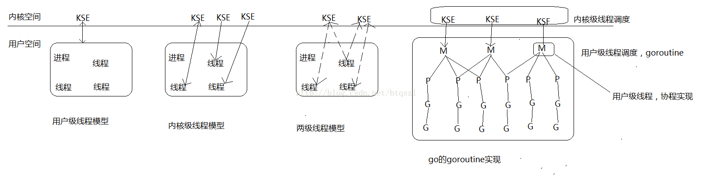

# 内核调度实体(Kernal Scheduling Entry， KSE)

---

线程实现模型主要有三种:

`KSE`是内核调度实体, 又称内核级线程, 就是可以被内核调度器调度的对象.

### 用户级线程模型

此模型下的线程由用户级别的线程库管理, 线程库在进程的用户空间中. 包含多个用户级线程的进程只与一个KSE对应, 又被称为`M:1`线程模型.

* 优点: 线程切换不需要让CPU从用户态切换到内核态.
* 缺点：多线程不能被真正的并发执行.

### 内核级线程模型

此模型下的线程是由内核负责管理的, 进程中的每一个线程都与一个KSE对应(确定关联), 又被称            为`1:1`线程模型.

* 优点: 即使一个线程受到阻塞线程, 其他线程也不会受到影响.
* 缺点：内核线程管理成本高很多, 线程切换需要进行用户太-内核态-用户态转变.

### 两级线程模型

同时包含内核级和用户级线程管理, 一个进程可以与多个KES相连, 又称为`M:N`线程模型, 与内核级线程模型类似, 但不相同的是进程中的用户级线程与KSE并**不一一对应**, **在`go`语言中不受内核管理的独立控制流(两级线程模型的中的用户级线程管理)就叫`Goroutine`**.

