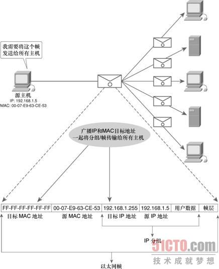
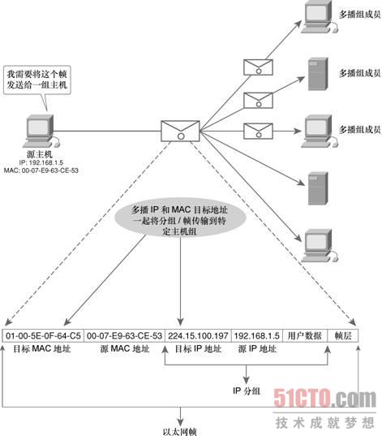

# 单播, 广播和多播IP地址

## 简介

* 一对一(单播)
* 一对多(多播)
* 一对所有(广播)

## 单播

单播地址是IP网络中最常见的.

如: IP地址为`192.168.1.5`(源地址)的主机向IP地址为`192.168.1.200`(目标地址)的服务器请求网页.


要发送和接收单播分组, IP分组报头中必须有一个目标IP地址, 而以太网帧报头中必须有相应的目标MAC地址. IP地址和MAC地址一起将数据传输到特定的目标主机.

如果目标IP地址属于另一个网络, 则在帧中使用的目标MAC地址将为与源IP地址位于同一个网络中的路由器接口(网关)的MAC地址.

## 广播

广播分组的目标IP地址的**主机部分全为1**, 这意味着本地网络(广播域)中的所有主机都将接收并查看该分组. 诸如`ARP`和`DHCP`等很多网络协议都使用广播.

例如:

* C类网络192.168.1.0的默认子网掩码为255.255.255.0, 其广播地址为192.168.1.255, 其主机部分为十进制数255或二进制数11111111(全为1)

* B类网络172.16.0.0的默认子网掩码为255.255.0.0, 其广播地址为172.16.255.255；

* A类网络10.0.0.0的默认子网掩码为255.0.0.0, 其广播地址为10.255.255.255.

在以太网帧中, 必须包含与广播IP地址对应的广播MAC地址. 在以太网中, 广播MAC地址长48位, 其十六进制表示为FF-FF-FF-FF-FF-FF. 所有网卡在Mac层都不过滤目的地址为FF FF FF FF FF FF的数据报.



## 多播

多播地址让源设备能够将分组发送给**一组设备**, 

属于多播组的设备将被分配一个多播组IP地址.

多播地址范围为**`224.0.0.0～239.255.255.255`**(D类地址). 由于多播地址表示一组设备(有时被称为主机组), 因此只能用作分组的目标地址. 源地址总是为单播地址.

远程游戏就是一个使用多播地址的例子, 很多玩家通过远程连接玩同一个游戏; 另一例子是通过视频会议进行远程教学, 其中很多学生连接到同一个教室. 还有一个例子是硬盘映像应用程序, 这种程序用于同时恢复众多硬盘的内容.

同单播地址和广播地址一样, 多播IP地址也需要相应的多播MAC地址在本地网络中实际传送帧. 多播MAC地址以十六进制值01-00-5E打头, 余下的6个十六进制位是根据IP多播组地址的最后23位转换得到的. 一个MAC多播地址是01-00-5E-0F-64-C5, 如图5.10所示. 每个十六进制位相对于4个二进制位.



```
ifconfig 网卡如果现实 MULTICAST 即为支持组播
```

