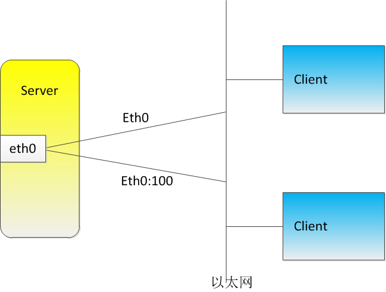

# 网卡别名

---

## 定义

IP别名就是一张物理网卡上配置多个IP, 从网络协议的角度来讲, 下层总是为上层提供服务, 一块网卡的MAC地址只要一一对应上层的一个IP地址, 并且这个逻辑关系是合理的, 就算成立, 而上层并不在乎下层是什么, 比如一个IP地址可以对应多个应用层端口.在linux作DHCP服务器向多网段分配不同IP或者linux作路由器等时可能需要在一个物理接口上配置多个IP地址.

网卡子接口也叫做网卡别名.

## 工作原理



## 配置步骤

`centos`使用`NerworkManager`这个服务来对网卡进行管理.

网卡后面的冒号就是自定义子接口编号.`ifcfg-enp0s3:0`.

### 临时创建

```shell
ip addr add 192.168.0.112/24 dev enp0s3  label enp0s3:1

其他主机尝试连接新ip.
ssh ansible@192.168.0.112 -p 17456
The authenticity of host '[192.168.0.112]:17456 ([192.168.0.112]:17456)' can't be established.
ECDSA key fingerprint is SHA256:CNDSneXteIKiA3CliD2QwWI7YS98yqR2UEhF8WK7Sf8.
Are you sure you want to continue connecting (yes/no)? yes
Warning: Permanently added '[192.168.0.112]:17456' (ECDSA) to the list of known hosts.
ansible@192.168.0.112's password:
Last login: Fri Sep 22 23:58:24 2017 from 192.168.0.103
-bash: warning: setlocale: LC_CTYPE: cannot change locale (UTF-8): No such file or directory
[ansible@localhost ~]$
```

### 永久创建

```shell
[root@localhost ansible]# cd /etc/sysconfig/network-scripts/
[root@localhost network-scripts]#

#我的虚拟机默认网卡是enp0s3

[root@localhost network-scripts]# ifconfig
docker0: flags=4099<UP,BROADCAST,MULTICAST>  mtu 1500
        inet 172.17.0.1  netmask 255.255.0.0  broadcast 0.0.0.0
        inet6 fe80::42:41ff:fef4:6816  prefixlen 64  scopeid 0x20<link>
        ether 02:42:41:f4:68:16  txqueuelen 0  (Ethernet)
        RX packets 0  bytes 0 (0.0 B)
        RX errors 0  dropped 0  overruns 0  frame 0
        TX packets 3  bytes 258 (258.0 B)
        TX errors 0  dropped 0 overruns 0  carrier 0  collisions 0

enp0s3: flags=4163<UP,BROADCAST,RUNNING,MULTICAST>  mtu 1500
        inet 192.168.0.110  netmask 255.255.255.0  broadcast 192.168.0.255
        inet6 fe80::77b7:d032:7a3:59ce  prefixlen 64  scopeid 0x20<link>
        ether 08:00:27:8d:4b:6a  txqueuelen 1000  (Ethernet)
        RX packets 466754  bytes 197851174 (188.6 MiB)
        RX errors 0  dropped 0  overruns 0  frame 0
        TX packets 52875  bytes 6907477 (6.5 MiB)
        TX errors 0  dropped 0 overruns 0  carrier 0  collisions 0
...
[root@localhost network-scripts]# cp ifcfg-enp0s3 ifcfg-enp0s3:0
[root@localhost network-scripts]# cat ifcfg-enp0s3:0
TYPE=Ethernet
BOOTPROTO=none
NAME=enp0s3:0
DEVICE=enp0s3:0
ONBOOT=yes
IPADDR=192.168.0.111
NETMASK=255.255.255.0
ONPARENT=yes
```

