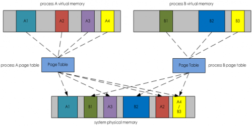

# 虚拟内存 和 swap

---

## 虚拟内存

虚拟内存是操作系统对进程地址空间进行管理而设计的逻辑内存空间概念, 我们程序中的指针其实都是这个虚拟内存空间的地址, 因为程序还没有开始运行, 所以根本就没有物理内存.

虚拟内存是如何映射到真是的物理内存上的, 是**页映射表**, 操作系统为每个进程维护一个页映射表, 通过页映射表把虚拟内存地址映射到真是的物理内存地址. 当程序开始运行的时候, 内核首先去查找内存缓存和物理内存, 如果数据已经在内存中, 则忽略, 如果数据不在内存里就引起一个缺页中断(Page Fault)然后从硬盘读取页, 并把缺页缓存到物理内存里 。

虚拟内存是一个假象的内存空间, 在程序运行过程中虚拟内存空间中需要被访问的部分会被映射到物理内存空间中. 虚拟内存空间大只能表示**程序运行过程中可访问的空间比较大**, 不代表物理内存空间占用也大.

## SWAP

当系统没有足够物理内存来应付所有请求的时候就会用到`SWAP`设备, `SWAP`设备可以是一个文件, 可以使一个磁盘分区. 使用 swap 的代价非常大. 如果系统没有物理内存可用, 就会频繁`swapping`, 如果`swap`设备和程序正要访问的数据在同一个文件系统上, 那会**碰到严重的IO问题**, 最终导致整个系统迟缓, 甚至崩溃.