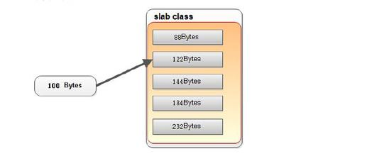
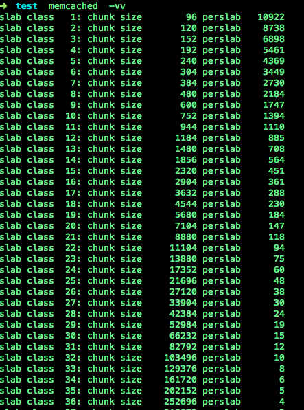
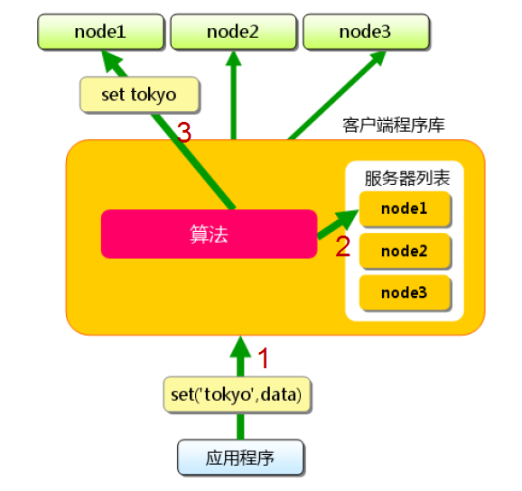
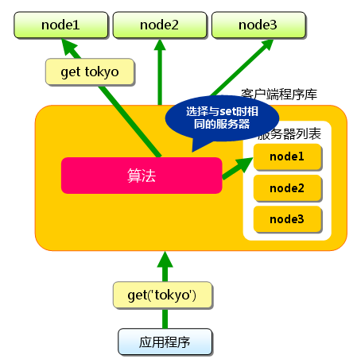
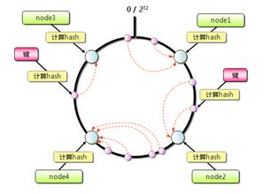
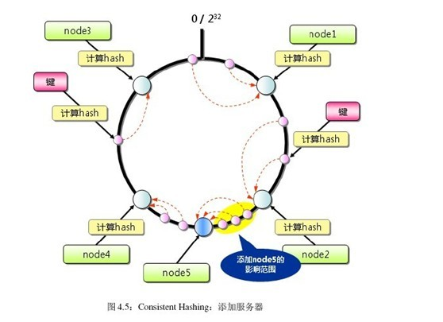

#Memcached

##memcached基础

---

memcached是高性能分布式内存缓存服务器.一般的使用目的是,通过`缓存数据库查询结果`,`减少数据库访问次数`,以`提高动态Web应用的速度`,提高`可扩展性`.

###memcache和memcached区别

2者都是memcache客户端(php).

**memcache**

* memcache独立用php实现
* [http://pecl.php.net/package/memcache][php-memcache]

[php-memcache]:http://pecl.php.net/package/memcache

**memcached**

* memcached是基于原生的c的libmemcached的扩展，更加完善
* [http://pecl.php.net/package/memcached][php-memcached]

[php-memcached]:http://pecl.php.net/package/memcached

**memcached替换memcached优点**

* 在高并发下稳定下极大提高
* 功能更多
* 出错码更精确
* 将memcached api统一换为libmemcached(方便多语言访问memcached，让分布式等各种规则都一致).

###memcached 的特征

* 协议简单
* 基于libevent的事件处理
* 内置内存存储方式
* memcached不互相通信的分布模式

**协议简单**

使用简单的基于文本行的协议.(textline)

**libevent的事件处理**

libevent是个程序库,它将linux的epoll, BSD类操作系统的kqueue等事件处理功能封装成统一的接口.即使对服务器的连接数增加,也能发挥`O(1)`的性能.
Memached依赖libevent库实现并发进程,memcached启动后一个线程响应多个请

**内置内存存储方式**

memcached中保存的数据都存储在memcached内置的内存存储空间中.犹豫数据仅存在于内存中,因此重启memcached,重启操作系统都会导致全部数据消失.

内容容量达到制定定值之后,就基于 `LRU` (leatest Recently Used)算法自动删除不使用的缓存.

**memcached不互相通信的分布式**

服务器端没有分布式功能. 各个memcached不会互相通信以共享信息.

**键和值**

* 最大键长为250个字符
* 储存数据不能超过1MB

###memcached启动

* -p : 使用的TCP端口. 默认为11211.
* -m : 最大内存大小. 默认为64M.
* -vv : 用very verbose模式启动, 调试信息和错误输出到控制台.
* -d : 作为daemon在后台启动.
* -c : 最大并发连接数，默认1024
* -U :指定监听的UDP端口，默认11211，0表示禁用
* -n :chunk起始大小,默认为48字节
* -f :指定增长因子，默认1.25
* -M:内存耗尽时禁止移除缓存中的数据，而是返回错误信息

###memcached操作

**保存数据**

向memcached保存数据时可以指定期限(秒).不指定期限时, memcached按照`LRU`算法保存数据

* add : 仅当存储空间中`不存在`键相同的数据时才保存.
* replace : 仅当存储空间中`存在`键相同的数据时才保存.
* set : 与add和replace不同,`无论何时都保存`.
* append : 向已存在元素后追加数据

		$m->set('foo', 'abc');
		$m->append('foo', 'def');
		var_dump($m->get('foo'));
		
		string(6) "abcdef"
		
**PHP中的问题**

OPT_COMPRESSION作用:

item的值超过某个阈值(当前是100bytes)时,会首先对值进行压缩然后存储,并在获取该值时进行解压缩然后返回,使得压缩对应用层透明

如果Memcached::OPT_COMPRESSION常量开启,这个操作会失败,并引发一个警告,因为向压缩数据后追加数据可能会导致解压不了.

* prepend : 向一个已存在的元素前面追加数据

		$m->set('foo', 'abc');
		$m->prepend('foo', 'def');
		var_dump($m->get('foo'))

		string(6) "defabc"
		
* cas : 比较并交换值,检查并设置.检查是通过cas_token参数进行的,这个参数是Memcach指定给已经存在的元素的一个唯一的64位值.

不使用cas:

		第一步,A取出数据对象X;
		第二步,B取出数据对象X;
		第三步,B修改数据对象X,并将其放入缓存;
		第四步,A修改数据对象X,并将其放入缓存.
		第四步中会产生数据写入冲突
		
使用cas:
		
		第一步，A取出数据对象X,并获取到CAS-ID1;
		第二步，B取出数据对象X,并获取到CAS-ID2;
		第三步，B修改数据对象X,在写入缓存前,检查CAS-ID与缓存空间中该数据的CAS-ID是否一致.结果是“一致”,就将修改后的带有CAS-ID2的X写入到缓存。
		第四步，A修改数据对象Y,在写入缓存前,检查CAS-ID与缓存空间中该数据的CAS-ID是否一致.结果是“不一致”,则拒绝写入,返回存储失败.
		
**获取数据**

* get : 一次获取一条数据
* get_multi : 非同步地同时取得多个键值,起速度要比循环调用get快数十倍.

**删除数据**

* delete : 第2个参数指定一个时间值,可以禁止使用同样的键保存新数据.此功能用于防止缓存数据的不完整. `set函数忽视该阻塞,照常保存数据`.客户端希望服务端在这段时间`拒绝`对这个`key`的`add和replace`命令. 由于这个时间段的存在,`元素被放入一个删除队列`,表明它`不可以通过get命令获取到值`,但是同时`add和replace命令也会失败`(无论如何set命令都会成功).在这段时间过去后,元素最终被从服务端内存删除.time参数默认0(表明元素会被立即删除并且之后对这个 key的存储命令也会成功). 

		如果值为0,则该元素立即删除.如果值为30,元素会在30秒内被删除.

**增一和减一操作**

* incr 和 decr
* 增一和减一是原子操作, 但`未设置初始值时`,`不会自动赋成0`.

##理解memcached的内存存储

---

###为什么使用Slab Allocation

在该机制出现以前,内存的分配是通过对所有记录简单的进行`malloc`和`free`(C语言函数)来进行的.但是,这种方式会`导致内存碎片`,`加重操作系统内存管理器的负担`.**最坏的情况下**,会导致操作系统比memcached进程本身还慢.

**malloc函数**

void *malloc(long NumBytes):该函数分配了NumBytes个字节,并返回了指向这块内存的指针.如果分配失败,则返回一个空指针(NULL).

**free函数**

void free(void *FirstByte):该函数是将之前用malloc分配的空间还给程序或者是操作系统,也就是释放了这块内存,让它重新得到自由.

**程序代码**

		 // Code...
        char *Ptr = NULL;
        Ptr = (char *)malloc(100 * sizeof(char));
        if (NULL == Ptr)
    	{
       		exit (1);
    	}
        gets(Ptr);

        // code...
        free(Ptr);
        Ptr = NULL;
        // code...

* 申请了内存空间后,必须检查是否分配成功.
* 当不需要再使用申请的内存时,记得释放;释放后应该把指向这块内存的指针指向NULL,防止程序后面不小心使用了它.
* 这两个函数应该是配对.如果申请后不释放就是内存泄露;如果无故释放那就是什么也没有做.释放只能一次,如果释放两次及两次以上会出现错误(释放空指针例外,释放空指针其实也等于啥也没做,所以释放空指针释放多少次都没有问题).

**maloc()的机制**

对`堆`(heap)里面. 函数返回的指针是指向堆里面的一块内存.操作系统中有一个记录空闲内存地址的链表.当操作系统收到程序的申请时,就会遍历该链表,然后就寻找第一个空间大于所申请控件的堆结点,然后就将该结点从空闲结点链表中删除,并将该`结点的空间`分配给程序.

沿链表寻找到一个大到足以满足用户请求的内存块.然后,将该内存块一分为二(一块的大小与用户请求的大小相等,另一块的大小就是剩下的字节).接下来,将分配给用户的那块内存传给用户,并将剩下的那块(如果有的话)返回到链表上.

调用free()函数时,它将用户释放的内存块连接到空闲链表上.到最后,空闲链会被切成很多的小内存片段,如果这时用户申请一个大的内存片段,那么空闲链上可能没有可以满足用户要求的片段了.于是,malloc函数请求延时,并开始在空闲链上翻箱倒柜地检查各内存片段,对它们进行整理,将相邻的小空闲块合并成较大的内存块.如果无法获得符合要求的内存块,malloc函数会返回NULL指针,`因此在调用malloc动态申请内存块时,一定要进行返回值的判断`.

**free()到底释放了什么**

free()释放的是指针指向的内存.`释放的是内存,不是指针`.

指针是一个变量,只有程序结束时才被销毁.释放了内存空间后,原来指向这块控件的指针还是存在.只不过指针指向的内容是未定义的.

`释放内存后把指针指向NULL,防止指针在后面不小心又被引用了`.

在free的时候试图整合相邻的碎片,使其合并成为一个较大的free空间.

**内存碎片**

内存碎片一般是由于空闲的连续空间比要申请的空间小,导致这些小内存块不能被利用.

		假设有一块一共有100个单位的连续空闲内存空间,范围是0~99.如果你从中申请一块内存,如10个单位,那么申请出来的内存块就为0~9区间.这时候你继续申请一块内存,比如说5个单位大,第二块得到的内存块就应该为10~14区间.
		
		如果你把第一块内存块释放,然后再申请一块大于10个单位的内存块,比如说20个单位.因为刚被释放的内存块不能满足新的请求,所以只能从15开始分配出20个单位的内存块.
		
		现在整个内存空间的状态是0~9空闲,10~14被占用,15~24被占用,25~99空闲.其中0~9就是一个内存碎片了.如果10~14一直被占用,而以后申请的空间都大于10个单位,那么0~9就永远用不上了,造成内存浪费.
		

###什么是Slab Allocation机制

Slab Allocator的基本原理是按照`预先规定的大小`,将分配的内存`分割`成`特定长度`的块,以完全解决内存碎片问题.

将分配的内存分割成各种尺寸的块(chunk),并把尺寸相同的块分成组(chunk的集合).

slab allocator还有`重复使用`已分配的内存的目的. 分配到的内存不会释放，而是重复利用.

* **Page** : 分配给Slab的内存空间,默认是1MB. 分配给Slab之后根据slab的大小切分成chunk.
* **Chunk** : 用于缓存记录的内存空间.
* **Sub Class** : 特定大小的chunk组.

###在Slab中缓存记录的原理

memcached根据收到的数据的大小,选择最适合的数据大小的slab.memcached中保存着slab内空闲chunk的列表,根据该列表选择chunk,让后将数据缓存于其中.

选择最恰当的组:

###Slab Allocator的缺点

`Slab Allocator解决了当初的内存碎片问题`.

**新的问题**

由于分配的是特定长度的内存,因此无法有效利用分配的内存.

		将100字节的缓存到128字节的chunk中,剩余的28字节就浪费了.

**内存分配**

memcached启动时制定的内存分配量是memcached用于保存数据的量,没有包括`slab allocator`本身占用的内存,以及为了保存数据而设置的管理控件.因此,`memcached进程的实际内存分配量要比指定的容量要大`.

###使用Growth Factor进行调优

memcached在启动时制定`Growth Factor因子`(通过-f选项),用于控制`slab`之间的差异.默认值为`1.25`.

*但是在选项出现之前,这因子曾经固定为2,称为"power of 2"策略*

用以前的设置,以verbose模式启动memcached:

组的大小依次增大为原来的2倍.

**power of 2 的问题**

slab之间的差别比较大,有些情况下就相当浪费内存.

**解决方案**

为尽量减少内存浪费,追加了`growth factor`这个选项

**默认设置**

用默认设置(f=1.25)时的输出

组间的差距比因子为2时小得多,更适合缓存几百字节的记录.

**为什么有计算误差**

以上2个输出结果会有些计算误差,这些误差是为了保持字节数的对齐而故意设置的.

**调优方案**

计算一下数据的预期平均长度,调整`growth factor`,已获得最恰当的设置.

###查看memcached的内部状态

**telnet**

		telnet 主机号 端口
		
		连接到memcached之后,输入stats再按回车
		
		输入 stats slabs 或 stats items 还可以获得关于缓存记录的信息.
		

**memstat**

如果安装了libmemcached,就会安装memstat这个命令.可以一次性从多台服务器获得信息.

		memstat --servers=server1,server2,server3,...

####一些参数

**pid**  						

memcache服务器进程ID  

**uptime**					

服务器已运行秒数

**time**	
					
服务器当前Unix时间戳

**version**

memcache版本

**libevent**					

libevent版本

**pointer_size**

操作系统指针大小

**rusage_user**

进程累计用户时间

**rusage_system**				

进程累计系统时间

**curr_connections**		

当前连接数量

**total_connections**

Memcached运行以来连接总数

**connection_structures**		

Memcached分配的连接结构数量

**reserved_fds**

内部使用的FD数

**cmd_get**					

get命令请求次数

**cmd_set**					

set命令请求次数

**cmd_flush**

flush命令请求次数

**cmd_touch**				

touch命令请求次数

**get_hits**					

get命令命中次数

**get_misses**				

get命令未命中次数

**delete_misses**				

delete命令未命中次数

**delete_hits**

delete命令命中次数

**incr_misses**	

incr命令未命中次数

**incr_hits**	

incr命令命中次数

**decr_misses**	

decr命令未命中次数

**decr_hits**	

decr命令命中次数

**cas_misses**	

cas命令未命中次数

**cas_hits**	

cas命令命中次数

**cas_badval** 

使用擦拭次数

**touch_hits**

touch命令命中次数

**touch_misses**	

touch命令未命中次数

**auth_cmds**	

认证命令处理的次数

**auth_errors**	

认证失败数目

**bytes_read**	

读取总字节数

**bytes_written**	

发送总字节数

**limit_maxbytes**	

分配的内存总大小(字节)

**accepting_conns**	

接受新的连接

**listen_disabled_num**	

失效的监听数

**threads**	

当前线程数

**conn_yields**	

连接操作主动放弃数目

**hash_power_level**	

hash表等级

**hash_bytes**	

当前hash表大小

**hash_is_expanding**	

hash表正在扩展

**expired_unfetched**	

已过期但未获取的对象数目

**evicted_unfetched**	

已驱逐但未获取的对象数目

**bytes**	

当前存储占用的字节数

**curr_items**	

当前存储的数据总数

**total_items**	

启动以来存储的数据总数

**evictions**	

LRU释放的对象数目

**reclaimed**	

已过期的数据条目来存储新数据的数目

##memcached的删除机制

---

###有效利用资源

memcached`不会`释放已分配的内存.记录超时后,客户端就无法再看见该记录(invisible,透明),其存储空间即可重复使用.

**Lazy Expiration**

memcached内部不会监视记录是否过期,而是在`get时查看记录的时间戳`,检查记录是否过期.这中技术被称为`lazy expiration`.因此,`memcached不会在过期监视上耗费CPU时间`.

###LRU:从缓存中有效删除数据的原理

memcached会优先使用已超时的记录的空间.但还是会发生追加新记录时空间不足的情况,此时就要使用名为Least Recently Used(LRU)机制来分配空间.`删除最近最少使用`的记录的机制.

因此,当memcached的内存空间不足时(无法从slab class获取到新的空间时),就从最近未被使用的记录中搜索,并将其空间分配给新的记录.

		memcached -M -m 1024

* -M : 可以禁止LRU.(内存用尽时memcached会返回错误)
* -m : 用来指定最大内存大小的.不指定具体数值则使用默认值64MB.

##memcached的分布式算法

---

###memcached的分布式

memcached服务端并没有`分布式`功能.完全是由`客户端`程序库来实现的.

###什么是分布式

**准备**

假设如下:

* memcached 服务器有 `node1`,`node2`,`node3`
* 应用程序要保存键名为 `tokyo`,`beijing`,`auckland`,`hamilton`,`newyork`

**添加**

首先向memcached中添加`tokyo`.将`tokyo`传给客户端程序库后,客户端实现的算法就会根据`键`来决定保存数据的memcached服务器.服务器选定后,即命令它保存`tokyo`及其值.

同样,`beijing`,`auckland`,`hamilton`,`newyork`都是先选择服务器再保存.

**获取**

获取也要将获取的键`tokyo`传递给函数库.`函数库通过与书库保存时相同的算法`,根据"键"选择服务器.使用的算法相同,就能选择中与保存时相同的服务器,然后发送get命令.

**结论**

这样,将不同的键保存到不同的服务器上,就实现了memcached的分布式,memcached服务器增多后,键就会分散.即使一台memcached服务器发生故障无法连接,也不会影响其他的缓存,系统依然能继续运行.

###根据余数计算分散(取余)

**定义**

根据服务器台数的余数进行分散.求得键的整数哈希值(使用了CRC),再除以服务器台数,根据其余数来选择服务器.

即使standard.

**服务器无法连接**

当选择的服务器无法连接时,memcached会将连接次数添加到键之后,再次计算哈希值并尝试连接.这个动作称为rehash.

**缺点**

当添加或移除服务器时,缓存重组的代价相当巨大.添加服务器后,余数就会产生巨变,这样就无法获取与保存时相同的服务器,从而影响缓存的命中率,

**示例**

###一致性hash(Consistent Hashing)

**原理**

首先求出memcached服务器(节点)的哈希值,并将其配置到`0~2^32的圆(continuum)上.然后用同样的方法求出存储数据的键的哈希值,并映射到圆上.然后从数据映射到的位置开始顺时针查找,将数据保存到找到的第一个服务器上.如果超过2^32仍然招不到服务器，就会保存到第一台memcached服务器上.

**添加一台服务器**

在上图中添加一台memcached服务器.余数分布式算法犹豫保存键的服务器会发生巨大变化而影响缓存的命中率,但Consistent Hashing中,只有在continuum上增加服务器的`地点逆时针方向的第一台服务器上的键会受到影响`.

**优点**

Consitent Hashing最大限度的`抑制了`键的重新分布.

**解决分布不均**

使用一般的hash函数的话,服务器的映射地点的分布分厂不均匀.使用`虚拟节点`的思想,为每个物理节点(服务器)在continuum上分配100-200个点.这样就能抑制分布不均匀,最大限度地减小服务器增减时的缓存重新分布.

**公式**

* 服务器台数(n)
* 增加的服务器台数(m)

`增加服务器后`的命中率计算公式:

`(1-n/(n+m))*100`

