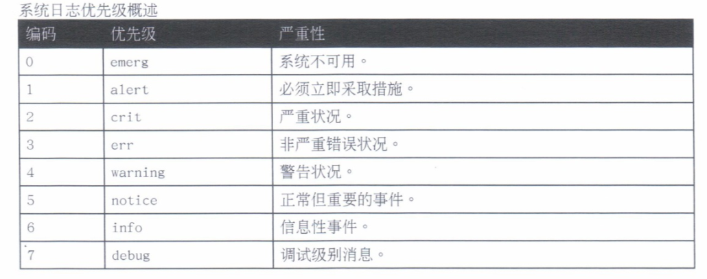

# 10.分析和存储日志

## 系统日志架构

* 系统日志

### 系统日志

进程和操作系统内核需要能够为发生的事件记录日志. 这些日志可用于系统审核和问题的故障阿劈出. 这些日志永久存储在`/var/log`目录中.

红帽7的系统日志消息由两个服务负责处理

* systemd-journald
* rsyslog

#### systemd-journald

**systemd-journald**守护进程提供一种改进的日志管理服务, 可以收集来自

* 内核
* 启动过程的早期阶段
* 标准输出
* 系统日志
* 以及守护进程启动
* 运行期间错误的消息. 

这些消息写入到一个结构化事件日志中, **默认情况下不在重新启动之间保留**. 系统日志信息也可由`systemd-journald`转发到`rsyslog`以做进一步处理.

#### rsyslog

**rsyslog**服务随后根据类型(或设备)和优先级排列系统日志消息, 将它们写入到`/var/log`目录内的永久文件中.

#### 日志类型

##### /var/log/messages

大多数系统日志消息记录在此

##### /var/log/secure

安全和身份验证相关的消息和错误的日志文件

##### /var/log/maillog

邮件服务器相关的消息的日志文件

##### /var/log/cron

定期执行任务相关的日志文件

##### /var/log/boot.log

系统启动相关的消息记录在此处

## 查看系统日志文件

* 系统日志文件
* 日志文件轮转
* 分析系统日志条目
* 利用 tail 监控日志文件
* 使用 logger 发送系统日志消息

### 系统日志文件

使用`syslog`协议将事件记录到系统. 每一日志消息根据

* 设备(消息类型)
* 优先级(消息的严重性)

分类.

#### 优先级



`rsyslogd`服务使用日志消息的设备和优先级来确定如何进行处理. 通过`/etc/rsyslog.conf`文件, 以及`/etc/rsyslog.d`中的`*.conf`文件进行配置.

`#### RULES ####`包含定义日志消息保存位置的相关指令.

* 左侧表示与指令匹配的日志消息的设备和严重性. `*`表示所有设备或所有验证级别.
* 右侧表示要将日志消息保存到的文件. 通常保存在`/var/log`目录中的文件中.

优先级`none`表示不添加到指定的日志文件中.

```
#### RULES ####

# Log all kernel messages to the console.
# Logging much else clutters up the screen.
#kern.*                                                 /dev/console
```

### 日志文件轮转

日志通过`logrotate`**轮转**, 防止他们将包含`/var/log`的文件系统填满.

通过`logrotate`的配置指定轮转规则.

### 分析系统日志条目

`rsyslog`所写的系统日志在文件的开头显示最旧的消息, 在文件的末尾显示最新的消息.

```
Aug 12 20:04:44 bunker sshd[24780]: pam_unix(sshd:session): session closed for user ansible
```

* 记录该日志条目的时间
* 发送该日志消息的主机
* 发送该日志消息的程序或进程
* 发送的实际消息

### 利用 tail 监控日志文件

可以使用`tail -f /path/to/file`输出指定文件的最后10行, 并在新行写入到被监控文件中时继续输出它们.

### 使用 logger 发送系统日志消息

`logger`命令可以发送消息到`rsyslog`服务. 默认情况下, 它将严重性为`notice(user.notice)`的消息发送给设备用户, 除非通过`-p`选项另外指定.

## 查看 systemd 日志条目

* 通过 journalctl 查找事件

### 通过 journalctl 查找事件

`systemd`日志将日志数据存储在带有索引的结构化二进制文件中. 此数据包含与日志事件相关的额外信息.

红帽7日志默认存储叜`/run/log/`中, 其内容会在重启后予以清除. 此设置可以由系统管理员更改.

`journalctl`命令从最旧的日志条目开始显示完整的系统日志.

* `-p`可以接受优先级的名称或编号作为参数, 显示所有指定级别及更高级别的条目.
* `-f`显示最后的10行.
* `--since`和`--until`限制特定的时间范围.
* `_COMM`命令的名称.
* `_EXE`进程的可执行文件路径.
* `_PID`进程的`PID`.
* `_UID`运行该进程的用户的`UID`.
* `_SYSTEMD_UNIT`启动该进程的`systemd`单元.

## 保存 systemd 日志

* 永久存储系统日志

### 永久存储系统日志

默认`systemd`日志保存在`/run/log/journal`中. 系统重启时它会被清除. 对于大多数情况来说, 自上一次启动起的详细日志就已足够.

如果存在`/var/log/journal`目录. 永久日志, 并非所有数据都用永久保留. 有一个内置日志轮转机制, 会在每个月触发. 
默认, 日志的大小不能够超过所处文件系统的`10%`, 也不能造成文件系统的可用空间低于`15%`. 可以通过在`/etc/systemd.journald.conf`中调节.

* 创建文件夹`mkdir /var/log/journal`
* 修改权限
	* 属主为`root`
	* 属组为`systemd-journal`
	* 权限为`2755`
* 重启系统或者发送信号`killall -USR1 systemd-journald`

## 保持准确的时间

* 设置本地时钟和时区
* 配置或监控 chronyd

### 设置本地时钟和时区

网络时间协议(NTP)是计算机用于通过互联网提供并获取正确时间信息的一种标准方法. 计算机可以通过互联网上的公共`NTP`服务器获取正确的时间信息.

`timedatectl`显示当前的时间相关系统设置. 如当前时间, 时区和NTP同步设置.

* `list-timezones`, 列出已知时区的数据库.
* `set-time` 修改时间.
* `set-ntp true, false` 启用或禁用 NTP 同步.

### 配置或监控 chronyd

`chronyd`服务通过与配置的`NTP`服务器同步, 使通常不准确的本地硬件时钟(RTC)保持准确. 或者无网络链接, 与计算的`RTC`时钟漂移值同步, 该值记录在`/etc/chrony.conf`配置文件中指定的`driftfile`中.

时间源

* `server`, 比本地`NTP`服务器高一个级别
* `peer`, 属于同一个级别

`iburst`选项, 在服务启动后, 会在很短时间内执行四种测量, 获得更加精确的初始时钟同步.

`chronyc`命令充当`chronyd`服务的客户端. 在设置`NTP`同步后, 验证用于同步系统时钟的是否为`NTP`服务器.

`chronyc sources -v`获取`NTP`同步服务器的详细输出.

