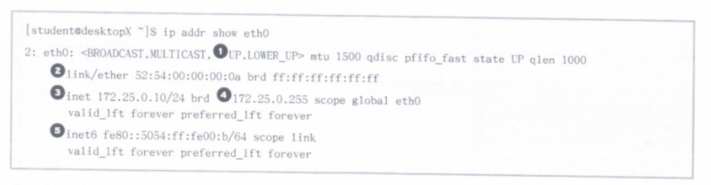

# 11.管理红帽企业 LINUX 网络

## 网络概念

* IPv4网络
* 网络接口名称

### IPv4 网络

4层模型

* 应用, 每一应用程序具有用于通信的规范, 以便客户端和服务器可以跨平台通信.
* 传输, TCP 和 UDP.
* 互联网, 网络层将数据从源主机传送到目标主机.
* 链路, 链路或介质存取层提供与物理介质的连接. 常见的有以太网(802.3)和无线局域网(802.11).


#### IPv4地址

IPv4地址是一个32位数字, 通常使用点号分隔的四个十进制八位字节(0~255). 分为**网络部分**和**主机部分**.

**相同的网络部分**的所有主机可以在彼此之间直接通信, 无需路由器. 网络部分用于标识子网. 同一子网中的任何两台主机都不能具有相同的主机部分. **主机部分用于标识子网中的特定主机**.

**子网掩码**指明由多少位的`IPv4`地址属于子网. 可供主机部分使用的位数越多, 子网中的主机就越多.

*  子网中可能达到的最低地址(主机部分的二进制值全为零)称为**网络地址**.
*  子网中可能达到最高地址(主机部分的二进制全为一)用于广播消息, 称为**广播地址**.

子网掩码的两种表示方式, `IP`地址中有多少前导位组成其网络地址.

* `255.255.255.0`
* `/24`


#### IPv4路由

网络通信都需要主机到主机和网络到网络的形式进行传输. 每一主机具有一个路由表, 该表告诉主机如何路由特定网络的通信. 与网络通信目的地相符的路由表条目用于路由该通信. 如果两个条目匹配, 则使用前缀最长的那一个.

如果网络通信匹配不到更加具体的路由, 则使用默认路由`0.0.0.0/0`. 这一默认路由指向一个可到达的子网上的路由器.

如果路由器收到的通信并非将其作为寻址目标, 则路由器不会像普通主机那样忽略该通信, 而是根据自己的路由表转发该通信. 

* 可能会将通信直接发送到目标主机(路由器恰巧与目标位于同一子网中)
* 可能转发到其他路由器. 

上面的过程会一直进行, 知道通信到达最终目标.

#### DNS

名称解析服务器, DNS 是分布式服务器网络, 可将主机名映射到 IP 地址. 

#### DHCP 或 静态网络配置

自动获取网络配置.

通过`DHCP`仅能分配一个地址. 一个接口可以指定多个静态地址.

### 网络接口名称

红帽7网络接口默认命名行为是根据固件, 设备拓扑或设备类型分配固定的名称.

* 以太网以`en`开头
* WLAN接口以`w1`开头
* WWAN接口以`ww`开头
* `o`代表板载
* `s`代表社插拔插槽
* `p`代表`PCI`地理位置
* `x`用于融入`MAC`地址
* `N`代表所以呢,`ID`或端口

如果无法确定固定名称, 则使用`ethN`等传统名称.

## 验证网络配置

* 显示IP地址
* 路由器故障排除

### 显示IP地址



1. 表示接口的状态为`UP`
2. `link`行指定设备的硬件`MAC`地址
3. `inet`行显示`IPv4`地址和前缀
4. 广播地址, 作用域和设备名称
5. `inet6`行显示`IPv6`信息.

`ip -s link show 网路接口`命令也可用于显示关于网络性能的统计信息. 接收(`RX`)和传送(`TX`)的数据包, 错误和丢弃计数器.

### 路由器故障排除

* `ip route`: 查看路由器信息.
* `ping`: 测试连通性.
* `traceroute`, `tracepath`跟踪**UDP**数据包路径.
* `traceroute`
	* `ICMP(-I)`
	* `TCP(-T)`
* `tracepath`
	* 显示往返用时(RTT)
	* 最大传输单元(MTU)

### 端口和服务故障排除

`TCP`服务使用套接字作为通信的端点.

* `IP`地址
* 协议
* 端口号

服务通常侦听标准端口. 客户端使用死机的可用端口.

`/etc/services`文件中列出了标准端口的常用名称.

`ss`用于显示套接字统计信息.


1. 此端口供`SSH`使用, 侦听所有`IPv4`端口. 当引用`IPv4`地址或端口时, `*`表示"所有"
2. 此端口供`SMTP`使用, 侦听`127.0.0.1 IPv4`环回接口
3. 已建立的`SSH`连接在`172.25.X.10`接口上, 其源地址为`172.25.254.254`的系统
4. 此端口供`SSH`使用, 侦听所有`IPv6`地址. `::`表示所有`IPv6`接口.
5. 此端口供`SMTP`使用, 侦听`::1` IPv6环回接口.

`ss`和`netstat`选项.

* `-n`, 显示接口和端口号的编号, 而不显示名称.
* `-t`, 显示TCP套接字.
* `-u`, 显示UDP套接字.
* `-l`, 仅显示侦听中的套接字.
* `-a`, 显示所有(侦听中和已建立的)套接字.
* `-p`, 显示使用套接字的进程.

## 使用 nmcli 配置网络

* NetworkManager

### NetworkManager

`NetworkManager`是监控和管理网络设置的守护进程. 

* **设备**是网络接口. 
* **链接**是供设备使用的配置.

同一设备可能存在多个链接, 但一次只能有一个保持活动的状态. 

### 使用 nmcli 查看网络信息

`nmcli con show`, 显示所有连接的列表.

`nmcli con show "链接ID或名称"`, 查看该连接的详细信息. 

`nmcli dev status` 显示设备状态和详细信息.

### 通过 nmcli 创建网络连接

参数顺序:

1. 公用参数
	* 类型
	* 接口
2. 类型相关参数
3. IP地址, 前缀和网关信息

一个设备可以指定多个IP地址.

#### 示例

定义一个名为`default`的新连接, 使用 DHCP 通过 eth0 设备的以太网连接自动连接.

```
nmcli con add con-name "default" type ethernet ifname eth0
```

新建一个名为`static`的连接, 并且指定`IP`地址和网关. 不要自动连接.

```
nmcli con add con-name "static" ifname eth0 autoconnect no type ethernet ip4 172.25.X.10/25 gw4 172.25.X.254
```

系统将在启动时通过`DHCP`连接进行自动连接. 更改为静态连接.

```
nmcli con up "static"
```

改回到 DHCP 连接

```
nmcli con up "default"
```

#### 类型选项

* 以太网类型会选择性的指定`MAC`地址
* `Wifi`类型的链接必须指定`SSID`

### 通过 nmcli 修改网络接口

`nmcli con mod`参数修改现有的连接. 参数为"键/指对"组合.

`nmcli con show "<ID>"`查看链接的当前值的列表.

#### 示例

关闭自动连接

```
nmcli con mod "static" connection.autoconnect no
```

指定 DNS 服务器

```
nmcli con mod "static" ipv4.dns 172.25.X.254
```

一些配置参数增加或删除"+/-", 添加辅助DNS

```
nmcli con mod "static" +ipv4.dns 8.8.8.8
```

替换静态`IP`地址和网关

```
nmcli con mod "static" ipv4.address "172.25.X.10/24 172.25.X.254"
```

添加没有网关的辅助`IP`地址

```
nmcli con mod "static" +ipv4.address 10.10.10.10/16
```

### nmcli 命令摘要

* `nmcli dev status`, 列出所有设备.
* `nmcli con show`, 列出所有连接.
* `nmcli con up "<ID>"`, 激活连接.
* `nmcli con down "<ID>"`, 取消激活连接. 如果自动连接为是, 则该连接将重新启动.
* `nmcli dev dis(connect) <DEV>`, 中断接口, 并且暂时禁用自动连接.
* `nmcli net off`, 禁用所有管理的接口.
* `nmcli con add...`, 添加新连接.
* `nmcli con mod "<ID>"...`, 修改连接.
* `nmcli con del "<ID>"...`, 删除连接.

## 编辑网络配置文件

* 修改网络配置

### 修改网络配置

可以通过编辑接口配置文件来配置网络. 文件通常命名为`/etc/sysconfig/network-scripts/ifcfg-<name>`, 其中`<name>`是指配置文件控制的设备或连接的名称.

## 配置主机名和名称解析

* 更改系统主机名
* 配置名称解析

### 更改系统主机名

`hostname`显示或**临时**修改系统的完全关限定主机名称.

在`/etc/hostname`文件中指定静态主机名. `hostnamectl`命令用于修改此文件, 也可用于查看系统的完全限定主机名的状态.

以前的红帽系统将主机名作为变量存储在`/etc/sysconfig/network`中.

### 配置名称解析

根解析器用于将主机名称转换为`IP`地址, 反之亦可. 首先检查`/etc/hosts`文件的内容.

如果未找到条目, 根解析器从 DNS 名称服务器中查找信息. `/etc/resolv.conf`文件控制如何完成此查询.

* nameserver: 要查询的名称服务器的IP地址. 可以指定最多三个.
* domain: 用来指定本地的域名. 在没有设置search的情况下, search默认为domain的值.
* search: 用于较短主机名称尝试搜索的域名列表. 不应该在同一文件中设置此参数和`domain`. nameserver解析失败时会在域名后加上search部分然后再解析.

`NetworkManager`将使用链接配置文件中的 DNS 设置更新 `/etc/resolv.conf`. 使用`nmcli`修改此连接.

## 补充 

* 网关往往是一个路由器, 是一个三层转发的设备(网络层).
* 网桥是一个链路层设备, 基于`MAC`地址在网络之间转发流量.