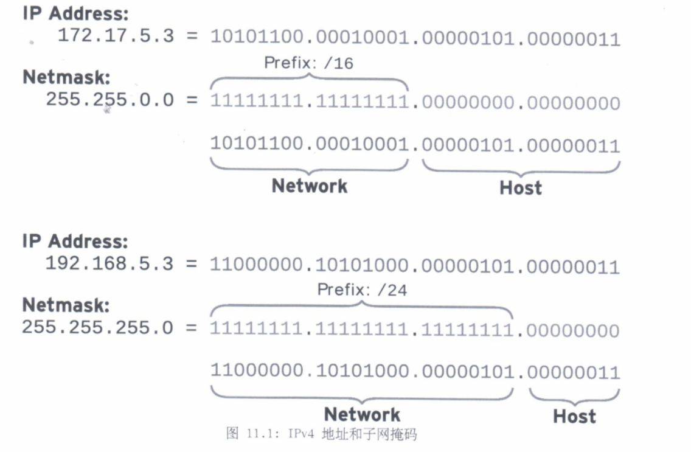
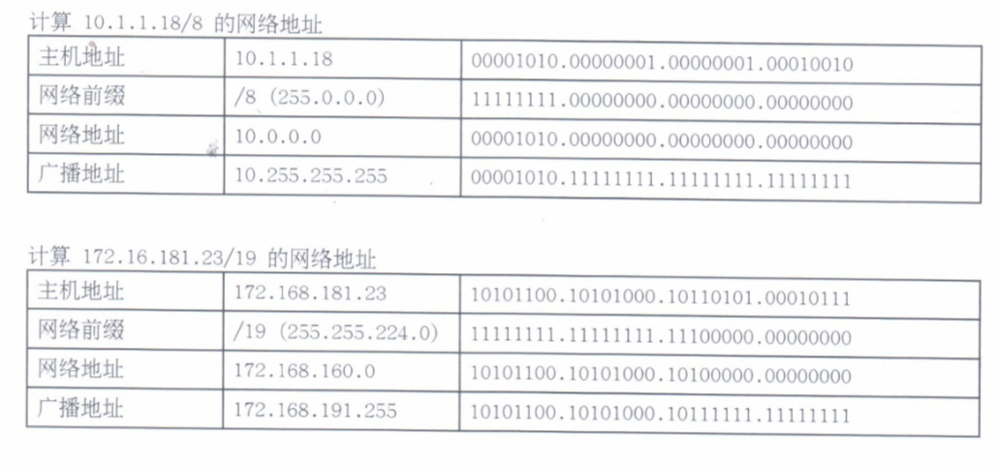

# 11.管理红帽企业 LINUX 网络

## 网络概念

* IPv4网络
* 网络接口名称

### IPv4 网络

4层模型

* 应用, 每一应用程序具有用于通信的规范, 以便客户端和服务器可以跨平台通信.
* 传输, TCP 和 UDP.
* 互联网, 网络层将数据从源主机传送到目标主机.
* 链路, 链路或介质存取层提供与物理介质的连接. 常见的有以太网(802.3)和无线局域网(802.11).

#### IPv4地址

IPv4地址是一个32位数字, 通常使用点号分隔的四个十进制八位字节(0~255). 分为**网络部分**和**主机部分**.

**相同的网络部分**的所有主机可以在彼此之间直接通信, 无需路由器. 网络部分用于标识子网. 同一子网中的任何两台主机都不能具有相同的主机部分. **主机部分用于标识子网中的特定主机**.

**子网掩码**指明由多少位的`IPv4`地址属于子网. 可供主机部分使用的位数越多, 子网中的主机就越多.

*  子网中可能达到的最低地址(主机部分的二进制值全为零)称为**网络地址**.
*  子网中可能达到最高地址(主机部分的二进制全为一)用于广播消息, 称为**广播地址**.

子网掩码的两种表示方式, `IP`地址中有多少前导位组成其网络地址.

* `255.255.255.0`
* `/24`

#### IPv4路由

网络通信都需要主机到主机和网络到网络的形式进行传输. 每一主机具有一个路由表, 该表告诉主机如何路由特定网络的通信. 与网络通信目的地相符的路由表条目用于路由该通信. 如果两个条目匹配, 则使用前缀最长的那一个.

如果网络通信匹配不到更加具体的路由, 则使用默认路由`0.0.0.0/0`. 这一默认路由指向一个可到达的子网上的路由器.

如果路由器收到的通信并非将其作为寻址目标, 则路由器不会像普通主机那样忽略该通信, 而是根据自己的路由表转发该通信. 

* 可能会将通信直接发送到目标主机(路由器恰巧与目标位于同一子网中)
* 可能转发到其他路由器. 

上面的过程会一直进行, 知道通信到达最终目标.

#### DNS

名称解析服务器, DNS 是分布式服务器网络, 可将主机名映射到 IP 地址. 

#### DHCP 或 静态网络配置

自动获取网络配置.

通过`DHCP`仅能分配一个地址. 一个接口可以指定多个静态地址.

### 网络接口名称

红帽7网络接口默认命名行为是根据固件, 设备拓扑或设备类型分配固定的名称.

* 以太网以`en`开头
* WLAN接口以`w1`开头
* WWAN接口以`ww`开头
* `o`代表板载
* `s`代表社插拔插槽
* `p`代表`PCI`地理位置
* `x`用于融入`MAC`地址
* `N`代表所以呢,`ID`或端口

如果无法确定固定名称, 则使用`ethN`等传统名称.

## 验证网络配置