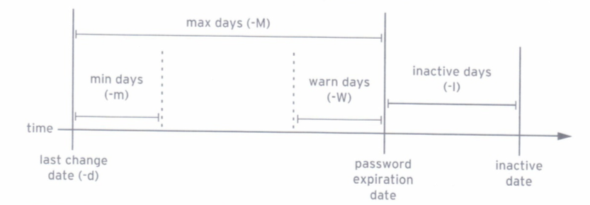

# 5.管理本地Linux用户和组

## 用户和组

* 什么是用户
* 什么是组

### 什么是用户

* 进程中每个进程(运行程序)都作为一个特定用户运行.
* 每个文件归一个特定用户所有.
* 对文件和目录的访问收到用户的限制.
* 与运行进程相关联的用户可确定该进程可访问的文件和目录.

**id** 命令用于显示有关当前已登录用户的信息.

**`/etc/passwd`**采用以下格式

```
username:password:UID:GID:GECOS:/home/dir:shell
```

* username: `UID`到名称的一种映射.
* password: **以前**是以加密格式保存密码的位置. 现在密码存储在称为`/etc/shadow`的单独文件中.
* UID: 是用户`ID`, 即在最基本的级别标识用户和编号.
* GID: 是用户的**主要组**`ID`编号
* GECOS: 任意文本
* /home/dir: 用户的个人数据和配置文件的位置

### 什么是组

组也有名称和编号(`GID`). 本地组在`/etc/group`中定义

#### 主要组

* 每个用户**有且只有一个**主要组
* 对于本地用户, 主要组通过`/etc/passwd`第三个字段中列出的组的`GID`编号定义
* 通常, 用户创建的新文件归主要组所有
* 通常, 新建用户的主要组是名称与用户名相同的新建组. 用户是此用户专用组(UPG)的唯一成员.

#### 补充组

* 用户可以是零个或多个补充组的成员
* 属于本地组补充成员的用户列在`/etc/group`中组条目的最后一个字段中. 对于本地组, 用户成员身份有`/etc/group`中组条目的最后一个字段又逗号分隔的用户列表确定.

```
groupname:password:GUD:list,of,users.in,this,group
```

补充组成员身份用于帮助确保用户具有对系统中文件及其他资源的访问权限.

## 获取超级用户访问权限

* root 用户
* 利用 su 切换用户
* 通过 sudo 以 root 身份运行命令

### root 用户

具有系统全部权限的用户.

非`root`用户可以添加或删除文件以及管理可移动的设备.

只有`root`用户可以管理"固定"硬盘

### 利用 su 切换用户

`su`命令可让用户切换至另一个用户账户. 如果未指定用户名, 则意味着使用`root`账户.

* 普通用户调用时, 需要输入被切换账户的密码.
* `root`账户调用时, 无须输入账户密码

```
su [-] <username>
```

`su username`会启动`non-login shell`. `su`仅以该用户身份使用当前的环境设置启动`shell`

`su - username`会启动`login shell`. `su -`会将环境设置为如同以该用户身份完全登录一样.

`-c`以另一个用户身份运行任意程序

### 通过 sudo 以 root 身份运行命令

使用`su`切换`root`运行命令, 需要知道`root`密码.

`sudo`命令可以使用户根据`/etc/sudoers`文件中的设置, 而被允许以`root`或其他用户身份运行命令. `sudo`要求用户**输入自己的密码以进行身份验证**.

`sudo`执行的所有命令都默认为将日志记录到`/var/log/secure`中.

红帽7中, `wheel`组的所有成员都可以使用`sudo`以包括`root`在内的任何用户的身份运行命令.

## 管理本地用户账户

* 管理本地用户

### 管理本地用户

#### useradd

`useradd`创建用户, 一些默认值从`/etc/login.defs`文件中读取. **创建新用户时候使用**

#### usermod

`usernmod`: 修改先用用户. 一些参数:

* `-c, --comment COMMENT`: 向`GECOS`字段添加值.
* `-g, --gid GROUP`: 为用户账户指定主要组.
* `-G, --groups GROUPS`: 为用户账户指定一组补充足.
* `-a, --append`: 与`-G`搭配使用, 将用户附加到所给的补充组, 而不将该用户从其他组删除. **追加, 常用**
* `-d, --home HOME_DIR`: 为用户指定新的主目录.
* `-m, --move-home`: 将用户主目录移动到新的位置. 必须与`-d`选项搭配使用.
* `-s, --shell SHELL`: Wie用户账户指定新的登录`shell`. **常用 /sbin/nologin 给服务进程使用, 不让该用户登录**
* `-L, --lock`: 锁定用户账户.
* `-U, --unlock`: 解锁用户账户.

#### userdel

`userdel`删除用户, 从`/etc/passwd`中删除, 但默认情况下保留主目录不变. 因为没删除主目录文件, 会产证具有未分配用户`ID`编号所拥有的文件. 旧用户`UID`将重新分配个新用户, 会为新用户提供旧用户遗留文件的所有权.

`userdel -r username`同时删除用户和其主目录.

#### id

* `id`显示用户信息, 包括用户的`UID`编号和组成员资格
* `id username`显示指定`username`

#### passwd

* `passwd username`用于设置用户的初始密码或更改该用户的密码
* `root`可以将密码设为任何值

#### UID 范围

* `0`为`root`.
* `1-200`是一些列"系统用户", 静态分配各红帽的系统进程.
* `201-900`是一系列"系统用户", 供文件系统中没有自己的文件的系统进程使用.
* `1000+`分配普通用户的范围

红帽`Linux 7`之前:

* `1-499`系统用户
* `500+`是普通用户

## 管理本地组账户

* 管理补充组

### 管理补充组

组必须存在后, 用户才能添加其中

#### groupadd 创建组

* `groupadd groupname`如果不带选项, 使用`/etc/login.defs`文件中指定范围内的下一个可用`GID`.
* `-g GID`用于指定具体的`GID`.
* `-r`使用`/etc/login.defs`文件中所列有有效系统`GID`编号范围内的`GID`创建**系统组**.

#### groupmod 修改现有组

* `-n`指定新的名称
* `-g`指定新的`GID`

#### groupdel 删除组

如果**组是任何现有用户的主要组**, 则它不能被删除.

#### usermod 变更组成员资格

* `usermod -g groupname`更改用户的主要组
* `usermod -aG groupname username`将用户添加到补充组

## 管理用户密码

* 阴影密码和密码策略
* 密码过期
* 限制访问

### 阴影密码和密码策略

现代密码哈希中存储三段信息

```
$6$/dJDwNdl$3gL5uG9DnAv4eeMcuqYdNyZkINVqtpaTf4H3F5tIIm3MKX2eEBZhyuRjQjS4CD01KM4urcwRqAo/gXitVNrN6
```

`$哈希算法$sqlt$已加密哈希`

* 哈希算法
	* `1`表示`MD5`哈希
	* `6`表示`SHA-512`
* salt: 杂质

用户登录时, 系统在`/etc/shadow`中查询用户的条目, 将用户的`salt`和键入的未加密密码组合, 再使用指定的哈希算法加密. 如果匹配, 则用户键入了正确的密码. 如果不匹配, 则键入了错误的密码.

`root`可以更改密码哈徐所用的默认算法. 运行`authconfig --passalog`从`md5, sha256, sha512`中选择一个.

#### /etc/shadow 格式

```
name:password:lastchange:minage:maxage:warning:inactive:expire:blank
```

* name: 登录名称, 有效账户名.
* password: 已加密密码. **密码字段开头为感叹号时**, 表示该密码已被锁定.
* lastchange: 最近一次更改密码的日期, 从距离1970年1月1日的天数表示.
* minage: 可以更改前的最少天数, 0表示无最短期限要求
* maxage: 必须更改密码前的最多天数
* warning: 密码到期的警告期. 以天数表示, 0表示不提供警告
* inactive: 账户在密码到期后保持活动的天数. 在此期限内, 用户依然可以登录系统并更改面膜. 在指定天数过后, 账户被锁定, 变为不活动.
* expire: 账户到期日期, 以距离1970年1月1日的天数表示.
* blank: 预留

### 密码过期



* `chage -d 0 username`: 将强制在下次登录时更新密码
* `chage -l username`: 列出用户名的当前设置
* `chage -E YYYY-MM-DD`: 在指定的日期使账户到期

### 限制访问

* `change`设置账户到期.
* `usermod -L`锁定账户(`-U`解锁)
	* `-e`可以设置用户到期, 和`chage -E`相同

#### nologin shell

用户需要一个账户并通过密码与系统进行身份验证, 但**不需要在系统上使用交互式`shell`**.

邮件服务器需要账户来存储邮件, 但是需要密码供用户通过检索邮件所用的邮件客户端进行身份验证. 用户不需要直接登录该系统.

设置用户的登录`shell`为`/sbin/nologin`.


