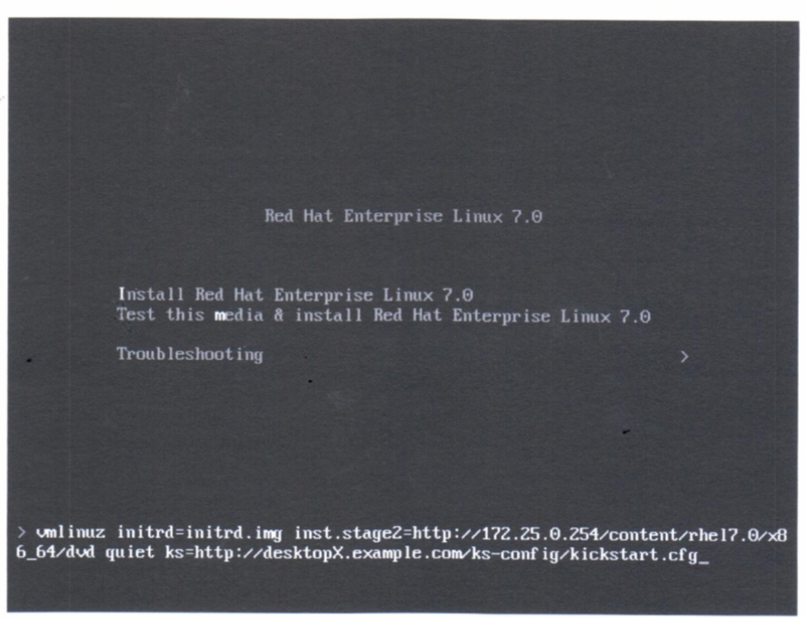

# 1.使用 KICKSTART 自动安装

## 定义 Anaconda Kickstart 系统

* Kickstart 安装简介
* Kickstart 配置文件命令

### Kickstart 安装简介

* `Kickstart`的功能自动执行红帽安装
* 安装程序`Anaconda`是一个交互式程序安装系统, 获取
	* 磁盘如何分区
	* 配置网络接口
	* 选择安装的软件包
	* ...
* `Kickstart`使用一个文本文件提供这些问题答案, **因此无需交互**

`Kickstart`配置文件以一个命令列表开头.

* `#`开头: 注释
* `%`开头, 结尾`%end`是指令
* `%packages`指定要在目标系统上安装的软件
	* 单个软件包根据名称(不带版本)
	* 软件包组, 根据名称或`ID`, 以`@`字符开头.
	* 环境组, 可使用`@^`指定，根据环境组名或`ID`
	* 以`-`开头的软件包或组名称将被**排除在外**, 除非必须或被其他软件依赖
* `%pre`脚本在进行**任何磁盘分区之前进行**
* `%post`脚本在**所有软件都已安装后对系统进行配置**
  
### Kickstart 配置文件命令

* 安装命令
	* `url`: 指定安装介质的位置(红帽安装盘, 镜像).
	* `repo`: 安装软件包的`yum`存储库.
	* `text`: 强制进行文本模式安装.
	* `vnc`: 允许通过`VNC`远程查看图形安装.
	* `askmethod`: 不自动使用`CD-ROM`作为软件包来源.
* 分区命令
	* `clearpart`: 安装之前清楚指定分区
	* `part`: 指定分区大小, 格式和名称
	* `ignoredisk`: 安装时忽略指定的磁盘
	* `bootloader`: 定义在何处安装启动加载器
	* `volgroup,logvol`: 指定`LVM`卷组和逻辑卷
	* `zerombr`: 格式未被识别的磁盘将被初始化
* 网络命令
	* `network`: 配置目标系统的网络信息, 并**激活**安装程序环境中的网络设备.
	* `firewall`: 配置防火墙.
* 配置命令
	* `lang`: 是定安装时使用的语言.
	* `keyboard`: 使用的键盘类型.
	* `timezone`: 定义时区, `NTP`服务器以及硬件始终是否使用`UTC`.
	* `auth`: 设置系统的身份验证选项.
	* `rootpw`: 定义初始`root`用户密码.
	* `selinux`: 设置`SELinux`.
	* `services`: 修改默认运行级别下将运行的默认服务集合.
	* `group,user`: 在系统上创建本地组或用户
* 杂项命令
	* `logging`: 定义安装期间`Anaconda`将如何进行日志记录
	* `firstboot`: 系统首次启动时`firstboot`是否启动
	* `reboot,poweroff,halt`: 指定安装结束后应发生什么情况

**Kickstart 文件中如果却好啊必须值, 会导致安装程序中断并以交互式提示用户输入答案或完全中止安装**

## 使用 Kickstart 部署新虚拟系统

* Kickstart 安装步骤
* 创建 Kickstart 配置文件
* 将 Kickstart 配置文件发布到 Anaconda
* 启动 Anaconda 并将其指向 Kickstart 配置文件

### Kickstart 安装步骤

* 创建 Kickstart 配置文件
* 将 Kickstart 皮质文件发布到安装程序
* 启动 Anaconda 并将其指向 Kickstart 配置文件

### 创建 Kickstart 配置文件

* `system-config-kickstart` 图形化工具
	* 不支持
		* LVM 和 软件 RAID
		* 高级的脚本, `%pre`和`%post`
* 文本编辑器

`ksvalidator`用于检查`Kickstart`配置文件中语法错误.
 
### 将 Kickstart 配置文件发布到 Anaconda
 
`Kickstart`配置文件可供安装程序使用:

* 网络服务器: FTP, HTTP, NFS
* DHCP/TFTP 服务器
* USB 磁盘或 CD-ROM
* 本地硬盘

**常用网络服务器**

### 启动 Anaconda 并将其指向 Kickstart 配置文件

`ks=LOCATION`

示例

```
ks=http://server/dir/file
```



物理机安装时, 安装介质启动时, 按`Tab`中断启动过程. 输入`ks=xxxx`

 