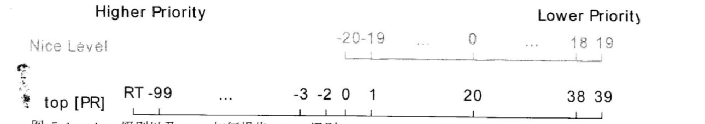

# 5.管理 LINUX 进程的优先级

## 进程优先级和 "nice" 概念

* Linux 进程调度和多任务
* 相对优先级
* nice 级别和权限

### Linux 进程调度和多任务

场景: 需要运行的进程数量总是超出了实际具有的核心数.

通过使用时间片的技术, Linux 实际能够运行的进程数(和线程数)可以超出可用的实际处理单元数. 操作系统进程调度程序将在**单个核心上的进程之间快速切换**, 从而给用户一种有多个进程在同时运行的印象.

执行切换的`Linux`内核部分称为**进程调度程序**.

### 相对优先级

调度程序为不同的进程使用不同的调度策略.

大多数进程使用的调度策略称为`SCHED_OTHER`(`SCHED_NORMAL`). 由于不是所有的进程以同样的方式创建, 可为采用`SCHED_NORMAL`策略运行的进程指定相对优先级. 此优先级称为进程的`nice`值, 一个进程由40种不同级别的`nice`值.

`nice`值范围是`-20 - 19`. 

* 进程继承其父进程的`nice`级别, 通常为`0`.
* `nice`级别越高, 代表优先级越低, (该进程容器将其CPU使用量让给其他进程);
* `nice`级别越低, 表示优先级越高, (该进程更加不倾向于让出CPU).

如果不存在资源争用(活动进程数量 < CPU核心数), 即使`nice`级别高的进程也将仍使用他们可使用的所有`CPU`资源.

当请求`CPU`时间的进程数超过可用核心数, `nice`几倍较高的进程比`nice`级别低的进程收到**更少**的`CPU`时间.

### nice 级别和权限

仅允许`root`用户(具有`CAP_SYS_NICE`功能的用户)设置**负nice级别**以及降低现有进程的`nice`级别(**提高优先级**). 可以设置**-20 到 -1**

普通非特权用户仅允许设置正的`nice`级别. 只能对现有进程**提升**`nice`级别(**降低优先级**), **不能降低**`nice`级别(**不能提高优先级**. 仅可以设置 **0 到 19**

## 使用 nice 和 renice 影响进程优先级

* 报告 nice 级别
* 启动具有不同 nice 级别的进程
* 更改现有进程的 nice 级别

### 报告 nice 级别

#### top

`NI`表示实际`nice`级别.

`PR`将`nice`级别显示为映射到更大优先级队列:

* `nice`级别`-20`映射到优先级`0`.
* `nice`级别`19`映射到优先级`39`.

#### ps

`ps nice` 显示`nice`级别.

如果进程`nice`级别报告为`-`. 这些进程用**不同的调度策略运行**, 调度程序几乎必然将它们视为具有**较高**的优先级.

通过从`ps`请求`cls`字段, 可以显示调度程序策略, 字段`TS`表示进程在`SCHED_NORMAL`调度策略.

### 启动具有不同 nice 级别的进程

启动进程时, 将继承父进程的`nice`级别. **从命令行启动一个进程时, 它将与从其启动的`shell`进程具有相同的`nice`级别**. 一般为`0`.

使用`nice`工具运行其命令.

`nice <COMMAND>`强启动`nice`级别为`10`的`<COMMAND>`.

`nice -n <NICELEVEL> <COMMAND>`可以设定`nice`级别.

### 更改现有进程的 nice 级别

`renice -n <NICELEVEL> <PID>`

* 普通用户仅允许**提升**进程的`nice`级别
* `root`用户使用`renice`降低`nice`级别