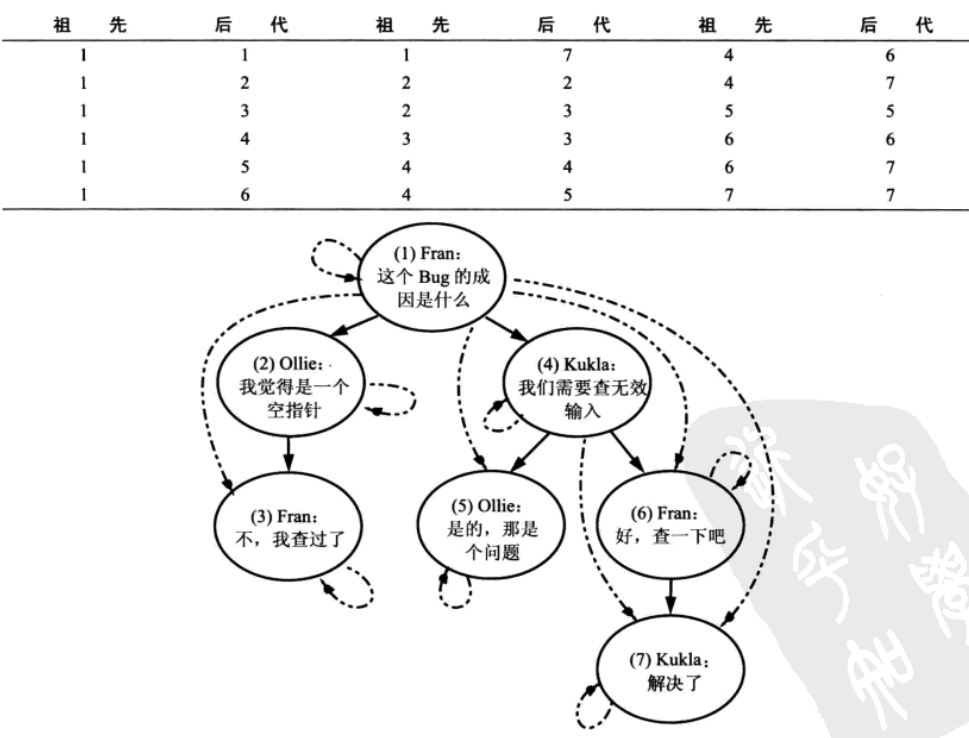
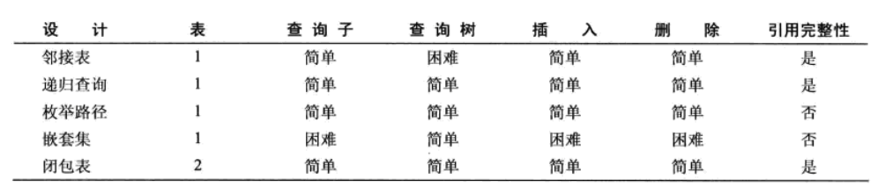

# 3 单纯的树

## 笔记

---

### 目标: 分层存储与查询

递归关系的数据, 数据会像树或者以层级方式存储.

树形结构:

* 实例被称为节点(`node`). 每个节点有多个子节点和一个父节点.
* 最上层的节点叫根(`root`)节点, 没有父节点.
* 最底层的没有子节点的节点叫叶(`leaf`).
* 中间的节点称为非叶(`nonleaf`)节点.

### 反模式: 总是依赖父节点

例如层级的文章评论.

最常见的解决方案是添加`parent_id`字段, 引用同一张表中的其他恢复. 可以建一个外键约束来维护这种关系.

```sql
CREATE TABLE Comments (
	comment_id ..
	parent_id ..
	..
	FOREIGN KEY (parent_id) REFERENCES Comments(comment_id)
);
```

这样的设计叫做**邻接表**. 也就是通常使用根就是`parent_id=0`, 然后子孙根据`parent_id`来确认.

#### 使用邻接表查询树

无法完成: 查询一个节点的所有后代.

每增加一层查询都需要额外扩展一个联结, 而`SQL`查询中联结的次数是有上限的.

查询`COUNT()`变得极其困难.

#### 使用邻接表维护树

增加一个叶子节点, 修改一个节点的位置,或者一个子树的位置 非常方便.

但是从一棵树中删除一个节点会比较复杂. 如果需要删除一棵子树, 不得不执行多次查询来找到所有后代节点, 然后逐个从最低级别开始删除这些节点以满足外键完整性.

如果确定只是删除可以使用`ON DELTE OCASCADE`修饰符的外键约束来自动完成这些操作.

### 如何识别反模式

* 我们的树结构要支持多少层
* 我需要一个脚本来定期地清理树中的孤立节点数据

### 合理使用反模式

邻接表设计的优势:

* 快速地获取一个给定节点的直接父子节点
* 容易插入新节点

### 解决方案: 使用其他树模型

* 路径枚举
* 嵌套集
* 闭包表

#### 路径枚举

邻接表的缺点之一是从树中获取一个给定节点的所有祖先的开销很大.

**路径枚举的设计通过将所有祖先的信息联合成一个字符串, 并保存为每个节点的一个属性**.

路径枚举是一个由连续的直接层级关系组成的完整路径. `/usr/local/lib`是一个路径枚举. `usr`是`local`的父亲. `usr`是`lib`的祖先.

这样我们的评论中`parent_id`替换为`path`.`path`存储`1/2/3`这样的层级关系.

```sql
比如要查询评论#7的祖先, 路径是1/4/6/7

WHERE '1/4/6/7' LIKE c.path || '%';

这句查询会匹配到路径为1/4/6/%, 1/4/%, 1/%的节点, 而这些节点就是评论#7 的祖先.
```

插入一个节点, 只需要复制一份要插入节点的逻辑上的父亲节点的路径, 并将这个新节点的`ID`追加到路径末尾就可以了.

如果这个`ID`是在插入时自动生成的, 可能需要先插入这条记录, 然后获取这条记录的ID, 并更新它的路径.

##### 缺点

* 依赖于应用程序的路基代码来维护路径的字符串, 验证正确性的开销很大.
* `varchar`存在长度限制, 不能支持无限口占.

##### 优点

* 通过字符串长度就能知道层级的深浅.

#### 嵌套集

存储子孙节点的相关信息, 而不是节点的直接祖先.

使用

* nsleft, 小于该节点所有后代ID
* nsright, 大于该节点所有后代的ID

这两个值和`comment_id`没有任何关联.

比如通过搜索哪些节点的ID在评论#4的`nsleft`和`nsright`范围之间来获取评论#4及其所有后代.

插入和移动节点是比较复杂的, 因为需要重新分配左右值.

#### 闭包表

记录了树中所有节点间的关系, 而不仅仅只有那些直接的父子关系.

额外创建一张表`Trepaths`.

* ancestor(祖先), 关联`comment_id`
* descendant(后代), 关联`comment_id`

不使用`Comments`表来存储树的结构, 而是将书中任何具有祖先后代关系的节点对都存储在`Trepaths`表的一行中, 即使这两个节点之间不是直接的父子关系. 同时还增加一行指向节点自己.

* 查询评论#4的后代, 搜索祖先是评论#4的行就可以了
* 获取评论#6的所有祖先, 在表中搜索后代为评论#6的行就可以了
* 插入你一个新的叶子节点(评论#5的子节点)
	* 插入一条自己到自己的关系
	* 搜索后代是评论#5的节点, 增加该节点和新插入节点的"祖先-后代"关系
* 删除一个叶子节点, 删除所有`TreePaths`表中后代为该id的行.



#### 你该使用哪种设计



递归查询需要数据库支持`WITH`或者`CONNECT BY PRIOR`, `mysql`不支持.

## 整理知识点

---