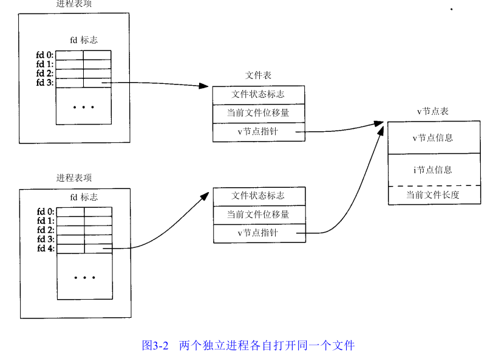

# 第三章 文件I/O

**不带缓冲**

`不带缓冲`(unbuffered I/O)指的是每个`read`和`write`都调用内核中的一个`系统调用`.

`不是` `ISO C`的组成部分. 是`POSIX.1` 和 `SUS` 的组成部分.

### 3.2 文件描述符

**文件描述符**

对于内核而言, 所有打开的文件都通过文件描述符起作用. 文件描述符是一个`非负整数`.当`打开`一个现有文件或`创建`一个新文件时, `内核向进程返回一个文件描述符`. 当`读`,`写`一个文件时,使用`open`或`creat`**返回的文件描述符标识该文件, 将其作为参数传送给**`read`或`write`.

* 标准输入: 0,`STDIN_FILENO`
* 标准输出: 1,`STDOUT_FILENO`
* 标准错误: 2,`STDERR_FILENO`

**范围**

0 - `OPEN_MAX-1`

### 3.3 函数open 和 openat

		#include <fcntl.h>
		int open(const char *path, int oflag,... /* mode_t mode */);
		int openat(int fd, const char *path, int oflag,... /* mode_t mode */);
		
* `...`: 表名余下的参数的数量及其类型是可变的.
* `path`: 是要打开或创建文件的名字.
* `oflag`: 用来说明此函数的多个选项.

**oflag**

用一下一个或多个常量进行"`或`"运算构成`oflag`参数.

在头文件`<fcntl.h>`中定义.

`oflag常量`:

* `O_RDONLY`: 只读打开,0
* `O_WRONLY`: 只写打开,1
* `O_RDWR`: 读,写打开
* `O_EXEC`: 只执行打开
* `O_SEARCH`: 值搜索打开(应用于目录)

`必须指定一个且只能指定一个`:

* `O_APPEND`: 每次写是都追加到文件`尾端`.
* `O_CLOEXEC`: 把`FD_CLOEXEC`常量设置为文件描述符标志.
* `O_CREAT`: 若此文件不存在则创建它.
* `O_DIRECTORY`: 如果`path`引用的不是目录,则出错.
* `O_EXCL`:  如果同时指定了`O_CREAT`, 而文件已经存在, 则出错. 用此可以测试一个文件是否存在.
* `O_NOCTTY`: 如果`path`引用的是终端设备,则不讲该设备分配作为此进程的控制终端.
* `O_NOFOLLOW`: 如果`path`引用的是一个符号链接,则出错.
* `O_NONBLOCK`: 如果`patg`引用的是一个`FIFO`, 一个块特殊文件或一个字符特殊文件,则此选项为文件的本次打开操作和后续的I/O操作设置`非阻塞`方式.
* `O_SYNC`: 每次`write`等待物理I/O操作完成, 包括由该`write`操作引起的文件属性更新所需的I/O.
* `O_TRUNC`:如果此文件存在,而且为只写或读-写成功打开,则将其长度截断为0.
* `O_TTY_INIT`:如果打开一个还未打开的终端设备,设置非标准`termios`参数值,使其复合`SUS`.
* `O_DSYNC`: 每次`write`要等待物理I/O操作完成，但是如果该写操作并不影响读取刚写入的数据, 则不需要等待文件属性被更新.
* `O_RSYNC`: 使每一个以文件描述符作为参数进行的`read`操作等待, 直至所有对文件同一部分挂起的`写操作都完成`.

**函数返回**

`open`和`openat`函数返回的文件描述符一定是`最小的未用描述符数值`.

**oepn 和 openat 区别**

* `path`参数指定的是`绝对路径`名, fd参数被`忽略`, `openat函数相当于open函数`.
* `path`参数指定的是`相对路径`名, fd参数指出了相对路径名在文件系统中的开始地址.fd参数是通过打开相对路径名所在的目录来获取.
* `path`参数指定的是`相对路径`,fd参数具有特殊值`AT_FDCWD`.在这种情况下,路径名在当前工作目录中获取.

#### 文件名和路径名截断

在`POSIX.1`中常量`_POSIX_NO_TRUNC`决定是要:

* 截断过长的文件名或路径名
* 返回一个出错

若`_POSIX_NO_TRUNC`有效,则在整个路径名超过`PATH_MAX`,或路径名中的任一文件名超过`NAME_MAX`时,出错返回,并将`errno`设置`ENAMETOOLONG`.

### 3.4 函数creat

调用`creat`函数创建一个新文件.

		#include <fcntl.h>
		int creat(const char *path, mode_t mode);
		成功,返回只写打开的文件描述符;若出错,返回-1
		
**open替换creat**

在提供open的新版本之前(早期,open无法打开一个尚未存在的文件,第2个参数只能是0,1或2,因此需要另一个系统调用creat以创建新文件.现在open函数提供了选项`O_CREAT`和`O_TRUNC`).如果要创建一个临时文件,并要写该文件,然后又读该文件,则必须先调用`creat`,`close`然后再调用`open`.现在用下列方式调用`open`实现:

		open(path, O_RDWR|R_CREAT|R_TRUNC,mode);

### 3.5 函数close

调用`close`关闭一个打开文件.

		#include <unistd.h>
		#int close(int fd);
		成功,返回0;出错,返回-1

关闭一个文件时还会`释放该进程加在该文件上的所有记录锁`. 当一个`进程终止时`,`内核自动关闭它所有的打开文件`.

### 3.6 函数lseek

每个打开文件都有一个与其关联的"`当前文件偏移量(current file offset)`".通常是一个`非负整数`,用以度量从文件开始处计算的字节数.

通常`读` `写`操作都从当前文件偏移量处开始.

当打开一个文件时,除非指定`O_APPEND`选项,否则该偏移量被设置为0.

调用`lseek`显示地为一个打开文件设置偏移量.

		#include <unistd.h>
		
		off_t lseek(int fd, off_t offset, int whence);
		成功,返回新的文件偏移量.出错,返回-1(因为偏移量可能是负值,所以要测试是否等于-1)
		
**参数`whence`**

* `SEEK_SET`: 偏移量设置为距文件开始处`offset`个字节.`绝对偏移量`.
* `SEEK_CUR`: 偏移量设置为当前值加`offset`,`offset`可为正或负.`相对于当前位置的偏移量`.
* `SEEK_END`: 偏移量设置为文件长度加`offset`,`offset`可正可负.`相对于文件尾端的偏移量`.

**`lseek`不引起I/O操作**

`lseek`晋江当前的文件偏移量`记录在内核中`,它并`不引起任何I/O操作`,该偏移量用于下一个读或写操作

**空洞文件**

`文件偏移量可以大于文件的当前长度`,在这种情况下,对该文件的下一次写将加长该文件,并在文件中构成一个`空洞`,位于文件中但没有写过的字节都被`读`为`0`.

文件中的空洞`不占用`磁盘上的存储区,当定位到超出文件尾端之后写时,对于新写的数据需要分配磁盘块,但是`对于原文件尾端和新开始写位置之间的部分则不需要分配磁盘块`.

### 3.7 函数read

调用`read`函数从打开文件中读数据.

		#include <unistd.h>
		
		ssize_t read(int fd, void *buf, size_t nbytes);
		返回值: 读到字节数,若已到文件尾,返回0; 若出错,返回-1
		
`read()`会把参数`fd`所指的文件传送`nbytes`个字节到`buf`指针所指的内存中.
		
`void *`:用于表示通用指针.

`ssize_t`:带符号整型.

`size_t`:无符号整型.

### 3.8 函数write

调用`write`函数向`打开`文件写数据.

		#include <unistd.h>
		
		ssize_t write(int fd, const void *buf, size_t nbytes);
		返回值:若成功,返回已写的字节数;若出错,返回-1
		
`write()`会把参数`buf`所指的内存写入`nbytes`个字节到参数`fd`所指的文件内. 当然, 文件读写位置也会随之移动.

返回值通常与参数`nbytes`相同.

**出错常见原因**

* 磁盘已写满.
* 超过了一个给定进程的文件长度限制.

**写文件的位置**

对普通文件,写操作`从文件的当前偏移量出开始`(可以制定`O_APPEND`选项).

在`一次成功写之后`,该文件偏移量`增加`实际写的字节数.

### 3.9 I/O的效率

#### 预读

预读`read ahead`. 当检测到正进行`顺序`读取时,系统就试图读入比应用要求的`更多数据`,并`假想`应用很快就会读这些数据.

### 3.10 文件共享

不同进程间共享打开文件.

**内核使用3种数据结构表示打开文件**

1. `进程表项`: 每个`进程`在`进程表`中都有一个`记录项`,记录项中`包含一张打开文件描述符表`,可将其视为一个`矢量`,每个描述符占用一项.与每个文件描述符相关联的是:
	* 文件描述符标志(`close_on_exec`)
	* 指向一个`文件表项`的指针
2. `文件表项`: `内核`为所有打开文件维持一张文件表
	* 文件状态标志(读,写,添写(添加写?),同步和非阻塞等)
	* 当前文件偏移量
	* 指向该文件`v节点表项`的指针
3. `v节点表项`: 每个打开文件(或设备)都有一个`v节点`(Linux没有使用v节点,使用了通用的i节点结构).v节点包含了:
	* 文件类型
	* 对此文件进行各种操作函数的指针
	* 该文件的`i节点`(索引节点),i节点包含:
		* 文件的所有者
		* 文件长度
		* 指向文件实际数据块在磁盘上所在位置的指针
		* ...
    * 这些信息都是在`打开文件时从磁盘上读入内存的`,文件的所有相关信息都是`随时可用的`.
 
**每个进程都获得自己的文件表项原因**

这可以使每个进程都有`它自己的对该文件的当前偏移量`. 
 
**示例:1个进程打开两个不同文件**

`一个进程对应3张表之间的关系.该进程有两个不同的打开文件`:

1. 一个文件从标准输入打开(文件描述符0)
2. 另一个从标准输出打开(文件描述符1)

 
   
**示例:两个独立进程各自打开同一个文件**

   
   
`上图示例解析`

`假定`:

* 第一个进程在文件描述符3上打开该文件   
* 另一个进程在文件描述符4上打开该文件
* 对一个给定的文件只有一个`v节点`表项

`操作`:

* 完成每个`write`后,在**`文件表项`**中的`当前文件偏移量`即`增加` `所写入的字节数`.(`write后当前文件偏移量增加`),如果这导致当前文件偏移量超出了当前文件长度,则将**`i节点`**表项中的当前文件长度设置为当前文件偏移量(该文件`加长`了).
* 如果使用`O_APPEND`标志**`打开`**一个文件,则`相应标志`也被`设置`到**`文件表项`**的`文件状态标识中`(目前是`打开`).对这种具有追写标志的文件执行**`写`**操作时,文件表项中的当前文件偏移量会被设置为**`i节点`**表象中的文件长度.这就使得每次写入的数据都追加到文件的当前尾端处.
* 若一个文件用`lseek`定位到文件当前的尾端,`则文件表项中的当前文件偏移量被设置为i节点表象中的当前文件长度`.
* `lseek`函数只修改**`文件表项`**中的当前文件偏移量,不进行任何`I/O`操作.

`dup`: 多个文件描述符项指向同一文件表项.

`父进程,子进程`: 各自的每一个打开文件描述符共享同一个文件表项.
   
 **文件描述符标志和文件状态标志**
 
 `文件描述符标志`和`文件状态标志`在`作用范围`方面的区别:
 
 * `文件描述符标志`: 只用于`一个进程的一个描述符`.
 * `文件状态标志`: 应用于指向该给定文件表项的`任何进程中的`**`所有`**`描述符`.
   
### 3.11 原子操作

#### 追加到一个文件

早期的UNIX系统版本并不支持`open`的`O_APPEND`选项,所以程序被编写成下列形式:

`非原子`操作:

	if(lseek(fd,OL,2) < 0)
		err_sys("lseek error"); //position to EOF
	if(write(fd,buf,100)!=100)
		err_sys("write error"); //write
	
**非原子操作**	
	
任何要求多于一个函数调用的操作都不是原子操作,因为在两个函数调用之间,内核有可能会临时挂起进程(`内核切换进程`).

#### 函数pread和pwrite

**XSL扩展允许原子性地定位执行I/O**

`Single UNIX Specification` 包括了 `XSL`扩展,该扩展允许`原子性`地定位并执行I/O.

**pread**

调用`pread`相当于调用`lseek`后调用`read`

		#include <unistd.h>
		
		ssize_t pread(int fd, void *buf, size_t nbytes, off_t offset);
		返回值: 读到的字节数,若已到文件尾,返回0;若出错,返回-1

**pread 和 lssek后调用read 的区别**

* 调用`pread`时,`无法中断`其定位和读操作.
* `不更新`当前文件偏移量(不更新`文件指针`).

**pwrite**

调用`pread`相当于调用`lseek`后调用`write`
		
		#include <unistd.h>
		
		ssize_t pwrite(int fd, void *buf, size_t nbytes, off_t offset);
		返回值:若成功,返回已写的字节数;若出错,返回-1
		
#### 创建一个文件

`open`函数的`O_CREAT`和`O_EXCL`: 检查文件是否存在和创建文件这两个操作是作为一个`原子操作`执行.		
		
等同于下面程序(`非原子操作`):		
	
		if((fd == open(pathname, O_WRONLY)) < 0){
			if(errno == ENOENT){
				if((fd = creat(path,mode)) < 0)
					err_sys("creat error");
			}else{
				err_sys("open error");
			}
		}
	
#### 原子操作(atomic operation)

由多步组成的一个操作.如果该操作原子地执行,`则要么执行完所有步骤`,`要么一步也不执行`,`不可能只执行所有步骤的一个子集`.
		
### 3.12 函数dup和dup2

用来`复制`一个现有的文件描述符.

		#include <unistd.h>
		
		int dup(int fd);
		int dup2(int fd, int fd2);
		
**dup**

`dup()` 返回的新文件描述符一定是`当前可用文件描述符中的最小数值`.

**dup2**

`fd2`参数制定新描述符的值.

* 如果`fd2`已经打开,则先将其`关闭`.
* 如若`fd` `等于` `fd2`,则`dup2` `返回` `fd2`,而不关闭它.
* 如果`fd` `不等于` `fd2`(返回新的文件描述符),`fd2`(新文件描述符)的 `FD_CLOEXEC` 文件描述符标志就被清除.`fd2`在进程调用`exec`时是打开状态.

返回的新文件描述符与参数fd`共享`同一个`文件表项`.

**共享同一个文件表项**

若描述符0先前被打开为`只读`,那么我们也只能对fd进行`读`操作. 即时系统忽略打开模式,而且下列调用是成功的:

		fd = open("/dev/fd/0",O_RDWR);
		
我们仍然`不能`对fd进行`写操作`.

**dup和fcntl**

`dup(fd);` 等效于 `fcntl(fd, F_DUPFD,0);`.

`dup2(fd,fd2)` 等效于:

`非原子操作`:

* `close(fd2)`;
* `fcntl(fd,F_DUPFD,fd2)`;

### 3.13 函数sync,fsync 和 fdatasync

内核中设有`缓冲区高速缓存`或`页高速缓存`,大多数磁盘I/O都通过缓冲区进行.

当我们向文件写数据时:

1. 内核通常先将数据复制到缓冲区中
2. 排入队列
3. 再写入磁盘

以上方法称为`延迟写(delayed write)`.

当内核需要`重用`缓冲区来存放其他磁盘块数据时,会把所有延迟写数据块写入磁盘.

`sync`,`fync`,`fdatasync`: 保证磁盘上实际文件系统与缓冲区中内容的一致性.

		#include<unistd.h>
		
		int fsync(int fd);
		int fdatasync(int fd);
		
		void sync(void):
		
**sync**

将所有修改过的`块缓冲区排入写队列`,返回,`不等待`实际写磁盘操作结束.

`update`的系统守护进程周期性地调用`sync`函数. 保证了定期冲洗(`flush`)内核的块缓冲区.

**fsync**

`fsync`函数只对由文件描述符`fd`指定的的一个文件起作用.`等待`写磁盘操作结束才返回.(`内核缓冲区写到磁盘`).

`应用场景`:

可用于数据库这样的应用程序,需要确保修改过的块`立即`写到磁盘上.

更新:

* `文件数据部分`
* `文件属性`

**fdatasync**

类似于`fsync`,`只影响文件的数据部分`(`不更新文件的属性`).

### 3.14 函数fcntl

`fcntl`函数可以`改变`已经`打开`文件的属性.

		#include<fcntl.h>
		
		int fcntl(int fd, int cmd,.../* int arg */);
		
**cmd**

* `F_DUPED`或`F_DUPED_CLOEXEC`: 复制一个已有的描述符
* `F_GETFD`或`F_SETFD`: 获取/设置文件`描述符标志`
* `F_GETEL`或`F_SETEL`: 获取/设置文件`状态标志	`
* `F_GETOWN`或`F_SETOWN`: 获取/设置`异步I/O所有权`
* `F_GETLK`,`F_SETLK`或`F_SETLKW`: 获取/设置记录所

**F_DUPED**

复制文件描述符fd. 新文件描述符作为函数值返回.

是`尚未打开` 的 各描述符中 `大于或等于` `第3个`参数值(取为整型值)中各值的`最小值`.

新描述符与fd`共享`同一个文件表项.

新描述符有它`自己的` `一套文件描述符标志`.

**F_DUPED_CLOEXEC**

复制文件描述符.

设置与新描述符关联的`FD_CLOEXEC`文件描述符标志的值.

返回新文件描述符.

**F_GETFD**

返回对应于`fd`的`文件描述符标志`.

当前`只定义了一个`文件描述符标志`FD_CLOEXEC`.(个人理解只有一个文件描述符至就是`FD_CLOEXEC`)

**F_SETFD**

设置`fd`文件描述符新标志. 设置值为第`3`个参数.

`FD_CLOEXEC`:

* 0, 系统默认,在`exec`时不关闭.
* 1, 在`exec`时关闭.

**F_GETFL**

返回`fd`的文件状态标志.

* `O_RDONLY`: 只读打开
* `O_WRONLY`: 只写打开
* `O_RDWR`: 读,写打开
* `O_EXEC`: 只执行打开
* `O_SEARCH`: 只搜索打开
* `O_APPEND`: 追加写
* `O_NONBLOCK`: 非阻塞模式
* `O_SYNC`: 等待写完成(数据和属性)
* `O_DSYNC`: 等待写完成(仅数据)
* `O_RSYNC`: 同步读和写
* `O_FSYNC`: 等待写完成(`FreeBSD`和`Mac OS X`)
* `O_ASYNC`: 异步I/O(`FreeBSD`和`Mac OS X`)

`O_RDONLY`,`O_WRONLY`,`O_RDWR`,`O_EXEC` 和 `O_SEARCH` 这5个值`互斥`,一个文件的访问方式只能取其一.

`使用时`: 须用`屏蔽字 O_ACCMODE`取得访问方式为, 然后将`结果`与这5个值中的每一个相比较.

**F_SETFL**

将文件状态标志设置为第3个参数的值(整型值). 

`不能更改(更改不收影响)`:

`O_RDONLY`, `O_WRONLY`, `O_RDWR`, `O_CREAT`, `O_EXCL`, `O_NOCTTY` 和 `O_TRUNC` 

`可以更改`:

`O_APPEND`,`O_ASYNC`, `O_DIRECT`, `O_NOATIME` 和 `O_NONBLOCK`. 

**F_GETOWN**

获取当前接受`SIGIO` 和 `SIGURG` 信号的`进程ID` 或 `进程组ID`.

**F_SETOWN**

设置接受`SIGIO` 和 `SIGURG` 信号的`进程ID` 或 `进程组ID`. 

* `正`的 `arg` 指定一个`进程ID`.
* `负`的 `arg` 表示等于`arg` `绝对值`一个`进程组ID`

### 3.15 函数ioctl

`ioctl` 函数是 I/O 操作的`杂物箱`.

		#include <unistd.h> //System v
		#include <sys/ioctl.h> //BSD and Linux
		
		int ioctl(int fd,int request,...);
		
		若出错,返回-1; 若成功, 返回其他值.
		
通常使用时还要求另外的`设备专用头文件`.

系统则为不同种类的设备提供通用的ioctl命令.

**应用示例**

磁带操作使我们可以在磁带上写一个文件结束标志,倒带,越过指定个数的文件或记录等,用本章中的其他函数(read,write,lseek等)都难于表示这些操作,所以,对这些设备进行操作最容易的方法就是使用`ioctl`.

### 3.16 /dev/fd

打开文件`/dev/fd/n`等效于复制描述符`n`(假定描述符n是打开的).

调用:

		fd = open("/dev/fd/0",mode);

等效于:

		fd = dup(0);
		
描述符`0`和`fd` **`共享`** **`同一`** **`文件表项`**(3.12节有示例解释).

**Linux实现/dev/fd**

把文件描述符`映射`成指向底层物理文件的`符号链接`.

* `/dev/stdin` = `/dev/fd/0`
* `/dev/stdout` = `/dev/fd/1`
* `/dev/stderr` = `/dev/fd/2`

**/dev/fd的作用**

主要有shell使用, 允许使用路径名作为调用参数的程序, 能用处理其他路径名的相同方式处理标准输入和标准输出.

## 知识点整理

#### openat

解决`TOCTTOU`?

#### FD_CLOEXEC

`fcntl`的一个`Flag`标志.

		fcntl(fd, F_SETFD, FD_CLOEXEC);
		
`FD_CLOEXEC`表示当程序执行exec函数时本fd将被系统自动关闭,表示不传递给exec创建的新进程.
		fcntl(fd, F_SETFD, 0)
		
那么本fd将`保持打开状态` `复制到exec创建的新进程中`.

`FD_CLOEXEC`用来设置文件的`close-on-exec状态标准`.在exec()调用后,close-on-exec标志为0的情况,此文件不被关闭.非零则在exec()后被关闭.默认close-on-exec状态为0,需要通过FD_CLOEXEC设置.

#### 延迟写

**延迟写**

当将数据写到文件上时,内核先将该数据写到缓存,如果该缓存未满,则并不将其排入输出队列，直到缓存写满或者内核再次需要重新使用此缓存时才将其排入输入队列,待其到达队首,在进行实际的I/O操作,也就是此时才把数据真正写到磁盘,这种技术叫`延迟写`.

现在假设内核所设的缓存是100个字节,如果你使用write,且buff的size为10,当你要把9个同样的buff写到文件时,你需要调用9次`write`,也就是9次`系统调用`,此时也并没有写到硬盘,如果想立即写到硬盘,调用`fsync`,可以进行实际的I/O操作.

**标准IO操作流程:fwrite->write->fflush->fsync**

标准I/O, 带缓存的I/O采用FILE*, `FILE实际上包含了为管理流所需要的所有信息`:

* 实际I/O的文件描述符
* 指向流缓存的指针(标准I/o缓存,由malloc分配,又称为`用户态`进程空间的缓存,区别月内核所设的缓存)
* 缓存长度
* 当前在缓存中的字节数
* 出错标志

`frwite` 调用 `write`系统调用, 把数据写到流缓存

当满了以后调用`fflush`时才填入`内核缓存`

`fflush`将流所有未写的数据送入(刷新)到内核(内核缓冲区),`fsync`将所有内核缓冲区的数据写到文件(磁盘).