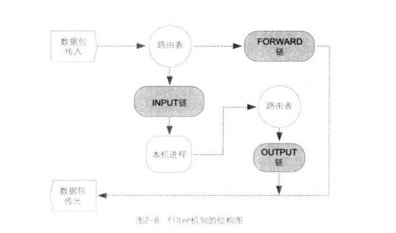
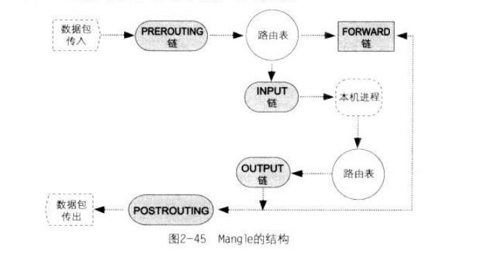
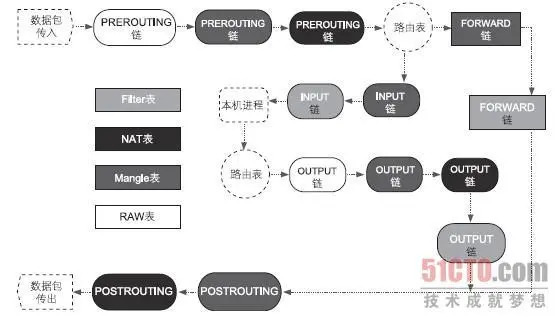
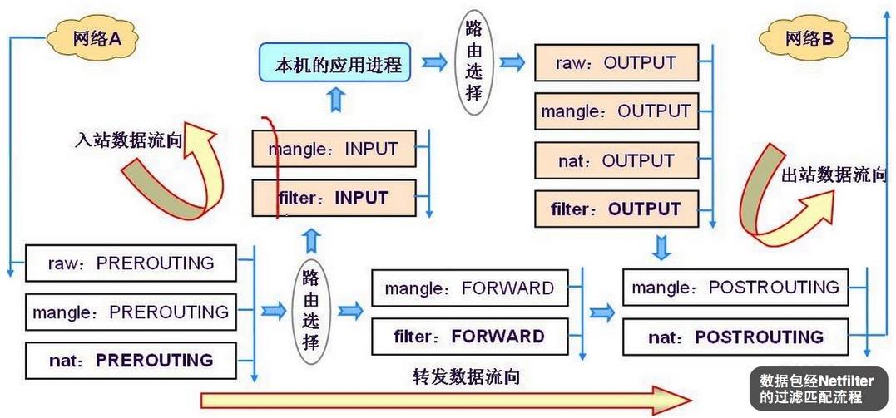
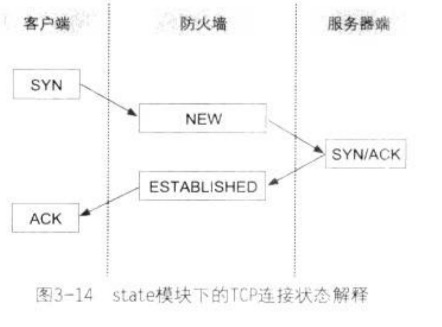

# README

## 1. 防火墙的基本概念

### 1.1 TCP/IP的基本概念

* 应用层: 主要用于定义客户端与服务器端的数据交换方法。
* 传输层：定义数据传输方法。
* 网络层：使用IP地址来定位网络上的每一台计算机，并采用路由方法决定数据传输路径，将数据传输到正确的目的端。
* 链路层，又称为数据链路层或网络接入层，也就是网络的基础设施。任务是传输和接收实体网络层传输的光电信号。

### 1.3 TCP、UDP及Socket的关系

在`OS`的网络系统中会有两个`Socket`, 分别是`TCP Socket`及`UDP Socket`, `Socket`上各有`65536`个洞，范围为`0 ~ 65535`, 我们称为`Port0 ~ Port65535`。

端口的分类

* 公认端口: 0 ~ 1023
* 注册的端口: 1024 ~ 49151
* 动态端口: 49152 ~ 65535
	* 供临时使用，几乎所有客户端应用程序都会使用动态端口。

### 1.6 防火墙的分类

* 数据包过滤防火墙
	* 链路层
	* 网络层，检查范围只有一个数据包，无法检查内容
	* 路由表
* 应用层防火墙
	* 应用层，应用程序过滤进程会受到该连接的所有的包，所以可以把数据还原，检查内容。但是无法处理应用程序过滤进程不支持的通信协议。所以，应用层防火墙的使用范围较小。

### 1.7 常见的防火墙结构

* 单机防火墙，客户只能有一个公网`ip`, 通过`NAT`转换分配对外的服务主机使用。所谓的单机防火墙通常是软件，而这个软件是工作在网卡的驱动程序上，凡是要进入主机的数据报，都会受到这个防火墙的监控，由此达到维护本机安全的目的。
	* 优点: 价格低廉
	* 缺点: 任何来自因特网的攻击行为，都由主机承担。

* 网关式防火墙
	* 部署在网关位置，可以防护整体网络（单机防火墙的包范围只有本机）

* 透明防火墙
	* 一个网桥设备，并且在网桥设备上赋予过滤器（Filter）功能。网桥是工作在OSI第二层的网络设备，因此不会有任何路由的问题，并且网桥上可以不需要设置任何的IP，如此就没有路由问题。即防火墙主机无需设置IP，即使黑客要攻击这个防火墙，也可能会因为没有目的端IP而无功而返。

## 2. Netfilet/iptables

`Netfilter`存放规则的内存块被分为四个**表**(Table)

* `filter`: 过滤，起到防火墙作用。默认机制，作用于`INPUT`, `OUTPUT`和`FORWARD`
* `nat`: Network Address Translation, 功能是IP分享, 作用于`PREROUTING`和`POSTROUTING`
* `managle`: 通过`managle`机制来修改经过防火墙内数据包的内容, 在5类`hook_function`中的任意位置
* `raw:` 负责加快数据包穿过防火墙机制的速度，由此提高防火墙的性能。动作是`notrack`, 将跳过`nat`表和`ip_conntract`处理

### 2.6 Netfilter的filter机制



**链**

* INPUT: 网络上其他主机发送给本机进程的数据包
* OUTPUT: 本机进程产生的数据包，如本机启动浏览器访问网络上的其他主机
* FORWARD: 数据包路过本机, 如服务器扮演路由器角色

对应INPUT、OUTPUT和FORWARD三个链。

### 2.7 规则的匹配方式

规则匹配方式为"优先"匹配。

添加规则时，先来后到。匹配规则时，从第一条规则逐一向下匹配。如果第一条规则决定丢弃，则丢弃。反之如果第一条规则决定放行，则放行。**不管后面的规则内容是什么**。

如果没有规则匹配到，则走默认策略。默认策略在每个链的对底端。默认策略只能放行(ACCEPT)或丢弃(DROP)。默认是放行(ACCEPT)。

### 2.8 Netfilter与iptables的关系

`iptables`是编辑`Netfilter`规则的工具。

### 2.9 iptables工具的使用方法

`iptables`命令可以划分为两个部分

1. `iptables`命令参数
2. 规则语法

#### 2.9.1 iptables命令参数

`iptables -t TABLE - 操作方法 规则`

* `TABLE`
	* `filter`, 没有标明，默认为`filter`
	* `nat`
	* `managle`
	* `raw`

处理方式, `-j`后面跟的命令

* ACCEPT: 允许通过
* DROP: 将数据包丢掉、此种处理方式将导致来源端误以为数据包丢失而不断重新发送数据包。这个动作将持续到连接超时为止
* REJECT: 将数据包丢掉，并回送一个Destination Unreachable的`icmp`数据包给发送端，发送端应用程序在收到这个错误信息数据包后，会终止连接。

### 2.10 使用`iptables`机制来构建简单的单机防火墙

#### 2.10.2 解决无法在防火墙主机上对外建立连接的问题

在`TCP/IP`模型中，连接状态共分十二种，但在`state`模块（`xt_state.ko`）的描述中只有四种

* `ESTABLISHED`
* `NEW`
* `RELATED`
* `INVALID`

如在`TCP/IP`标准定义中，`UDP`及`ICMP`数据报是没有连接状态的，但在`state`模块的定义中，任何数据报都有连接状态

**ESTABLISHED**

只要数据报能够成功穿过防火墙，那么之后的所有数据报（包括反向的所有数据报），其状态都会是`ESTABLISHED`。

所以解决无法在防火墙主机上对外建立连接，可以用`state`模块匹配所有`ESTABLISHED`状态的数据包。

**NEW**

`NEW`与协议无关，其所指的是每一条连接中的第一个数据包。

**RELATED**

`RELATED`状态的数据包其含义是指"被动产生的应答数据包, 而且这个数据包不属于现在任何的连接”。

如使用`traceroute`命令，主机发送出一个`TCP`协议的数据报，但因为这个数据包的声明周期已尽，而遭到第N个路由器丢弃。接着，这个路由器就会回送一个`ICMP`数据包给发送端，请注意!最右边的主机送出的是`TCP`包，这一是条“连接”，但第三个路由器回送的是`ICMP`数据包，很明显，这是另一条新连接，而这个数据包之所以会产生，完全是因为第一条连接的存在才产生应答的数据包，且该数据包不属于任意现有的连接。

即，只要应答的数据包是因为本机先送出一个数据包而导致另一条连接的产生，那么这个新连接的所有数据包都属于`RELATED`状态的数据包。

如`FTP`协议工作在“主动模式”时，当客户端对服务器端的`TCP Port 21`提出服务请求时，服务器端会主动使用`TCP Port21`对客户端建立另一条`TCP`连接，而这条`TCP`l连接也是`RELATED`状态。

**INVALID**

`INVALID`状态是指"状态不明的数据包", 也就是不属于`ESTABLISHED`、`NEW`及`RELATED`的数据包。凡是`INVALID`状态的数据包皆视为“恶意”的数据报，因此，请将`INVALID`状态的数据包丢弃掉。

#### 2.10.3 管理防火墙规则数据库的办法

**iptables工具的规则数据库**

使用`service iptables save`命令把所有`Netfilter`规则存储到`/etc/sysconfig/iptables`文件中，让`iptables`服务器开机启动，则重新开机后会自动将规则从文件中载入到`Netfilter`的各个链中。

**shell**

### 2.11 使用`filter`机制来构建网关式防火墙

### 2.12 `Netfilter`的`NAT`机制

`NAT`是`Network Address Transaltion`的缩写，即“网络地址转换”。

`NAT`应用在客户端的主要目的是隐藏客户端的`IP`, 由此达到阿博湖客户端主机免于遭受因特网攻击的行为，以及节省公用`ip`的使用了。

`NAT`应用在服务端的主要用途是保护服务器端主机在因特网上的安全。

#### 2.12.2 私有IP

* A类: `10.0.0.0 ~ 10.255.255.255`, 子网掩码: `255.0.0.0`
* B类: `172.16.0.0 ~ 172.32.255.255`, 子网掩码: `255.255.0.0`
* C类: `192.168.0.0 ~ 192.168.255.255`, 子网掩码: `255.255.255.0`

#### 2.12.4 数据包传输方向与SNAT及DNAT的关系

* 变更`Source IP`的机制称为`SNAT`
* 变更`Destionation IP`的机制称为`DNAT`

无论NAT机制有多少种，都是由SNAT和DNAT所共同搭配出来的。


**PREROUTING链**

当我们下发“规则”要去修改数据包的`Destion IP`时，需要将规则置于PREROUTING链中。

因此PREROUTING链的功能在于执行`DNAT`任务。

==PREROUTING链的位置在整个NAT机制的最前面==。因此数据包一旦进入`NAT`机制，数据包内的`Dstion IP`即被修改。

**POSTROUTING链**

POSTROUTING链的任务是修改数据包内的"来源端IP", POSTROUTING链的功能在于执行`SNAT`任务。

==POSTROUTING链的位置在整个NAT机制的最末端==。因此执行`SNAT`操作时，`Source IP`是在整个`NAT`机制的最末端才会修改的。

**OUTPUT链**

==和`filter`表的OUTPUT链毫无关系==

因为本机进程生成数据包并向外发送，这个数据包会先交给路由表来判断路由，接着数据包进入`OUTPUT`链，最后进入`POSTROUTING`链，然后送离本机。**这个数据包不可能送到`PREROUTING`链内**.

`NAT`特别设计了一个名为`OUTPUT`链的机制，这个链的功能是执行`DNTA`任务，其对象就是本机进程产生炳耀外送的这些数据包。

#### 2.12.5 NAT的分类

**一对多NAT**

"让大家共用一个公网IP来上网", 也称为`ip`分享器

* 节省公网`ip`的使用量
* 隐藏企业内部主机的`ip`地址

不管我们下达的是`SNAT`或`DNAT`的规则，`NAT`机制都会自动帮我们判别"另一个方向的应答数据包“，因此，我们只需要下达单一方向的规则即可。

设定公网`ip`

* `-j SNAT --to Public IP`, 公网`ip`固定
* `-j MASQUERADE`, 公网`ip`不固定

**多对多NAT**

先决条件：拥有多个公网ip, 且是连续的。

`-j SNAT --to 10.0.1.200 - 10.0.1.205`

会循环使用公网`ip`。

**一对一NAT**

为每个服务单一设置映射`ip`

**NAPT**

`NAPT(Network Address Port Translation)`

### 2.13 `Netfilter`的`Mangle`机制



当一个数据包"穿过"防火墙时，可以通过`Mangle`的机制来修改数据包的内容。

* 修改`IP`包头的`TTL`值
	* 如修改由`linux`主机发送的数据包，将这些数据包的`TTL`值改为`128`, 让黑客误以为是`Windows`操作系统；也可以将`Windows`曹组哦系统所送出的数据包`TTL`值改为`64`, 让黑客误以为是`Linux`系统。
* 修改`IP`包头的`DSCP`值或对特定的数据报设置特征
	* `QOS(Quality of Service)`机制，`QOS`机制可以让我们在有限的带宽中，有效分配不同的带宽给不同的协议来使用。
	* `QOS`是由两个不同部分组成
		* 数据包分类器
		* 带宽分配器
	* 数据先进入"数据包分类器"，数据包即会被加以分类，被分类后的数据报接着进入"带宽分配器"，再由带宽分配器决定各类数据包可以使用多少网络带宽
		* 通过`IP`包内的`DSCP`值类分类，通过`Managle`机制来修改`IP`包内的`DSCP`值，如, 把`DSCP`值改为`0000-01`, 后在"带宽分配器"上设置，如果数据包内的`DSCP`值为`0000-01`, 就给予`xxKB/s`的带宽
		* 使用`Managle`机制来为数据包标识识别码

```
#修改SSH协议的数据报，修改后的DSCP值为43

iptables -t mangle -A OUTPUT -p tcp --dport 22 -j DSCP --set-dscp 43
```

### 2.14 `Netfilter`的`raw`机制




`raw`表与"连接跟踪"机制有关

## 3. `Netfilter`的匹配方式及处理方法

### 3.1.1 内置的匹配方式

**接口的匹配方式**

```
-i xxx , 进入接口的数据包
-o xxx, 出接口的数据包
```

**Source/Destination Address匹配**

```
-d: 匹配目的端IP
-s: 匹配来源端IP
```

**协议**

```
-p 协议

-p icmp 与 -p 1 等效（1代表icmp）
```

**icmp**

* `icmp`的请求包: `Type=8、Code=0`
* `icmp`的应答包: `Type=0、Code=0`

希望别人`ping`不到我们，我们可以`ping`到别人

```
iptables -A INPUT -p icmp --icmp-type 8 -j DROP
```

### 3.1.2 从模块扩展而来的匹配方式

**TCP**

匹配端口

```
--dport 20
--sport 20:50, 支持范围匹配, 匹配端口20到端口50之间的范围
```

`TCP-Flags`的匹配

TCP-Flags

* 位1: Finish, 连接终止信号
* 位2: Synchronize, 连接请求信号
* 为3: Reset, 立即终止信号
* 位4: Acknowledge, 确认应答信号

三次握手

```
客户端 --SYN--> 服务端
客户端 <--SYN, ACK-- 服务端
客户端 --ACK--> 服务端
```

四次挥手

```
客户端 --FIN--> 服务端
客户端 <--ACK-- 服务端
客户端 <--FIN-- 服务端
客户端 --ACK--> 服务端
```

```
#检查"所有"TCP-Flags, 但只有 syn 和 fin 两个标记同时为 1 时，数据包才会删选出来

iptables -A INPUT -p tcp --tcp-flags ALL SYN,FIN -j DROP
```

**UDP**

只能匹配

* `--sport`
* `--dport`

**MAC地址匹配**

不能用在`OUTPUT`和`POSTROUTING`的规则链上（OUTPUT是自己发出的数据包，不是接收的数据包，所以没有源mac地址， POSTROUTING是要路由出去了，源mac要换成自己的了，也不是接收到的数据包），这是因为封包要送出网卡后，才能由网卡驱动程序透过 ARP 通讯协议查出目的地的 MAC 地址，所以 iptables 在进行封包对比时，并不知道封包会送到那个网络接口去（MAC地址是绑定到网卡上的）。

```
-m mac --mac-source xx:xx:xx:xx:xx
```

**Multiport的匹配**

```
-m multiport --dports 21,22,23,35
```

**匹配数据包的MARK值**

```
#设置mark值

-j MARK --set-mark xxx
```

```
#匹配mark值

-m mark --mark xx
```
**`Owner`的匹配**

* `--uid-owner userid|username`
* `--gid-owner groupid|groupname`

只能在本机使用，因为这些要匹配的特征不会随着数据包送到网上。

**`IP`范围的匹配**

```
-m iprange --src-range xx.xx.xx-xx.xx.xx
```

* `--src-range`: 匹配"来源地址"范围
* `--dst-range`: 匹配"目的地址"范围

**`TTL`值的匹配**

* `-m ttl --ttl-eq 64`: 匹配`TTL`值“等于”64
* `-m ttl --ttl-lt 64`: 匹配`TTL`值“小于”64
* `-m ttl --ttl-gt 64`: 匹配`TTL`值“大于”64

**数据包的状态匹配:TCP**

`TCP`链接状态

* ESTABLISHED
* SYN_SENT
* SYN_RECV
* FIN_WAIT1
* FIN_WAIT2
* TIME_WAIT
* CLOSED
* CLOSE_WAIT
* LAST_ACK
* LISTEN
* CLOSING
* UNKNOWN

`Netfilter`的`state`模块

* ESTABLISHED
* RELATED
* NEW
* INVALID



`/proc/net/nf_conntrack`这个文件是`Netfilter`链接跟踪功能的数据库。

```
示例: 客户端发送数据报给服务端，第一次握手

1	tcp
2	6
3 	117
4	SYN_SET
5	src=192.168.0.200 dst=100.1.102 sport=41501 dport=23
6	[UNREPLIED]
7	src=10.0.1.102 dst=192.168.0.200 sport=23 dport=41501
8	mark=0 secmark=0 use=1
```

记录:

1. 协议
2. 协议代码
3. 超时时间`/porc/sys/net/netfilter/nf_conntrack_tcp_timeout_xx`文件决定, 超过该时间都无法得到应答，则该连接的状态在防火墙上就会被清除掉
4. 链接状态
	* `TCP`规范中是`SYN_SENT`, 在`state`模块的记录则是为`NEW`状态
5. 记录该数据包的
	* Source IP
	* Destination IP
	* Source Port
	* Destionation Port
6. `UNREPLIED`代表防火墙尚未收到服务器端应答的数据包
7. 有防火墙自动产生的，依据是第5个字段的反向（为何服务器应答给客户端的数据报可以正常返回客户端？关键就是这一条新信息）


```
#超时时间
[ansible@k8s-agent-1 ~]$ ls /proc/sys/net/netfilter/nf_conntrack_tcp_timeout_*
/proc/sys/net/netfilter/nf_conntrack_tcp_timeout_close        /proc/sys/net/netfilter/nf_conntrack_tcp_timeout_last_ack     /proc/sys/net/netfilter/nf_conntrack_tcp_timeout_time_wait
/proc/sys/net/netfilter/nf_conntrack_tcp_timeout_close_wait   /proc/sys/net/netfilter/nf_conntrack_tcp_timeout_max_retrans  /proc/sys/net/netfilter/nf_conntrack_tcp_timeout_unacknowledged
/proc/sys/net/netfilter/nf_conntrack_tcp_timeout_established  /proc/sys/net/netfilter/nf_conntrack_tcp_timeout_syn_recv
/proc/sys/net/netfilter/nf_conntrack_tcp_timeout_fin_wait     /proc/sys/net/netfilter/nf_conntrack_tcp_timeout_syn_sent
```

```
#服务器硬蛋带有SYN及ACK标记的数据包，第二次握手
1	tcp
2	6
3	54 (/proc/sys/net/netfilter/nf_conntrack_tcp_timeout_syn_recv, 如果在该时间内没有等到客户端响应，防火墙会清楚记录)
4	SYN_RECY
5	src=192.168.0.200 dst=10.0.1.102 sport=41501 dport=23
6	
7	src=10.0.1.102 dst=192.168.0.200 sport=23 dport=41501
8	mark=0 secmark=0 use=1
```

```
#客户端应答带有ACK标记的数据包，第三次握手
1	tcp
2	6
3	431956
4	ESTABLISHED
5	src=192.168.0.200 dst=10.0.1.102 sport=41501 dport=23
6	src=10.0.1.102 dst=192.168.0.200 sport=23 dport=41501
7	[ASSURED]（表示链接已经确认）
8	mark=0 secmark=0 use=1
```


**数据包的状态匹配:UDP**

```
# 客户端发出DNS的服务器请求数据报
1	udp
2	17
3	22
4	src=10.0.1.103 dst=168.95.192.1 sport=32881	dport=53
5	[UNREPLIED]
6	src=168.95.192.1 dst=10.0.1.103 sport=53 dport=32881
7	mark=0 secmark=0 use=1
```

```
# 客户端收到DNS的应答数据包
1	udp
2	17
3	166
4	src=10.0.1.103 dst=168.95.192.1 sport=32881	dport=53
5	src=168.95.192.1 dst=10.0.1.103 sport=53 dport=32881
6	[ASSURED]（表示链接已经确认）
7	mark=0 secmark=0 use=1
```

**数据包的状态匹配:ICMP**

`ICMP`不像`TCP`有"会话（Session）"的概念，而且`ICMP`也不像`UDP`协议一样会有一段较长的超时时间。

`nf_conntrack`是以单一数据报为单位来跟踪`ICMP`数据报，每当一个`ICMP`数据包经过防火墙时，`nf_conntrack`就会在数据库中建立一条跟踪记录；但在`ICMP`数据包返回时候，`nf_conntrack`就会从数据库中清除之前的记录。

```
# 客户端送出ICMP服务请求包
1	ICMP
2	1
3 	29
4	src=192.168.0.200 dst=168.85.192.1 type=8 code=0
5	[UNREPLIED]
6	src=168.85.192.1 dst=192.168.0.200 type=0code=0
7	mark=0 secmark=0 use=1
```

**AH及ESP协议的SPI值匹配**

`IPSec`由`AH`及`ESP`组合而成。

* AH: 负责完整性验证，数据包没有篡改
* ESP: 负责数据包的"加密"操作

`IPSec`微辣几块系统查找密钥的速度，会在`IPSec`的数据库中为每一把密钥加上一个"索引"值，称其为`SPI`值。

```
# AH包头内的SPI值为300, 可以通过防火墙
iptables -A FORWARD -p ah -m ah --ahspi 300 -j ACCEPT
# ESP包头内的SPI值为200, 可以通过防火墙
iptables -A FORWARD -p esp -m esp --espspi 200 -j ACCEPT
```

**pkttype匹配**

在`TCP/IP`网络环境中，数据包的传输方式如下：

* `Unicast`: 数据包发送的对象是特定的，如主机A传输给主机B即为`unicast`类型
* `Broadcast`: 数据包传送的对象为广播地址，如`192.168.0.255`
* `Multicast`: 多播，通常应用于网络的“音频”或“视频”广播，而`Multicast`数据包的特点是，其`Source IP`一定介于`224.0.0.0/4`之间

```
-m pkttype --pkt-type broadcast
```

**length(MTU值)匹配**

* `MTU`: 实体网络层每一次能传输数据大小的限制, 如MTU=(IP包头+ICMP包头+DATA)
* `MSS`: 每次传输的最大数据分段, 如MSS+(ICMP包头+DATA)

**limit特定数据包重复率的匹配**

**recent特定数据包重复率匹配**

“先取证，后处理”

```
#当进来的数据报是icmp type 8，就使用recent模块来处理这个数据包，以icmp_db这个数据库作为匹配的依据，并且以目前这个时间点向前搜索60秒内的数据来做匹配，如果在这个60秒内已有超过6个以上的符合记录，那就将目前符合规则的这个icmp包丢弃掉
iptables -A INPUT -p icmp --icmp-type 8 -m recent --name icmp_db --recheck --second 60 --hitcount 6 -j DROP

#如果进来的数据包是icmp type 8，就使用recent模块来处理这个数据包，并将符合规则的数据包相关信息记录到名为icmp_db的数据库之中，这个数据库会存放在/proc/net/xt_recent/icmp_db
iptables -A INPUT -p icmp --icmp-type 8 -m recent --set --name icmp_db
```

优先匹配第一个规则，数据库中没有数据的时候，则进入第二个规则更新数据库

**IP包头内TOS值的匹配**

匹配DSCP

**使用String模块匹配数据包内所承载的数据内容**

```
# 如果数据包是要送往Web服务器的端口80，那我们就使用string模块来进行匹配的操作，而匹配的操作使用bm算法进行处理的：如果这个数据包内包含 'system32' 字符串的话，就将这个数据包丢弃掉
iptables -A FORWARD -i eth0 -o eth1 -p tcp -d $WEB_SERVER --dport 80 -m string --algo bm --string "system32" -j DROP
```

**使用connlimit模块限制连接的最大数量**

以`/prot/net/nf_conntrack`文件中的数据为依据，来限制一个IP或一个网段同时对目标主机或服务所能建立的最大连接数。

* `--connlimit-above xx`: 指定最大连接数量
* `--connlimit-mask xx`
	* 8 A类子网
	* 16 B类子网
	* 24 C类子网
	* 25 代表1/2个C类子网
	* 32 代表单一一个IP

**使用connbytes模块限制每个连接中所能传输的数据量**

**使用quota模块限制数据传输量的上限**

`quota`限制每个使用者每小时或每天所能够传输的数据总量。

`-m quota`

**使用time模块来设置规则的生效时间**

`xt_time.ko`, 设置规则的生效时间。

`-m time`

**使用connmark模块匹配mark值**

`-m connmark`

`CONNMARK`是对一整条连接来设置`mark`值。只要连接中的某一个数据包被标记了`mark`, 那么, 其后所有该连接双向的所有数据包都会自动设置这个`mark`值。

* mark 匹配方式只识别 nfmark
* connmark 识别 nfmark 即 ctmark

**使用conntrack模块匹配数据包的状态**

`-m conntrack`

`state`模块的加强版

* `DNAT`, 匹配一条连接是否经过`DNAT`处理
* `SNAT`, 匹配一条链接是否经过`SNAT`处理

**使用statistic模块进行比率匹配**

`-m statistic`

* `--mode random`: 以随机方式丢弃包
	* `--probability`, 随机
* `--mode nth`: 按一定规律丢弃数据包

**使用hashlimit模块进行重复率匹配**

`-m hashlimit`

数据库存在`/proc/net/ipt_hashlimit/xxx`目录下(`xxx`由`--hashlimit-name`设置)

hashlimit的匹配是基于令牌桶 (Token bucket）模型的。令牌桶是一种网络通讯中常见的缓冲区工作原理，它有两个重要的参数，令牌桶容量n和令牌产生速率s。我们可以把令牌当成是门票，而令牌桶则是负责制作和发放门票的管理员，它手里最多有n张令牌。一开始，管理员开始手里有n张令牌。每当一个数据包到达后，管理员就看看手里是否还有可用的令牌。如果有，就把令牌发给这个数据包，hashlimit就告诉iptables，这个数据包被匹配了。而当管理员把手上所有的令牌都发完了，再来的数据包就拿不到令牌了。这时，hashlimit模块就告诉iptables，这个数据包不能被匹配。除了发放令牌之外，只要令牌桶中的令牌数量少于n，它就会以速率s来产生新的令牌，直到令牌数量到达n为止。通过令牌桶机制，即可以有效的控制单位时间内通过（匹配）的数据包数量，又可以容许短时间内突发的大量数据包的通过（只要数据包数量不超过令牌桶n）。

--hashlimit-name。 hashlimit会在/proc/net/ipt_hashlimit目录中，为每个调用了hashlimit模块的iptables 命令建立一个文件，其中保存着各匹配项的信息。--hashlimit-name参数即用来指定该文件的文件名。

**多功能匹配模块u32**

为什么要减3

FF = 00000000000000000000000011111111

6&0xFF, 因为每次抓取4个字节，从第6个字节抓取刚好最后8位是`protocol`


### 3.2.1 内置处理方法

`QUEUE`是功能是将符合条件的数据包转发给`User Space`的应用程序来处理。

```
iptables -A FORWARD -p tcp -d $MAIL_SERVER --dport 25 -j QUEUE
```


