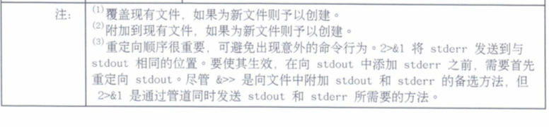

# 4.创建, 查看或编辑文本文件

## 将输出重定向到文件或程序

* 标准输入, 标准输出或标准错误
* 重定向输出到文件
* 构建管道

### 标准输入, 标准输出或标准错误

构建了一个带有编号标记的通道(文件描述符)的进程结构来管理打开的文件.

进程链接到文件, 从而到达这些文件所代表的数据内容或设备. 

* `0`: 标准输入
* `1`: 标准输出
* `2`: 标准错误
* `3+`: 通道连接其他文件


### 重定向输出到文件

通道重定向将默认通道目标位置替换为代表输出文件或设备的文件名. 利用重定向, 进程输出和错误消息可以捕获为文件内容, 发送到设备, 或者丢弃.




### 构建管道

重定向控制的是**至/自文件的通道输出, 而传送则将通道输出发送到另一进程**


```
ls -l /user/bin | less
```

**tee**


`tee`tee命令用于将数据重定向到文件, 另一方面还可以提供一份重定向数据的副本作为后续命令的stdin. 简单的说就是把数据重定向到给定文件和屏幕上.

```
ls -l | tee /tmp/saved-output
```

在终端上查看`ls`列表, 同时将该列表存储到文件中。

## 从`shell`提示符编辑文本文件 

* vim编辑器
* 图形化编辑器