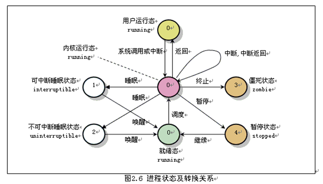
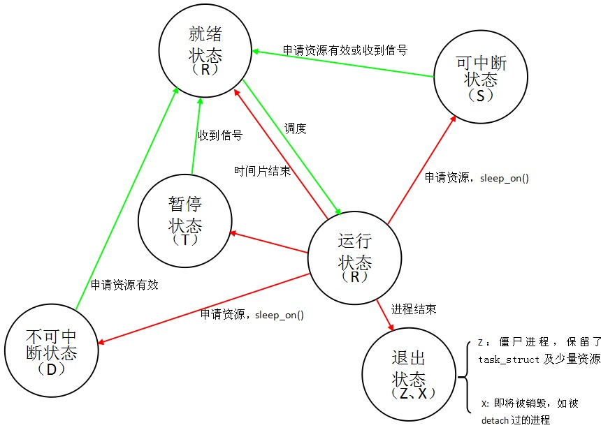
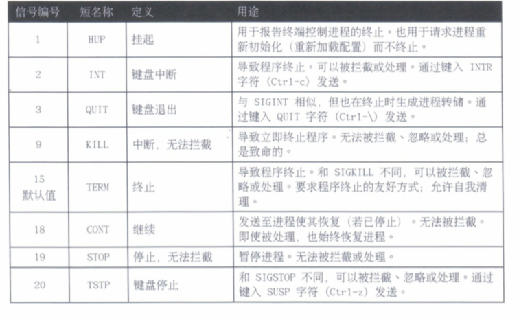

# 7.监控和管理LINUX进程

## 进程

* 什么是进程
* 进程状态
* 列出进程

### 什么是进程

进程是已启动的**可执行程序的运行中实例**. 进程由以下组成部分:

* 已分配内存的地址空间
* 安全属性, 包括所有权凭据和特权
* 程序代码的一个或多个执行线程
* 进程状态

进程的环境包括:

* 本地和全局变量
* 当前调度上下文
* 分配的系统资源, 如文件描述符和网络端口

`fork`例程, 子进程继承

* 安全性身份
* 过去和当前的文件描述符
* 端口和资源特权
* 环境变量
* 程序代码

随后, 子进程可能`exec`其自己的程序代码.

父进程在子进程运行期间处于睡眠状态, 设置一个在子进程完成时发出信号的请求(`wait`). 在退出时, 子进程可能已经关闭或丢弃了其资源和环境; 剩余的部分称为**僵停**. 父进程在子进程退出时收到信号而被唤醒, 清理剩余的结构, 然后继续执行其自己的程序代码.

### 进程状态

多任务处理系统, 每个CPU(或CPU核心)在一个时间点上处理一个进程. 在进程运行时, 它对CPU时间和资源分配的直接要求会有变化. **进程分配有一个状态, 它随着环境要求而改变**





* 运行中
	* `R`: `TASK_RUNNING`, 进程正在CPU上执行, 或者正在等待运行. 处于**运行中**(或可运行)状态时, 进程可能正在执行用户例程或内核例程(系统调用), 或者已排队并**就绪**.
* 睡眠
	* `S`: `TASK_INTERRUPTIBLE`, 进程正在等待某一条件: 硬件请求, 系统资源访问信号. 当事件或信号满足该条件时, 该进程将返回到运行中.
	* `D`: `TASK_UNINTERRUPTIBLE`, 进程也在睡眠, 与`S`状态不同, 不会响应传递的信号. 仅在特定的条件下使用, 其进程中断可能会导致意外的设备状态.
	* `K`: `TASK_KILLABLE`, 与不可中断的`D`状态相同, 允许等待中的任务通过响应信号而别中断(彻底退出). 
* 已停止
	* `T`: `TASK_STOPPED`, 进程已被停止(暂停), 通常是通过用户或其他进程发出的信号. 进程可以通过另一信号返回到运行中状态, 继续执行(恢复).
	* `T`: `TASK_TRACED`, 正在被调试的进程也会临时停止, 并且共享同一个`T`状态标志.
* 僵停
	* `Z`: `EXIT_ZOMBIE`, 子进程在退出时向父进程发出信号. 除进程身份(`PID`)之外的所有资源都已释放.
	* `X`: `EXIT_DEAD`, 当父进程清理(获取)剩余的子进程结构时, 进程现在已彻底释放. 此状态从不会在进程列出使用程序中看到.

### 列出进程

`ps`命令用于列出当前的进程, 包括:

* 用户识别符(UID), 确定进程的特权
* 唯一进程识别符(PID)
* CPU 和已经花费的实时时间
* 进程在各种位置上分配的内存数量
* 进程的位置`STDOUT`, 称为控制终端.
* 当前进程的状态

默认选择具有与当前用户相同的有效用户`ID`(EUID)并与`ps`所处同一中断关联的所有进程.

## 控制作业

* 作业和会话
* 在后台运行作业

### 作业和会话

**作业控制**允许单个`shell`示例运行和管理多个命令.

没有作业控制

* 父级`shell`分出子进程以运行命令, 保持失眠状态知道子进程退出. 当`shell`提示符重新显示时, 父级`shell`已返回. 

使用作业控制

* 可以选择性地暂停, 回复和异步运行命令, 让`sehll`可以在子进程运行期间返回接受其他命令.

**前台进程**是在中断端口中运行的命令. 终端的设备`ID`(tty)是进程的控制终端. 前台进程接收键盘生成的输入和信号， 可以从终端读取或写入到终端(stdin, stdout).

**后台进程**是以无控制终端的形式启动的, 它不需要终端交互. 如服务守护进程和内核进程线程, **在TTY列中显示一个问号(?)**. 后台进程如果尝试从终端读取或写入到终端, **可能会被暂停**.

### 在后台运行作业

在命令行中附加`&`符号(`&`). `bash shell`会显示作业编号(**对于该会话唯一)和新的子进程的`PID`. `shell`不等待子进程, 并且重新显示`shell`提示符.

```shell
[ansible@bunker ~]$ sleep 100 &
[1] 24690
[ansible@bunker ~]$
[ansible@bunker ~]$ jobs
[1]+  Running                 sleep 100 &
```

`jobs`命令显示作业列表.

`fg %job number`将后台作业带到前台作业, 后台作业可以重新和控制终端连接.

`Ctrl-z`可以将命令重新发送到后台, 或者把原先结尾不含`&`符号的热虐命令发到后台. **暂停将立即起到作用, 作业将被放到后台, 未处理的输出和键盘预先输入将被丢弃**.

`bg %作业ID`命令可以在后台重新启动进程.

```shell
[ansible@bunker ~]$ sleep 100 &
[1] 26074
[ansible@bunker ~]$ jobs
[1]+  Running                 sleep 100 &
[ansible@bunker ~]$ fg %1
sleep 100
^Z
[1]+  Stopped                 sleep 100
[ansible@bunker ~]$ jobs
[1]+  Stopped                 sleep 100
[ansible@bunker ~]$ bg %1
[1]+ sleep 100 &
[ansible@bunker ~]$ jobs
[1]+  Running                 sleep 100 &
```

用户尝试退出带有暂停中作业的终端端口(会话)时, 命令`shell`将发出警告.

```shell
[ansible@bunker ~]$ sleep 100
^Z
[1]+  Stopped                 sleep 100
[ansible@bunker ~]$ exit
logout
There are stopped jobs.
```

## 中断进程

* 使用信号控制进程
* 以管理员身份注销用户

### 使用信号控制进程



每个信号都有一个默认操作

* 终止: 导致程序立即终止(退出).
* 核心转储: 导致程序保存内存映像(核心转储), 然后终止.
* 停止: 导致程序停止运行(暂停), 再等到继续(恢复).

程序可以通过实施句柄例程来为预期的事件信号做准备, 以忽略, 替换或扩展信号的默认操作.

可以通过名称或编号指定信号. 用户可以中断自己的进程, **但需`root`特权才能终止由其他人拥有的进程**.

**kill**

`kill`命令根据`ID`向进程发送信号. 可用于发送任何信号, 而不仅仅是终止程序的信号.

**killall**

`killall`可发送信号到一个或多个与选择条件匹配的进程.

* 命令名称
* 特定用户拥有的进程
* 系统范围内的所有进程

```
killall command_pattern
killall -signal command_pattern
killall -signal -u username command_pattern
```

**pkill**, 可向多个进程发送信号. `pkill`使用高级选择条件, 可包含以下条件的组合:

* 命令, 具有模式匹配的命令成的进程.
* UID, 某一Linux用户账户拥有的进程.
* GID, 某一Linux组账户拥有的进程.
* 父级, 特定父进程的子进程.
* 终端, 运行于特定控制终端的进程.

### 以管理员身份注销用户

`w`命令查看当前登录系统的用户

* `JCPU`, 后台任何和子任务占用的CPU资源.
* `PCPU`, 前台进程CPU占用情况.

可以停止某个用户的进程.

```
pkill -SIGKILL -u xxx
```

可以中断引用统一中断`ID`的进程.

```
pkill -t 终端
```

或者使用`pstree`查看进程关系, `kill`父进程ID下的所有进程.

```
pstree
pkill -P 父进程ID
```

## 监控进程活动

* 负载平均值
* 实时进程监控

### 负载平均值

`Linux`内核以负载数(活动系统资源请求的 CPU 累计数)的指数移动平均值计算负载平均值指标.

* **活动请求数**从运行中线程和等待`I/O`的线程的每个`CPU`队列数计算.
* **负载数**是默认每五秒运行一次的计算例程, 累计所有`CPU`的请求数并计算出一个平均值.
* 指数移动平均数, 提高当前活动的重要度, 降低老化数据质量.
* 负载平均值是负载数计算例程的结果. 是最近1分钟, 5分钟, 15分钟内系统活动数据的三个显示值的平均值.

**负载平均值计算**

Linux 通过预期服务等待时间(CPU, 磁盘和网络I/O)的表示来实施平均负载计算.

* 不仅计算进程数, 也作为独立的任务计算线程数.
	* 运行中线程(`nr_running`)和等待`I/O`资源的线程(`nr_iowait`)的CPU的请求队列适度对应于`R`(运行总)和`D`(不可中断的睡眠)进程状态. 等待`I/O`包括处于睡眠而等待预期磁盘的网络响应的任务.
* 负载数属于全局计算器技术, 是所有`CPU`的总和数. 从睡眠返回的任务可能会重新调度到不同的`CPU`, 难以获得精确的每`CPU`计数, 但累计数的准确度可以保障. **显示平均负载代表所有的`CPU`**
* Linux **将各个物理CPU核心和微处理器超线程计为独立执行单元**, 在逻辑上表示和指代为个体`CPU`. 每个`CPU`拥有独立的请求队列. `/proc/cpuinfo`, 了解系统`CPU`的核心.
* 具有空闲`CPU`的系统可能会因为磁盘或网络资源忙碌而遇到很长的等待时间, Linux 负载平均值包含了对`I/O`的考量. 遇到负载平均值很高但`CPU`活动很低时, 请检查磁盘和网络活动.

`top`,`uptime`,`w`显示负载平均值.

将显示的负载平均值除以系统中的逻辑`CPU`数. 值低于1表示资源利用率较好, 等待时间很短. 值高于1表示资源饱和, 而且有一定的服务等待时间.

空闲`CPU`队列和负载数均为0. 每个就绪和等待的线程是计数增加1. 总队列数为1时, 资源(CPU,磁盘和网络)正在使用中, 但没有请求把时间花在等待上. **增加的请求数会累积该计数, 但由于许多请求可以在时限内处理, 资源使用率会提高,而等待时间则不会**.

因为磁盘或网络资源忙碌等待`I/O`而处于睡眠的进程包含在该计数内, 而且使负载平均值增大.

* 资源饱和前, 平均负载将保持在`1`以内, 因为几乎不会在队列中发现等待的任务.
* 只有资源饱和导致请求留在排队状态并且被负载计算例程计算时, 负载平均才会增大.
* 当资源使用率接近100%时, 每个增加的请求将开始遭遇服务等待时间。

### 实时进程监控

`top`

