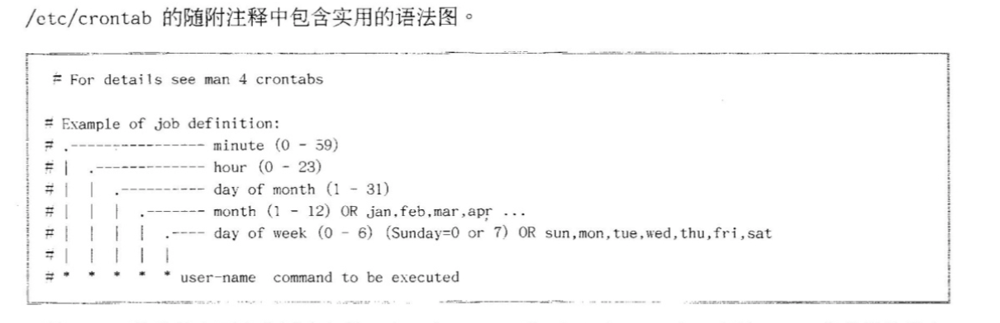

# 4.计划将来的 LINUX 任务

## 使用 at 计划一次性任务

* 计划将来的任务
* 使用 at 计划一次性任务
* 检查和管理作业

### 计划将来的任务

要在将来某个设定点运行一个或一组命令.

### 使用 at 计划一次性任务

`at`是一个系统守护进程(`atd`), 有一组命令行工具(at, atq)可与守护进程进行交互.

用户可以使用命令行工具`at`为`atd`守护进程的作业盘对.

`atd`守护进程提供了`a`到`z`共26个队列, 作业按字母顺序排列, 队列越后, 系统优先级越低.

```
at <TIMESPEC> 
```

计划新作业, `at`会读取从`stdin`执行的命令, 也可以使用脚本

```
at <TIMESPEC> < myscript
```

TIMESPEC:

* now + 5min
* teatime tommorrow
* noon + 4days
* 5pm august 3 2016

### 检查和管理作业

`atq`或`at -l`获取用户的待处理作业的概述.

显示:

1. 作业编号
2. 该作业计划的日期和时间
3. 作业所在队列
4. 作业所有者(将运行作业的用户身份)

**普通和费特权用户只能查看和控制自己的作业, `root`可以查看和管理所有作业**

`at -c <JOBNUMBER>`, 显示所设置作业的环境

`atrm <JOBNUMBER>`, 删除和计划作业

## 使用 cron 计划周期性作业

* cron 简介
* 计划作业
* 作业格式

### cron 简介

周期性作业的`crond`守护进程, 默认开机启用并启动.

每个用户敌营一个配置文件. 这些配置文件使用户和管理员拥有细微的控制权, 可以控制应执行周期性作业的确切时间.

`cron`作业运行命令如果向未重定向的`stdout`和`sderr`生成任何输出, 将尝试使用系统中配置的邮件服务将该输出通过电子邮件发送给拥有该作业的用户.

### 计划作业

`crontab`

* `-l`: 列出当前用户的计划任务.
* `-r`: 删除当前用户的所有计划任务.
* `-e`: 编辑当前用户的计划任务.
* `<filename>`: 删除所有作业, 并替换为从`<filename>`读取的作业. 如果未指定任何文件, 则将使用`stdin`.

### 作业格式

环境变量:

* `SHELL`: 更改用于下面的行中执行命令的`shell`. 默认是`/bin/sh`
* `MAILTO`: 更改发送到电子邮件地址的输出(如有).

作业字段:

1. 分钟
2. 小时
3. 几号
4. 月
5. 星期几
6. 命令

**如果"几号"和"星期几"字段都不是"\*", 则该命令将在其中任一字段匹配是执行**

字段语法规则:

* `*`: 始终
* 数字: 表示确定时间
* `x-y`: 范围, x 到 y (含)
* `x,y`: 列表. 每 x,y 执行
* `*/x`: x 的时间间隔. 如分钟列中的`*/7`表示每7分钟执行一次作业

## 计划系统 cron 作业

* 系统 cron 作业

### 系统 cron 作业



系统`cron`作业是在两个位置定义的:

* `/etc/crontab`
* `/etc/cron.d/*`

预订作业, 里面是可执行(chmod +x)脚本.

* 每小时: `/etc/cron.hourly/`
* 每天: `/etc/cron.daily/`
* 每周: `/etc/cron.weekly/`
* 每月: `/etc/cron.monthly/`

`/etc/cron.hourly/*`脚本是使用`run-parts`命令从`/etc/cron.d/0hourly`中定义的走也执行的.

每日, 每周和每月也使用`run-parts`命令执行, 从其他配置文件`/etc/anacrontab`执行.

**run-parts**命令位于/usr/bin/run-parts, 内容是很简单的一个`shell`脚本, 就是遍历目标文件夹, 执行第一层目录下的可执行权限的文件.

过去, `/etc/anacrontab`是由单独守护进程(`anacron`)处理的, 红帽7是由常规`crond`守护进程解析. 该文件旨在确保重要的作业始终运行, 且**不会因为系统在应执行作业时关闭或休眠而意外跳过**.

`/etc/anacrontab`包含四个字段:

* Period in days: 每多少天应运行一次该作业
* Delay in minutes: 在启动该作业前, `cron`守护进程应等待的时间
* Job identifier: 为`/var/spool/anacron/`中的文件的名称. 在`cron`从`/etc/anacrontab`启动作业时, 它会更新此文件的时间戳. 同一时间戳可用于检查作业上次运行的时间.
* Command: 要执行的命令

环境变量:

* `START_HOURS_RANGE`: 作业不会在此范围外启动.

## 管理临时文件

* 使用 systemd-tmpfiles

### 使用 systemd-tmpfiles

原来使用`tmpwatch`的工具来从配置的目录中删除未使用的旧文件.

`systemd`启动系统后, 其中一个启动的服务单元是`systemd-tmpfiles-setup`. 该服务运行命令`systemd-tmpfiles --create --remove`. 该命令会从`/usr/lib/tmpfiles.d/*.conf`, `/run/tmpfiles.d/*.conf`和`/etc/tmpfiles.d/*.conf`读取配置文件. 系统会删除这些配置文件中标记要删除的任何文件和目录, 并且会创建标记要创建(后修复权限)的任何文件和目录, 并使其拥有正确的权限(如有必要).

#### 定期清理

为确保长期运行的系统不会填满磁盘, `systemd`定时器单元会按固定间隔调用`systemd-tmpfiles --clean`. 清楚在此配置文件中定义的最长期限更近的时间尚未访问, 更改或修改的所有文件. 如果三个时间戳(`atime`,`mtime`,`ctime`)比`systemd-tmpfiles`期限配置都旧, 则文件将被视为未使用. 如果其中任一时间戳比期限配置新, 不会删除文件.

#### 定时器单元

`systemd`定时器单元是一类特殊的`systemd`服务, 有一个`[Timer]`块会只是同名服务的启动频率.

```
systemd-tmpfiles-clean.timer

[Timer]
OnBootSec=15min
OnUnitActiveSec=1d
```

将在`systemd`启动15分钟后启动, 然后每隔1天启动一次.

#### systemd-tmpfiles 配置文件

基本语法:

* 类型
* 路径
* 模式
* UID
* GID
* 期限
* 参数

类型(systemd-tmpfiles应执行的操作)

* d: 创建还不存在的目录
* Z: 以递归方式回复`SELinux`上下文以及文件权限和所有权
* ...

配置文件

* `/etc/tmpfiles.d/*.conf`, 自定义, 用来覆盖运营商提供的默认值. **优先级最高**
* `/run/tmpfiles.d/*.conf`, 临时文件, 通常由守护进程用来管理自己的运行时临时文件. **优先级中**
* `/usr/lib/tmpfiles.d/*.conf`: 由相关 RPM 软件包提供. **优先级最低**

优先级代表文件名相同, 优先使用哪个文件.