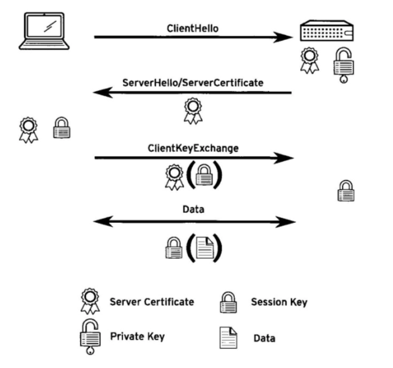

# 10. 提供 APACHE HTTPD WEB 服务

## 配置 Apache HTTPD

* Apache HTTPD 简介

### Apache HTTPD 简介

Web 服务器是一个用`http(s)`协议进行交流的守护进程, 这是一个基于为本的协议, 用于通过网络连接来发送和接收对象.

**请求**: 以一个空行结尾

**响应**: 在报头完成后, 服务器发送一个空行, 后跟请求的内容. 此内容的长度必须与`Content-Length`包头中只是的长度相匹配.

## 虚拟主机的配置和故障排除

* 虚拟主机

### 虚拟主机

虚拟主机允许单个`httpd`服务器为多个域提供内容.

**虚拟主机定义顺序**, 将按照所包含文件的文件名的字母顺序来读取包含的文件.

## 配置 HTTPS

* 传输层安全性(TLS)

### 传输层安全性(TLS)

传输层安全性(TLS)是用于加密网络通信的方法. `TLS`是安全套接字层(SSL)的后续版本.

TLS允许:

* 客户端验证服务器的身份
* 服务器验证客户端的身份

**证书**, 包含多个部分:

* 公钥
* 服务器身份
* 证书颁发机构的签名

私钥绝不会公开, 使用私钥加密的任何数据只能通过公钥解密, 反之亦然.

#### TLS握手过程 (重要)

1. 客户端通过`ClientHello`消息启动与服务器的连接. 作为此消息的一部分, 客户端发送`32`字节的随机数字, 包括**时间戳以及客户端支持的加密协议和密码的列表**.
2. 服务端以`ServerHello`消息响应, 包含另一个32字节随机数字, 其中带有时间戳记以及客户端应使用的加密协议和密码.
	* 服务器也会发送服务器证书. 公钥, 常规服务器身份信息(如FQDN)以及来自可信认证办法机构(CA)的签名. 
3. 客户端通过检查提供的身份信息是否匹配, 以及验证所有签名, 检查这些签名是否是由客户端信任的CA生成, 从而验证服务器证书.
	* 如果证书确认, 则客户端使用先前交换的随机数字来创建会话密钥. 
	* 客户端使用来自服务器证书的公钥加密此会话密钥, 然后使用`ClientKeyExchange`消息将其发送到服务器.
4. 服务器解密会话密钥, 然后客户端和服务器均开始使用会话密钥来加密和解密通过连接发送的所有数据.

## 集成动态 Web 内容

* 动态内容
* 通用网关接口

### 动态内容

### 通用网关接口

`CGI`, 当请求`CGI`资源时, `httpd`不是简单读取和提供资源, 而是作为进程来执行资源, 并提供该进程`stdout`.

使用**环境变量**将请求中的信息(包括客户端信息)提供给`CGI`程序.
