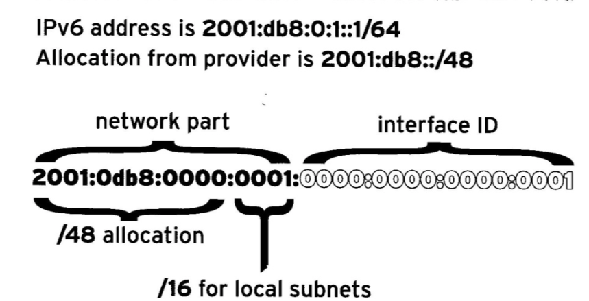

# 2.管理 IPv6 网络

## 复习 IPv4 联网配置

* IPv4 联网
* NetworkManager 概述
* 查看联网信息
* 添加网络连接
* 控制网络连接
* 修改网络连接设置
* 删除网络连接
* 修改系统主机名
* 命令摘要

### IPv4 联网

* IPv4 地址
* 网络前缀(网络掩码)
* 默认网关和基本路由
* 网络接口
* `/etc/hosts`
* 名称解析

### NetworkManager 概述

红帽7, 网络接口的配置是由`NetworkManager`的系统守护进程来管理的. 对于`NetworkManager`:

* 设备是网络接口
* 链接是可以为设备配置的设置的集合
* 对于一个设备, 同一时间内只能有一个连接处于激活状态.
* 每个连接具有一个用于标识自身的名称或ID.
* 链接的持久配置存储在`/etc/sysconfig/network-scripts/ifcfg-name`中, `name`是链接的名称.
* `nmcli`通过`shell`提示符来**创建和编辑连接文件**

### 查看联网信息

`nmcli dev status`将显示所有网络设备的状态.

`nmlci con show`将显示所有连接的列表. 

`ip addr show`显示系统上网络接口的当前配置.

### 添加网络连接

`nmcli con add`添加新的网络连接. 

### 控制网络连接

`nmlci con up name`将在其绑定到的网络接口上激活`name`连接.

`nmlci dev dis device` 停用网络接口.

因为`nmcli con down name`通常并非是停用网络接口的最佳办法. 此命令将关闭连接. 但是大部分优先系统连接启用了`autoconnect`, 会重新开启.

### 修改网络连接设置

`nmcli con mod name`用于更改连接的设置. 这些更改还将保存在连接的`/etc/sysconfig/network-scripts/ifcfg-name`文件中.

设置多个值, 通过想设置名称的开头添加`+`或`-`符号, 可以在列表中添加或从列表中删除特定值.

DNS, 网卡里的配置优先于resolv.conf.

### 删除网络连接

`nmcli con del name`, 将从系统中删除名为`name`的链接, 同时断开它与设备的连接并删除文件`/etc/sysconfig/network-scripts/ifcfg-name`.

### 修改系统主机名

`hostname`临时修改系统的完全限定主机名.

`/etc/hostname`文件中指定静态主机名. `hostnamectl`用于修改此文件, 也可用于查看系统的完全限定主机名的状态.

```shell
hostnamectl set-hostname xxxx
```

## IPv6 联网概念

* IPv6 概述
* 解读 IPv6 地址
* IPv6 地址分配
* IPv6 地址配置

### IPv6 概述

因为无法让`IPv6`可以和`IPv4`地址通信, 现在是让主机同时提供`IPv4`和`IPv6`两种地址.

### 解读 IPv6 地址

`IPv6`地址是一个`128`位数字. 表示为**8组以分号分隔的四个十六进制半字节. 每个半字节表示4位的 IPv6 地址, 每个组表示 16 位的 IPv6 地址**

地址规则:

1. 必须始终隐藏组中的前导零.
2. 一组或多组连续零可以通过一个`::`来合并.
3. 使用`::`来尽可能地缩短. 如果两串连续零的长度相等, 最好是缩短最左侧的连续零.
4. 请不要使用`::`来缩短**一组**零, 应使用`:0:`来表示, 用`::`来表示**多组零**.
5. 始终对十六进制数字使用小写字母`a`到`f`.

和端口一起使用, 需要把`IPv6`地址括在方括号中`[]`.

`IPv6`有一个标准的子网掩码`/64`, 用于几乎所有的普通地址. 地址的一半是网络前缀, 另一半是接口ID. 

通常, 网络提供商将为组织分配一个较短的前缀. 如`/48`. 这回保留其余网络部分以用于通过这一分配的前缀来指定子网, 将保留`16`位用于子网.



### IPv6 地址分配

* `::1/128`, 本地主机. 等效于`127.0.0.1/8`
* `::`, 未指定的地址. 等效于`0.0.0.0`
* `2000::/3`, 全局单播地址
* `fd00::/8`, 唯一本地地址
* `fe80::/64`, 本地链接地址
* `ff00::/8`, 多播(IPv6没有广播地址)

#### 本地链接地址

系统上的每个网络接口都通过`fe80::`网络上的本地链接地址来自动配置. 为确保唯一性, 本地链接地址的接口ID是通过网络接口的以太网硬件地址来构建的.

本地链接地址:

* 网络前缀: `fe80::/64`
* MAC 地址: `00:11:22:aa:bb:cc`
* 本地链接地址: `fe80::211:22ff:feaa:bbcc/64`
由于每个链接都具有`fe80::/64`网络, 不能使用路由表来正确地选择出站接口. 必须使用作用域标识符. **作用域标识符由 % 以及后跟的网络接口名称组成**.

```shell
ping6 fe80::211:22ff:feaa:bbcc%eth0
```

**普通全局地址的使用如同在 IPv4 中的用法一样**

#### 多播

IPv6 没有广播地址. IPv6 中的多播地址是`ff02::1`**全节点本地链接地址**. 对此地址进行`Ping`操作会将流量发送到连接上的所有节点. 需要使用作用域标识符来指定链接作用域多播地址.

### IPv6 地址配置

#### 静态选址

一下接口 ID 是保留的, 无法用于主机上的普通网络地址.

* 全零标识符`0000:0000:0000:0000`(子网路由器任意广播), 对于`2001:db8::/64`网络, 可能是地址`2001:db8::`)
* 标识符`fdff:ffff:ffff:ff80`到`fdff:ffff:ffff:ffff`

#### DHCPv6 配置

DHCPv5 请求从其本地链接地址发送到`ff02::1:2`上的端口`547/UDP`，即全`dhcp`服务器本地链接多播组. 然后`DHCPv6`服务器通常想客户端的本地链接地址上的端口`546/UDP`发送一个包含响应信息的回复.

**SLAAC**, 无状态地址自动配置(SLAAC). 主机通常使用本地链接`fe80::/64`地址来跳出其接口. 主机随后向`ff02::2`全路由器本地链接多播组发送一个"路由器请求". 本地连接上的`IPv6`路由器以网络前缀以及其他可能的信息来响应主机的本地链接地址. 主机随后将该网络前缀与其同城构建的接口`ID`配合使用.

## IPv6 联网配置

* NetworkManager 和 IPv6
* 添加 IPv6 网络连接
* 修改 IPv6 的网络连接设置
* 查看 IPv6 联网信息
* IPv6 故障排除工具

### NetworkManager 和 IPv6

与`IPv4`联网使用的命令类似.

### 添加 IPv6 网络连接

`nmcli con add`用于添加新的网络连接.

### 修改 IPv6 的网络连接设置

`nmcli con show name`查看`IPv6`相关设置.

`nmcli con mod name`用于调整链接设置`IPv6`地址的方式.

### 查看 IPv6 联网信息

### IPv6 故障排除工具

`ping6`类似`ping`.

`tracepath6` 和 `traceroute -6`等效于 `IPv6`版本的`tracepath`和`traceroute`.

`ss`和`netstat`可以显示有关网络套接字的信息.