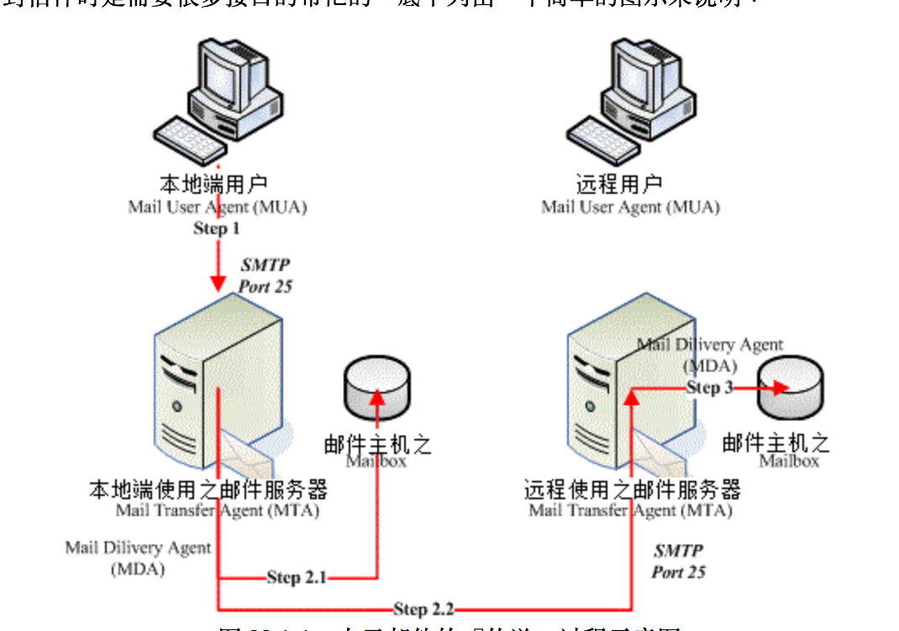

# 6. 配置电子邮件传输

## 配置仅发送电子邮件服务

* 电子邮件架构和空客户端
* 电子邮件信息的传输
* Postfix
* Postfix 空客户端配置

### 电子邮件架构和空客户端

`Linux`服务器也会发送电子邮件, 通常是处于自动用途或者是想管理员报告错误.

大部分服务器都收到监控, 并且在发生事件时发出邮件. 通常需要一个已配置的`usr/sbin/sendmail`来发送电子邮件.

空客户端是一个运行本地服务器的客户端计算机, 它将所哟电子邮件转发到出站邮件中继以进行发送. 空客户端不接受任何邮件的本地发送, 它只能将这些邮件发送到出站邮件中继. 用户可以在空客户端上运行邮件客户端来读取和发送电子邮件.

### 电子邮件信息的传输

要发送电子邮件, 邮件客户端与传出邮件服务器进行通信, 后者可帮助将该邮件中继到其最终目标. 邮件客户端使用简单邮件传输协议(SMTP)将邮件传输到有钱服务器.

### Postfix

### Postfix 空客户端配置

* sendmail 命令以及使用该命令将所有电子邮件转发到现有出站邮件中继以进行发送的程序
* 本地 Postfix 服务不接受任何电子邮件的本地发送
* 用户可以在空客户端上运行邮件客户端来读取和发送电子邮件