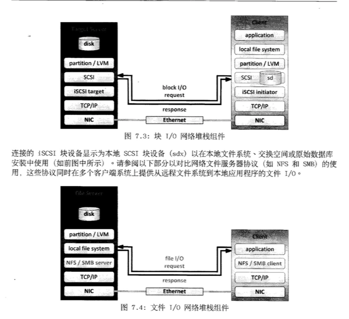

# 7. 提供远程块存储

## iSCSI 概念

* iSCSI 简介

### iSCSI简介

Internet 小型计算机系统接口(iSCSI)是一个基于`TCP/IP`的协议, 用于通过`IP`网络仿真`SCSI`高性能本地存储总线, 从而为远程块存储设备提供数据传输和管理. 作为存储区域网络(SAN)协议, `iSCSI`跨本地和广域网络(LAN, WAN 以及 Internet)扩展`SAN`,通过分布式服务器和数组提供独立于位置的数据存储检索.

SCSI 协议套件提供基于设备总线通信协议的命令描述其块(`CDB`)命令集. 对于每个通道的所有设备(电缆总线), 原始`SCSI`拓扑使用长度限制为20米的物理布线. 光纤通道(FC)已淘汰了物理`SCSI`磁盘和布线, `FC`保留了`SCSI`的`CDB`命令集, 但是将磁盘和总线通信更换为协议以便进行更长且速度更快的光纤布线.

**iSCSI协议还保留了CDB命令集, 在通过标准TCP/IP封装的iSCSI系统之间执行总线通信**. `iSCSI`服务器使用文件， 逻辑卷或任何类型的磁盘作为底层存储来仿真成纤维目标的`SCSI`设备.

**iSCSI**的使用使`SAN`摆脱了本地布线的限制, 促进了本地或远程数据中心的存储整合.

#### iSCSI 基础知识

`iSCSI`协议的运行方式类似于客户端-服务器配置. 客户端系统将启动器软件配置为将`SCSI`命令发送到远程服务器存储目标. 访问的`iSCSI`目标在客户端系统上显示为本地且未格式化的`SCSI`块设备, 等同于通过`SCSI`布线, `FC`直连或`FC`交换光纤连接的设备.

#### iSCSI 组件术语

* 启动器, 客户端.
* 目标, `iSCSI`存储资源, 针对来自`iSCSI`服务器的连接而配置.
* ACL, 访问权限控制列表(条目), 一个使用节点`IQN`来验证启动器的访问权限的访问限制.
* 发现, 查询目标服务器以列出配置的目标.
* IQN, `iSCSI`限定明恒, 一个全球唯一名称, 用于以强制命名格式来识别启动器和目标.
* 登录, 向目标或`LUN`进行身份验证以开始使用客户端块设备.
* LUN, 逻辑单元号, 带有编号的块设备, 连接到目标并且通过目标来使用.
* 节点, 任何`iCSI`启动器或`iSCSI`目标, 由其`IQN`来标识.
* 门户, 目标或启动器上用于建立链接的`IP`地址和端口.
* TPG, 目标门户组, 某个特定`iSCSI`目标将要侦听的接口`IP`地址和`TCP`端口的集合.

集群系统利用全局文件系统(GFS2)解决多系统访问权限, 提供分布式文件锁定和并发多节点文件系统挂载.

**块 I/O**对比**文件 I/O**

## 提供 iSCSI 目标

* iSCSI 目标概述
* iSCSI 目标配置

### iSCSI 目标概述

在`iSCSI`中, `SCSI`总线是在`IP`网络中仿真, 目标可以是网络附加存储机柜中的专用物理设备, 也可以是网络存储服务器上`iSCSI`软件配置的逻辑设备.

目标是`SCSI`中心概念通信中的端点, 可将命令描述符块(CDB)传递到请求或者提供存储事务.

提供对存储或输出设备的访问权限, 需使用一个或多个逻辑单元号(LUN)来配置目标. 启动器
执行`SCSI`与目标的协商, 以建立与`LUN`的连接. `LUN`作为仿真的`SCSI`磁盘块设备来响应, 后者能以原始形式使用, 也可以通过客户端支持的文件系统进行格式化.

`iSCSI`允许来自多个启动器节点的共享目标和`LUN`访问权限, 因此需要使用支持集群功能的文件系统, 如`GFS2`. 同时从多个系统中挂载转为本地, 单一系统访问设计的标准文件系统(如 ext4, zfs...)将导致文件系统损坏.

### iSCSI 目标配置

#### 后备存储

* block: 服务器上定义的块设备. 
* fileio: 服务器上文件系统创建一个指定大小的文件. 类似使用映像文件作为阻尼及磁盘映像的存储.
* pscsi: 物理SCSI.
* ramdisk: 服务器上的内存中创建一个指定大小的`ramdisk`设备.

## 访问 iSCSI 存储

### iSCSI 启动器简介

