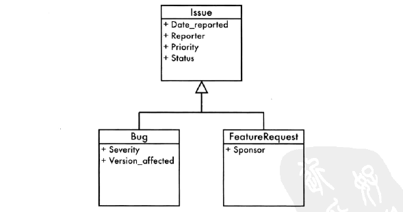
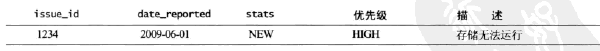

# 6 实体-属性-值

### 笔记

---

#### 目标:支持可变的属性

通常来说,数据库的一张表由一些属性列组成,表中的每一条记录都是用这些列,因为这条记录表示的都是相似的对象实例.**不同的属性集合表示不同的对象,因而就应该用不同的表来区分**.

**但是**,基于面向对象的变成模型,不同的对象类型可能是相连的.我们可能想:

* 仅适用一张表来存储所有这些不同类型的对象,这样能方便进行比较和计算.
* 将不同的子类分开存储,因为每个子类都有一些特殊的属性,和其他的子类甚至父类都不能共用.

**示例**

Bug 和 Request 的公共属性提炼为一个基类.但是 Bug 和 FeatureRequest 也有自己的特有属性.

#### 反模式:使用泛型属性表

**EAV**

当遇见这种支持可变属性的情况时,创建另一张表,将属性当成行来存储.

属性表中的每条记录都包含三列:

* 实体: 通常来说这就是一个指向父表的外键,父表的每条记录表示一个实体对象.
* 属性: 属性的名字(传统的表中,属性即每一列的名字),这里我们需要根据不同的记录来解析其标识的对象属性.
* 值: 对于每个实体的每一个不同属性,都有一个对应的值.

这样的设计成为`实体-属性-值`,简称`EAV`.也称为,开放架构,舞模式或者名-值对.

一些优点(但是后文会描述更多的缺点,所以需要根据情况来考量使用):

* 表的列很少.
* 新增的属性不会对现有的表结构造成影响,不需要新增列.
* 避免了由于空值而造成的表内容混乱.

**查询属性**

EAV设计查询时较为麻烦.

传统设计:

		SELECT issue_id,data_reported FROM Issues.
		
EAV设计:

		SELECT issue_id,attr_value AS "date_reported" FROM IssueAttributes WHERE attr_name= 'date_reported';

**支持数据完整性**

因为传统数据库增加一条数据(一个对象),即是增加一行数据.而使用EAV则意味着要同时增加多行数据.虽然使用事物可以保证完整性,但是相对于传统来说较为麻烦,且对性能有影响(事物:加锁解锁).

**无法声明强制属性**

相对于传统数据库来说,我们需要确保`date_reported`这个属性有值.在设计数据库时可以简单的通过在声明的时候加上`NOT NULL`的限制来确保该列的值不为空.

但是在EAV设计中却没法这么做.每个属性对应对应`IssueAttributes`表中的一行,而不是一列.

**无法使用SQL的数据类型**

同上,不能为一个属性声明类型.我们要保证其中的一列是日期.在EAV中因为使用的时字符存储,我们不能约束其一定是日期(除非在程序层面上),但是在传统中我们只要简单的声明`DATE`类型即可.

如果采用专门为EAV设计中每一个SQL类型都定义一个单独的attr_value列,不需要使用的列就留空.这个可以使用SQL的数据类型,却使得查询变得更加恐怖.

		attr_value_integer,attr_value_float,attr_value_string...
		
**无法确保引用完整性**

传统的数据库,可以定义一个指向另一张表的外键来约束某些属性的取值范围.在EAV中无法在attr_value列上使用这种约束方法.引用完整性的约束会应用到表中的每一行.

**无法配置属性名**

有可能在EAV设计中同一个属性被定义了多次.比如,在表中有个BUG的属性叫做date_reported,但另一个BUG记录却把这个属性称作report_date.虽然两者都表达了同样的意思.

EAV解决此方法时采用将attr_name列生命成一个外键,并指向一张存储着所有可能出现的属性名的表.

**重组列**

传统的表中获取一整行记录,并且得到所有属性是个很平常的需求:

如果EAV设计需要像上面那样按行获取所有这些属性就需要执行一个联结查询(这里是说只有SQL,相对于通过程序处理则会简单些).

#### 如何识别反模式(EAV)

* 数据库不需要修改元数据就可以扩展.可以在运行时定义新的属性.
* 查询时我能用的最大数量的联结是多少
* 查询报表极为复杂

#### 合理使用反模式

如果要使用EAV这样的设计可以考虑使用`NO-SQL`型数据库.

#### 解决方案:模型化子类型

**单表继承**

将所有相关的类型都存在一张表中,为所有类型的所有属性都存放在一张表中,为所有类型的所有属性都保留一列.同时,使用一个属性来定义每一行表示的子类型.

		把上文中 Bug 和 FeatureRequest 的属性存放在一张表中,并且又一个额外的字段来区分该行记录属于 Bug 还是 FeatureRequest.
		
		Issues:
		//公有的
		issue_id,
		reported_by,
		product_id,
		priority,
		status,
		//区分属于 Bug 还是 FeatureRequest
		issue_tye,
		//Bug 独有属性
		severity,
		version_affected,
		//FeatureRequest
		sponsor,

**实体表继承**

为每一个子类型都创建一张独立的表.每个表包含那些属于基类的共有属性,同时也包含子类型特殊化的属性.

		Bug 和 FeatureRequest 存在2张表中.每张表都包含他们所有的属性.
		
		Bug:
		
		issue_id,
		reported_by,
		product_id,
		priority,
		status,
		severity,
		version_affected,
		
		FeatureRequest:
		
		issue_id,
		reported_by,
		product_id,
		priority,
		status,
		sponsor,
		
缺点是很难将通用属性和子类特有的属性区分开来.因此,如果将一个新的属性增加通用属性中,必须为每个子类表都加一遍.而且如果希望不考虑子类型而在所有对象中进行过滤查找,问题会变得很复杂,需要创建一张视图来处理.		
		
**类表继承**

把表当成面向对象里的类.创建一张基类表,包含所有子类型的公共属性.对于每个子类型,创建一个独立的类,通过外键和基类表相连.

		Issues:
		
		issue_id,
		reported_by,
		product_id,
		priority,
		status,
		
		Bug:
		
		issue_id,
		severity,
		version_affected,
		FOREIGN KEY (issue_id) REFERENCES Issues (issue_id)
		
		FeatureRequest:
		issue_id,
		sponsor,
		FOREIGN KEY (issue_id) REFERENCES Issues (issue_id)

*我一般使用这种方式居多*

**半结构化数据模型**

如果有很多子类型或者必须经常的增加新的属性支持,可以使用一个`BLOB`列来存储数据,用XML或者JSON格式--同时包含了属性的名字和值.这种模式称之为`序列化大对象块(Serialized LOB)`.

		Issues:
		
		//公有的
		issue_id,
		reported_by,
		product_id,
		priority,
		status,
		//区分属于 Bug 还是 FeatureRequest
		issue_tye,
		//所有序列化后的数据存放在该字段中
		attributes (TEXT),
		
优点: 优异的扩展性.

缺点: SQL 基本上没有办法获取某个指定的属性(mysql5.7 可以支持从json中获取).
		
**后处理**

如果有时不得不使用EAV设计,考虑使用程序来辅助实现一些查询.

### 整理知识点

---