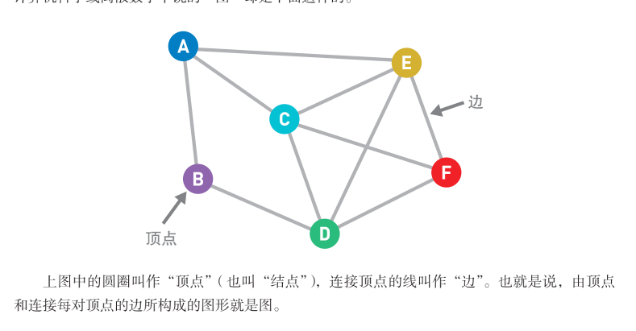
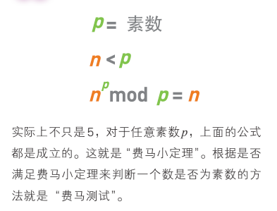

# README

## 1 数据结构

### 1-1 数据结构

数据存储于内存时，决定了数据顺序和位置关系的便是“数据结构”。

### 1-2 链表

在链表中，数据一般都是分散存储于内存中的，无须存储在连续空间内。

对链表的操作所需的运行时间到底是多少呢？在这里，我们把链表中的数据量记成
n。访问数据时，我们需要从链表头部开始查找（线性查找），如果目标数据在链表最后
的话，需要的时间就是 O(n)。

另外，添加数据只需要更改两个指针的指向，所以耗费的时间与 n 无关。如果已经到达了添加数据的位置，那么添加操作只需花费 O(1) 的时间。删除数据同样也只需O(1) 的时间。

### 1-3 数组

数据按顺序存储在内存的连续空间内。

由于数据是存储在连续空间内的，所以每个数据的内存地址（在内存上的位置）都可以通过
数组下标算出，我们也就可以借此直接访问目标数据（这叫作“随机访问”）。

假设数组中有 n 个数据，由于访问数据时使用的是随机访问（通过下标可计算出内存地址），所以需要的运行时间仅为恒定的O(1)。

但另一方面，想要向数组中添加新数据时，必须把目标位置后面的数据一个个移
开。所以，如果在数组头部添加数据，就需要 O(n) 的时间。删除操作同理。

### 1-4 栈 LIFO

栈也是一种数据呈线性排列的数据结构，不过在这种结构中，我们只能访问最新添加的数
据。栈就像是一摞书，拿到新书时我们会把它放在书堆的最上面，取书时也只能从最上面的新
书开始取。

**Last In First Out，简称 LIFO。**

栈的数据也是线性排列。

如`定（AB（C（DE）F）（G（（H）I J）K））`

* 读到左括号就将其入栈
* 读到有括号就将栈顶的左括号出栈

**应用于深度优先算法**

### 1-5 队列 FIFO

**“先进先出”的结构，我们称为 First In First Out，简称 FIFO。**

**应用于广度优先算法**

### 1-6 哈希表

在哈希表中，我们可以利用哈希函数快速访问到数组中的目标数据。如果发生哈希
冲突，就使用链表进行存储。

在存储数据的过程中，如果发生冲突，可以利用链表在已有数据的后面插入新数据
来解决冲突。这种方法被称为**“链地址法”**。

**“开放地址法”**，当冲突发生时，立刻计算出一个候补地址（数组上的位置）并将数
据存进去。如果仍然有冲突，便继续计算下一个候补地址，直到有空地址为止。可以通
过多次使用哈希函数或“线性探测法”等方法计算候补地址。

### 1-7 堆

**堆是一种图的树形结构**，被用于实现“优先队列”。优先队列是一种数据结构，可以自由添加数据，但取出数据时要从最小值开始按顺序取出。

堆中的每个结点最多有两个子结点。树的形状取决于数据的个数。另外，结点的排列顺序为从上到下，同一行里则为从左到右。

在堆中存储数据时必须遵守这样一条规则：=="子结点必定大于父结点。"==

堆中最顶端的数据始终最小，所以无论数据量有多少，**取出最小值**的时间复杂度都为 O(1)。

**取出数据后**需要将最后的数据移到最顶端，然后一边比较它与子结点数据的大小，一边往下移动，所以取出数据需要的运行时间和树的高度成正比。假设数据量为n，根据堆的形状特点可知树的高度为 log2n ，那么重构树的时间复杂度便为 O(logn)。

**添加数据**也一样。在堆的最后添加数据后，数据会一边比较它与父结点数据的大小，一边往上移动，直到满足堆的条件为止，所以添加数据需要的运行时间与树的高度成正比，也是 O(logn)。

==如果需要频繁地从管理的数据中取出最小值，那么使用堆来操作会非常方便。==

* 大顶堆：每个节点的值都大于或者等于它的左右子节点的值。
* 小顶堆：每个节点的值都小于或者等于它的左右子节点的值。

### 1-8 二叉查找树

二叉查找树又叫作二叉搜索树或二叉排序树。

每个结点最多有两个子结点。

二叉查找树有两个性质:

* 是每个结点的值均==大于其左子树上任意一个结点的值==。
* 每个结点的值均==小于其右子树上任意一个结点的值==。

二叉查找树的最小结点要从顶端开始，往其**左下的末端**（最左结点）寻找。二叉查找树的最大结点要从顶端开始，往其**右下的末端**（最右结点）寻找。

**添加节点**

从二叉查找树的顶端结点开始寻找添加数字的位置。将想要添加的节点与该结点中的值进行比较，小于它则往左移，大于它则往右移。

**查找**

把二叉查找树当作是二分查找算法思想的树形结构体现。

比较的次数取决于树的高度。所以如果结点数为 n，而且树的形状又较为均衡的话，比较大小和移动的次数最多就是 log2n。因此，时间复杂度为 O(logn)。但是，如果树的形状朝单侧纵向延伸，树就会变得很高，此时时间复杂度也就变成了 O(n)。 

### 总结

二叉查找树有两个性质:

* 是每个结点的值均==大于其左子树上任意一个结点的值==。
* 每个结点的值均==小于其右子树上任意一个结点的值==。

二叉查找树当作是二分查找算法思想的树形结构体现。

## 2 排序

### 2-1 什么是排序

### 2-2 冒泡排序

冒泡排序就是重复“从序列右边开始比较相邻两个数字的大小，再根据结果交换两个数字的位置”这一操作的算法。（每次找出最小的）

在这个过程中，数字会像泡泡一样，慢慢从右往左“浮”到序列的顶端，所以这个算法才被称为“冒泡排序”。

在冒泡排序中，第 1 轮需要比较 n -1 次，第 2 轮需要比较 n -2 次……第 n -1 轮需
要比较 1 次。因此，总的比较次数为(n -1) +(n -2) +…+1 ≈ n^2/2(一共有n-1个数正数第1个和倒数第1个相加=正数第2个和倒数第2个相加=……=n所以有（n-1）/2个等于n组合
相乘可得(n－1)n/2)。这个比较次数恒定为该数值，和输入数据的排列顺序无关。

不过，交换数字的次数和输入数据的排列顺序有关。假设出现某种极端情况，如输入数据正好以从小到大的顺序排列，那么便不需要任何交换操作；反过来，输入数据要是以从大到小的顺序排列，那么每次比较数字后便都要进行交换。因此，冒泡排序的时间复杂度为 ==O(n^2)==。

### 2-3 选择排序

选择排序就是重复“从待排序的数据中寻找最小值，将其与序列最左边的数字进行交换”这一操作的算法。

选择排序使用了线性查找来寻找最小值，因此在第 1 轮中需要比较 n -1 个数字，第
2 轮需要比较 n -2 个数字……到第 n -1 轮的时候就只需比较 1 个数字了。因此，总的比
较次数与冒泡排序的相同，都是(n -1) +(n -2) +…+1 ≈ n^2/2。

每轮中交换数字的次数最多为 1 次。如果输入数据就是按从小到大的顺序排列的，
便不需要进行任何交换。选择排序的时间复杂度也和冒泡排序的一样，都为==O(n^2)==。

### 2-4 插入排序

插入排序是一种从序列左端开始依次对数据进行排序的算法。在排序过程中，左侧的数据陆续归位，而右侧留下的就是还未被排序的数据。==插入排序的思路就是从右侧的未排序区域内取出一个数据，然后将它插入到已排序区域内合适的位置上==。

如果取出的数字比左边已归位的数字都要小，就必须不停地比较大小，交换数字，直到它到达整个序列的最左边为止。

就是第 k 轮需要比较 k -1 次。因此，在最糟糕的情况下，第 2 轮需要操作 1 次，第 3 轮操作 2 次……第 n 轮操作 n -1次，所以时间复杂度和冒泡排序的一样，都为==O(n^2)==。

### 2-5 堆排序

堆排序的特点是利用了数据结构中的堆。在堆中存储所有的数据，并按降序来构建堆。从降序排列的堆中取出数据时会从最大的数据开始取，所以将取出的数据反序输出，排序就完成了。依次执行：

* 取出根节点
* 重新构造堆

堆排序一开始需要将 n 个数据存进堆里，所需时间为 O(nlogn)。排序过程中，堆从空堆的状态开始，逐渐被数据填满。由于堆的高度小于 log2n，所以插入 1 个数据所需要的时间为 O(logn)。

每轮取出最大的数据并重构堆所需要的时间为 O(logn)。由于总共有 n 轮，所以重
构后排序的时间也是 O(nlogn)。因此，整体来看堆排序的时间复杂度为 ==O(nlogn)==。

* 升序: 使用大顶堆
* 降序: 使用小顶堆

为什么升序使用大顶堆，每个结点的值都大于或等于其左右孩子结点的值，我们把大顶堆构建完毕后根节点的值一定是最大的，然后把根节点的和最后一个元素（也可以说最后一个节点）交换位置，那么末尾元素此时就是最大元素了。实际中需要排序的数据都存储在数组中。这次我们使用了堆这种数据结构，但实际上，这也相当于将堆嵌入到包含了序列的数组中，然后在数组中通过交换数据来进行排序。

### 2-6 归并排序

把序列分成长度相同的两个子序列，当无法继续往下分时（也就是每个子序列中只有一个数据时），就对子序列进行归并。归并指的是把两个排好序的子序列合并成一个有序序列。该操作会一直重复执行，直到所有子序列都归并为一个整体为止。

在合并两个已排好序的子序列时，只需重复比较首位数据的大小，然后移动较小的数据，因此只需花费和两个子序列的长度相应的运行时间。

无论哪一行都是 n 个数据，所以每行的运行时间都为 O(n)。而将长度为 n 的序列对半分割直到只有一个数据为止时，可以分成 log2n 行，因此，总共有 log2n 行。也就是说，总的运行时间为 O(nlogn)。

### 2-7 快速排序

快速排序算法首先会在序列中随机选择一个基准值（pivot），然后将除了基准值以外的数分为“比基准值小的数”和“比基准值大的数”这两个类别，再将其排列成以下形式。

==[ 比基准值小的数 ] 基准值 [ 比基准值大的数 ]==

接着，对两个“[ ]”中的数据进行排序之后，整体的排序便完成了。对“[ ]”里面的数据进行排序时同样也会使用快速排序。

快速排序是一种“分治法”。它将原本的问题分成两个子问题（比基准值小的数和比基准值大的数），然后再分别解决这两个问题。子问题，也就是子序列完成排序后，再像一开始说明的那样，把他们合并成一个序列，那么对原始序列的排序也就完成了。

## 3. 数组的查找

### 3-1 线性查找

在数组中从头开始依次往下查找即可。

线性查找需要从头开始不断地按顺序检查数据，因此在数据量大且目标数据靠后，或者目标数据不存在时，比较的次数就会更多，也更为耗时。若数据量为 n，线性查找的时间复杂度便为 O(n)。

### 3-2 二分查找

只能查找已经排好序的数据。二分查找通过比较数组中间的数据与目标数据的大小，可以得知目标数据是在数组的左边还是右边。因此，比较一次就可以把查找范围缩小一半。重复执行该操作就可以找到目标数据，或得出目标数据不存在的结论。

数据量为 n 的数组，将其长度减半 log2n 次后，其中便只剩一个数据了。也就是说，在二分查找中重复执行“将目标数据和数组中间的数据进行比较后将查找范围减半”的操作 log2n 次后，就能找到目标数据（若没找到则可以得出数据不存在的结论），因此它的时间复杂度为 O(logn)。

## 4. 图的搜索

### 4-1 什么是图

**加权图**

可以给边加上一个值。这个值叫作边的“权重”或者“权”，加了权的图被称为“加权图”。没有权的边只能表示两个顶点的连接状态，而有权的边就可以表示顶点之间的“连接程度”。

**有向图**

给边加上箭头代表方向。

### 4-2 广度优先搜索

假设我们一开始位于某个顶点（即起点），此时并不知道图的整体结构，而我们的目的是从起点开始顺着边搜索，直到到达指定顶点（即终点）。在此过程中每走到一个顶点，就会判断一次它是否为终点。==广度优先搜索会优先从离起点近的顶点开始搜索==。

候补顶点是用“先入先出（FIFO）”来管理的，可以使用队列结构。

广度优先搜索的特征为从起点开始，由近及远进行广泛的搜索。因此，目标顶点离起点越近，搜索结束得就越快。

### 4-3 深度优先算法

深度优先搜索会沿着一条路径不断往下搜索直到不能再继续为止，然后再折返，开始搜索下一条候补路径。

候补顶点是用“后入先出”（LIFO）的方式来管理的，因此可以使用“栈”这个数据结构。

深度优先搜索的特征为沿着一条路径不断往下，进行深度搜索。

广度优先搜索选择的是最早成为候补的顶点，因为顶点离起点越近就越早成为候补，所以会从离起点近的地方开始按顺序搜索；而深度优先搜索选择的则是最新成为候补的顶点，所以会一路往下，沿着新发现的路径不断深入搜索。

### 4-4 贝尔曼-福特算法

是一种在图中求解最短路径问题的算法（寻找从起点到终点的路径中权重总和最小的那条路径）。

首先设置各个顶点的初始权重 ：起点为 0，其他顶点为无穷大。从所有的边中选出一条边，此处选择了连接 A-B 的边。然后，分别计算这条边从一端到另一端的权重，计算方法是“顶点原本的权重＋边的权重”。如果计算结果小于顶点的值，就更新这个值。依次计算所有顶点，

### 4-5 狄克斯特拉算法

一边逐一确定起点到各个顶点的最短路径，一边对图进行搜索。

### 4-6 A* 算法

在图中求解最短路径问题的算法，由狄克斯特拉算法发展而来。狄克斯特拉算法会从离起点近的顶点开始，按顺序求出起点到各个顶点的最短路径。也就是说，
一些离终点较远的顶点的最短路径也会被计算出来，但这部分其实是无用的。与之不同，A* 就会预先估算一个值，并利用这个值来省去一些无用的计算。

预估值：

* 起点到当前探索节点到的步数
* 当前探索节点到终点的预估值（可以根据各种算法预估，如曼哈顿：横+纵的步数）

## 安全算法

### 5-1 安全和算法

### 5-2 加密的基础知识

### 5-3 哈希函数

### 5-4 共享密钥加密

密钥数量（n为人数）： n(n-1)/2

### 5-5 公开密钥加密

### 5-6 混合加密

1. B 把自己的公钥公布，A获取B的公钥
2. A把**共享密钥**通过B的公钥加密，发给B
3. B使用自己的私钥解密
4. 后续A使用这个**共享密钥**发送数据即可，现在已经成功的把共享密钥发给了B

### 5-7 迪菲-赫尔曼密钥交换

合成密钥无法分解，合成结果与顺序无关. ==离散对数==

1. A和B生成密钥**P**
2. A和B准备自己的私钥**SA**和**SB**
3. A和B合成新的密钥**P+SA=PSA**, **P+SB=PSB**
4. A把**PSA**发给B
5. B把**PSB**发给A
6. 因为合成密钥的结果与顺序无关
	* A 收到 **PSB**与自己的**SA**合并得到**PSAB**
	* B 收到 **PSA**与自己的**SB**合并得到**PSAB**
7. 通过**PSAB**加密解密

## 聚类

### 6-1 什么是聚类

聚类就是在输入为多个数据时，将“相似”的数据分为一组的操作。1 个组就叫作 1 个“簇”。

### 6-2 k-means 算法

k-means 算法中，随着操作的不断重复，中心点的位置必定会在某处收敛。即使簇的数量相同，只要随机设置的中心点最初的位置不同，聚类的结果也会产生变化。因此，我们可以通过改变随机设定的中心点位置来不断尝试 k-means 算法，再从中选择
最合适的聚类结果。

**层次聚类算法**

在层次聚类算法中，一开始每个数据都自成一类。也就是说，有 n 个数据就会形成n 个簇。然后重复执行“将距离最近的两个簇合并为一个”的操作 n-1 次。每执行 1 次，簇就会减少 1 个。执行 n -1 次后，所有数据就都被分到了一个簇中。在这个过程中，每个阶段的簇的数量都不同，对应的聚类结果也不同。只要选择其中最为合理的 1 个结果就好。

## 其他算法

### 7-1 欧几里得算法

欧几里得算法（又称辗转相除法）用于计算两个数的最大公约数。

### 7-2 素性测试

素性测试是判断一个自然数是否为素数的测试。素数（prime number）就是只能被 1 和其自身整除，且大于 1 的自然数。

**费马小定律**

确认 n 和余数一致的次数越多，需要判断的数确实为素数的可能性就越大。但是，如果每一个小于 p 的数都要去计算，就会非常耗费时间。实际上，如果确认了几组 n 和余数之后就能判断该数是素数的可能性非常高，那么大致就可以判定该数是素数了。

如果 p 是素数，那么所有比 p 小的数 n 都满足 np mod p ＝ n 这个条件。但反过来，即使所有 n 都满足条件，p 也有可能不是素数。因为在极低概率下会出现所有 n 都满足条件的合数（非素数的自然数）。

### 7-3 网页排名

### 7-4 汉诺塔

