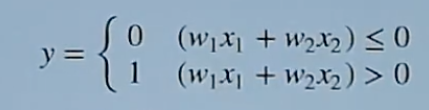

## 读书笔记

### 感知机定义**

* 感知机接收多个输入信号，输出一个信号
* 感知机信号向前流动，向前方输送信息
	* 感知机的信号只有**流**和**不流**两种情况，分别用`1`和`0`表示

### 神经元

* 神经元会计算传送过来的信号综合，只有当这个总和超过了某个界限值时，才会输出`1`, 这也被称为**神经元被激活**。
* 界限值称为阈值，用符`θ`表示



权重越大(`w`是权重), 输入信号的输出值越大，该神经元越容易被激活。

**w是控制输入信号的重要性的参数**

### 与门

`AND`门

### 引入偏置`b` 

**偏置是调整神经元被激活的容易程度（输出信号为1的程度）的参数。**

把`θ`换成`-b`, 比如原来`a-θ > 0`则为`1`(超过阈值), 现在改为`a+b > 0`则为`1`(负负得正)。

在传统的感知机模型中，输出是通过加权和与一个 阈值（θ） 的比较来决定的：

```
a = w1*x1 + w2*x2 + ... + wn * xn

if a - θ > 0 then y = 1 else = 0
```

现在改为

```
if a + b > 0 then y = 1 else = 0
```

### `numpy`

引入`numpy`, 使用数组相乘。

```
import numpy as np

x = np.array([1, 2])  # 创建NumPy数组
w = np.array([0.5, 0.5])  # 创建另一个NumPy数组

# 数组元素间的逐元素乘法
print("w * x (NumPy array):", x * w)

# 现在使用普通的Python数组（list）
x_list = [1, 2]  # 普通Python列表
w_list = [0.5, 0.5]  # 另一个普通Python列表

# 使用普通数组时，你需要逐个元素进行操作
x_list_result = [x * w for x, w in zip(x_list, w_list)]
print("w * x (Python list):", x_list_result)
```

运行结果

```
#NumPy数组
w * x (NumPy array): [0.5 1.  ]

普通Python列表
w * x (Python list): [0.5, 1.0]
```

**numpy数组与普通数组区别**

* np.array（NumPy数组）：
	* 允许直接进行逐元素的运算，代码更简洁和高效。
	( 支持大量的数值运算（加法、减法、乘法等），并且运算会对数组的每个元素自动广播和执行（例如 x * w 就是对 x 和 w 的每个对应元素进行相乘）。
	( 提供了丰富的数学、线性代数和统计功能，支持高维数据处理（如矩阵运算）。
* 普通数组（Python List）：
	* 不支持逐元素运算，如果你想对每个元素进行运算，需要使用 Python 的 for 循环，或者像上面的代码示例中使用 zip。	* 更适合存储一般的数据集合，而不是数值运算。
	* 数学运算通常效率较低，特别是当数据量很大时，因为需要手动迭代每个元素。

**数组相加**

```
x = np.array([1, 2])
w = np.array([0.5, 0.5])

x * w = [1 * 0.5, 2 * 0.5] = [0.5, 1.0]

# 会对乘积数组 x * w 中的所有元素求和
np.sum(x * w) = np.sum([0.5, 1.0]) = 0.5 + 1.0 = 1.5
```

如果`x`和`w`维度不同，NumPy 会自动进行**广播（broadcasting）**，将较小的数组扩展为较大的数组的形状，然后进行逐元素计算。例如：

```
import numpy as np

x = np.array([1, 2, 3])
w = np.array([0.5])

result = np.sum(x * w)
print(result)

# 结果
# w 数组只有一个元素（0.5），而 x 有三个元素，NumPy 会将 w 数组广播成 [0.5, 0.5, 0.5]，然后与 x 按元素相乘并求和。
(1 * 0.5) + (2 * 0.5) + (3 * 0.5) = 0.5 + 1.0 + 1.5 = 3.0
```

**数组广播规则**

NumPy 的广播机制基于以下规则：

* 如果两个数组的维度不同，NumPy 会将较小的数组沿着较大的数组的维度“扩展”。扩展时，它会通过“重复”较小数组的元素来实现。
* 广播要求两个数组在每一维度上的大小要么相等，要么其中一个数组的大小为1。

### 与非门

**NAND(Not AND)**

| x1 | x2 | y |
| --- | --- | --- |
| 0 | 0 | 1 |
| 1 | 0 | 1 |
| 0 | 1 | 1 |
| 1 | 1 | 0 |

#### 与非门实现计算机

与非门是"万能"门

* **非门(NOT):** 将同样的输入连接到与非门的两个输入端，输出就会变成输入的反向。例如：NAND(0, 0) 的输出是 1，这和 NOT(0) 一样。
* **与门(AND)：** 假设有两个输入 x1 和 x2，首先用与非门得到它们的与非结果，然后再把结果通过另一个与非门取反，就得到了与门的功能。`AND(x1, x2) `等价于 `NOT(NAND(x1, x2))`
* **或门(OR):** 与非门同样可以构建或门。可以通过先对两个输入进行非操作，再进行与非操作来实现。

#### 半加器

| 输入A	| 输入B	| 和 (S)| 	进位 (C)| 
| --- |  --- |  --- |  --- | 
| 0	| 0	| 0	| 0 | 
| 0 | 	1	| 1	| 0 | 
| 1	| 0	| 1  	| 0 | 
| 1	| 1	| 0	| 1 |

* S（和）：是输入 A 和 B 的 XOR（异或）运算结果，即 A XOR B。
* C（进位）：是输入 A 和 B 的 AND（与）运算结果，即 A AND B。
 
#### 全加器（Full Adder）

| 输入A	| 输入B| 	进位输入Cin| 	和 (S)	| 进位输出Cout| 
| --- |  --- |  --- |  --- | --- | 
| 0	 | 0	 | 0	 | 0	 | 0 | 
| 0	 | 0	 | 1	 | 1	 | 0 | 
| 0	 | 1	 | 0	 | 1	 | 0 | 
| 0	 | 1	 | 1	 | 0	 | 1 | 
| 1	 | 0	 | 0	 | 1	 | 0 | 
| 1	 | 0	 | 1	 | 0	 | 1 | 
| 1	 | 1	 | 0	 | 0	 | 1 | 
| 1	 | 1	 | 1	 | 1	 | 1 | 

* S = (A XOR B) XOR Cin（和）
* Cout = (A AND B) OR (Cin AND (A XOR B))（进位输出）

### 或门

### 异或门

`XOR`, 多层感知机实现异或门。

| x1 | x2 | 与 | 与非 | 或 | 异或 |
| --- | --- | --- | --- | --- | --- |
| 0 | 0 | 0 | 1 | 0 | 0 |
| 1 | 0 | 0 | 1 | 1 | 1 |
| 0 | 1 | 0 | 1 | 1 | 1 |
| 1 | 1 | 1 | 0 | 1 | 0 |

我们先实现**与非门**, 在实现**或门**, 这两个结果进行`AND`操作，最终得到异或门。

```python
def XOR(x1, x2):
	s1 = NAND(x1, x2)
	S2 = OR(x1, x2)
	y = AND(s1, s2)
	return y
```

## 代码

### 与门

```
def AND(x1, x2):
    w1, w2, theta = 0.5, 0.5, 0.7
    tmp = x1*w1 +x2*w2
    if tmp <= theta:
        return 0
    elif tmp > theta:
        return 1

print("AND(0, 0)", AND(0,0))
print("AND(0, 1)", AND(0,1))
print("AND(1, 0)", AND(1,0))
print("AND(1, 1)", AND(1,1))
```

**输出**

```
AND(0, 0) 0
AND(0, 1) 0
AND(1, 0) 0
AND(1, 1) 1
```

### 使用偏置实现与门

```
import numpy as np

def AND(x1, x2):
    x = np.array([x1, x2])
    w = np.array([0.5, 0.5])
    b = -0.7
    tmp = np.sum(w*x) + b
    if tmp <= 0:
        return 0
    else:
        return 1

print("AND(0, 0)", AND(0,0))
print("AND(0, 1)", AND(0,1))
print("AND(1, 0)", AND(1,0))
print("AND(1, 1)", AND(1,1))
```

### 与非门

```
import numpy as np

def NAND(x1, x2):
    x = np.array([x1, x2])
    w = np.array([-0.5, -0.5]) # 仅权重和偏置与AND不同
    b = 0.7
    tmp = np.sum(w*x) + b
    if tmp <= 0:
        return 0
    else:
        return 1

print("NAND(0, 0)", NAND(0,0))
print("NAND(0, 1)", NAND(0,1))
print("NAND(1, 0)", NAND(1,0))
print("NAND(1, 1)", NAND(1,1))
```

**输出**

```
NAND(0, 0) 1
NAND(0, 1) 1
NAND(1, 0) 1
NAND(1, 1) 0
```

### 或门

```
import numpy as np

def AND(x1, x2):
    x = np.array([x1, x2])
    w = np.array([0.5, 0.5])
    b = -0.2
    tmp = np.sum(w*x) + b
    if tmp <= 0:
        return 0
    else:
        return 1
 ```