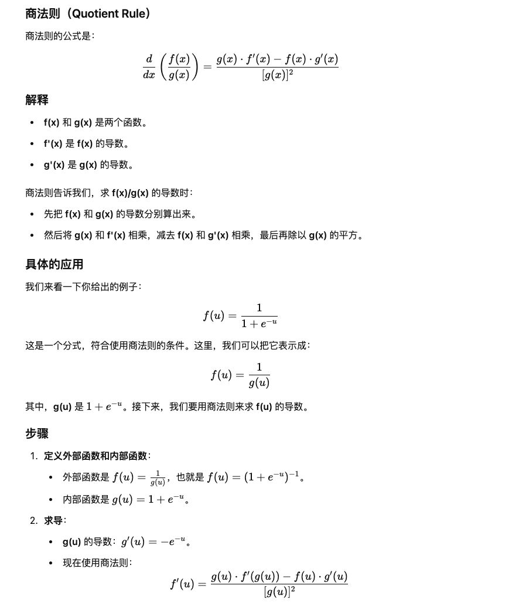

# README 

### 阶跃函数接收数组

```
import numpy as np

def step_function(x):
    return np.array(x > 0, dtype=np.int)

# 测试
print(step_function(np.array([1, -2, 3, 0])))  # 输出 [1 0 1 0]
```

**等价于**

```
def step_function(x):
      y = x > 0
      return y.astype(np.int)
```

### sigmoid

对数组的每一个元素都执行处理

```
def sigmoid(x):
     return 1 / (1 + np.exp(-x))
```

sigmoid(x) 函数接收一个实数 x，然后返回一个值，该值介于 0 和 1 之间。它通过对 x 进行一系列数学变换，压缩 x 的值到 0 和 1 之间。

* e 是自然对数的底数，大约等于 2.718。
* -x 是 x 的相反数，因此当 x 越大时，e^{-x} 越小，整个分母趋向于 1。这样 sigmoid(x) 的值就会接近 1。
* 当 x 越小（特别是负值）时，e^{-x} 越大，分母增大，sigmoid(x) 的值就会接近 0

```
sigmoid‘(x)=sigmoid(x)⋅(1−sigmoid(x))
```
sigmoid(x) 在求导时，只需要用它自己的值（sigmoid(x)）就可以直接得到导数，这让反向传播变得更加简洁。

**sigmoid(x)求导**


### 导数

**导数**是表示函数变化率的一个概念。简单来说，导数告诉你一个函数在某一点的变化速度，即该点的斜率。

例如，假设有一个函数 `f(x)`，它表示某个量（比如位置、温度、速度等）随时间或其他变量的变化。导数 `f ′(x)` 就是告诉我们，在 `𝑥` 这个点，函数 `f(x)` 是如何变化的。用直白的语言讲，就是函数曲线在该点的斜率。


* `Δx`：表示`x`的一个小的增量。
* `f(x+Δx)−f(x)`：表示`f(x)`在`x+Δx`处的函数值和`x`的函数值的差距，也就是函数值的变化量。
* `f(x+Δx)−f(x)/Δx`: 表示单位变化的变化量，实际上就是“变化率”。
* `limΔx→0`: 这个表示当`Δx`趋近于零时的极限值，也就是我们要求导时所用的核心操作。它意味着我们将函数在一个非常非常小的区间内的变化率（斜率）找出来，从而得到瞬时的变化率。

**计算`f(x)=x^2`的导数是`f′(x)=2x`**  


**链式法则**


**为什么f(x)=sin(x^2)是复合函数**


**商法则**




### ReLU 函数

函数

`x` 应为`NumPy` 数组

```
def relu(x):
	return np.maximum(0, x)
```


导数函数

 `x` 应为`NumPy` 数组

```
def relu_grad(x):
	# np.zeros(x) 用于创建一个与输入 x 形状相同的全零数组。x 可能是一个标量、向量或矩阵，因此 np.zeros(x) 会根据 x 的维度生成相应的零数组。
	grad = np.zeros(x.shape)
	# 对于 x 中大于或等于 0 的元素，对应的 grad 数组中的值会被设置为 1。其他元素保持为 0。
	grad[x >=0 ] = 1
	return grad
```

假设输入`x = np.array([-2, 0, 3])`, 当`>=0`时, 输出结果: `array([False,  True,  True])`

* 如果 x > 0，导数为 1。
* 如果 x < 0，导数为 0。
* 如果 x = 0，导数可以定义为 0 或 1（一般来说是 0，但为了方便，有时会使用 1）。在这个函数中，默认设置 x >= 0 时导数为 1。

```
x 的导数为1, 因为x的次方为1
```

### 三层神经网络