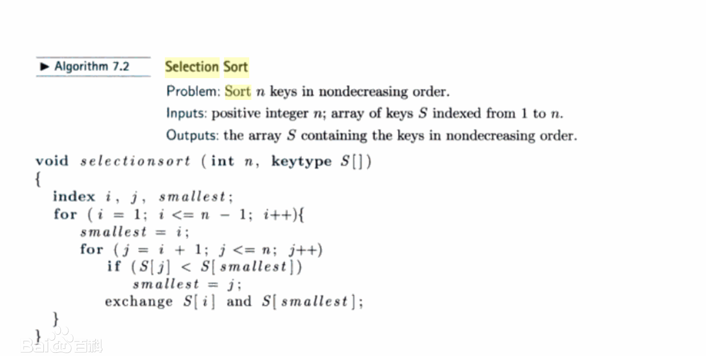

# 视频

## 1

### 图灵机

计算机设想：所有的计算机都都能在一种特殊的机器上执行。

* 数据描述
* 不是一台真实的机器

#### 数据处理器

计算机可以被看做一种接收数据输入、处理数据并产生数据输出的黑盒。

#### 可编程数据处理器

图灵模型：可编程计算机


程序：告诉计算机对数据处理的指令集合。

#### 通用图灵机

该机器只要提供合适的程序就能做任何运算。

### 冯-诺依曼模型

* 基于通用图灵机建造的计算机都是在存储器(内存/寄存器)上存储数据
* 鉴于程序和数据在逻辑上是相同的，因此程序也能存储在计算机的存储器中

#### 四个子系统

* 存储器：用来存储数据和程序的区域
* 算术逻辑单元（ALU）：用来计算和逻辑运算的地方
* 控制单元：对存储器、算术逻辑单元、输入/输出等子系统进行控制操作
* 输入/输出单元：输入子系统负责从计算机外部接收输入数据，输出子系统负责从计算机处理结果输出到计算机外部

#### 存储程序概念

* 冯-诺依曼模型要求程序也必须存储在存储器（内存）中
* 现代计算机的存储单元用来存储程序和数据，这意味着程序和数据应该有相同的格式，实际上它们都是以位模式（0和1序列）存储在内存中

#### 指令执行顺序

* 冯-诺依曼模型中的一段程序是由一组数量有限的指令组成
* 控制单元从内存中提取一条指令，解释指令，接着执行指令，也就说指令是一条接着一条顺序执行的

### 计算机组成部分

* 计算机硬件
* 计算机数据
* 计算机软件

#### 数据

冯-诺依曼模型将计算机定义为一台数据处理机，它接收输入数据，处理数据，最后输出数据。

## 数字系统

### 位置化数字系统

数字符号所占据的位置决定了其表示的值。

### 十进制转其他进制

**十进制转16进制**

`178.6`转16进制

* 整数: 178 除以 16 求余
* 小数: 0.6 乘以 16 求商

```
## 整数部分
178/16 商为 11 余数为 2 :  2
11/16 商为0 余数为 11: B

所以整数部分为 B2
```

```
## 小数部分
0.6 x 16 商为9 余数为 0.6: 9
0.6 x 16 商为9 余数为 0.6: 9

保留小数点后2位结果为 0.99
```

最终为`B2.99`

### 二进制转十六进制

二进制的四位 等于 十六进制的 一位

## 数据存储

### 计算机内部的数据格式

* 位 (bit, binary digit) 存储在计算机中的最小单位: 0或1, 代表设备的某一种状态
*  位模式(位流): 表述数据的不同类型，多个位组成一个位模式，由16个位组成的位模式
*  字节：长度为8的位模式，称为1字节
*  字：更长位模式，可以表示1个字=2字节，或 1个字=4字节

### 无符号整数

计算机定义了一个常量，称为最大无符号整数，它的值是(2^n-1)。n就是计算机中分配用于表示无符号的二进制位数。

### 补码

* 从右边复制位，直到有1被复制，直接反转其余位
* 先取整数的反码，再加1（取反加1）

### 十进制转二进制

**实数**

* 整数：除2取余，倒序排列
* 小数：乘2取整，正序排列

### 浮点表示法
 
 允许小数点浮动：可以在小数点的左右有不同数量的数码。极大地增加了可存储的实数范围。三部分组成：
 
 * 符号：正负
 * 位移量：显示小数点应该左右移动构成实际数字的位移量
 * 定点数：小数点位置固定的定点表示法

 科学计数法（用于十进制）和浮点表示法（用于二进制）都在小数点左边使用了唯一的非零数码，这称为**规范化**。
 
### 余码
 
[32位ieee 754的阶码偏移量为何用127?而不是128](https://www.zhihu.com/question/24784136)

## 数据运算

## 移位

**逻辑移位**

应用于不带符号位的数的模式。

* 右移：把每一位向右移动一个位置。最右位丢失，最左位填0。
* 左移：把每一位向左移动一个位置。最左位丢失，最右位填0。

**算术移位运算**

假定位模式是用二进制补码格式表示的带符号位的整数。算术右移被用来对整数除以2, 左移代表乘以2.

* 算术右移保留符号位，同时也把它复制，放入相邻的右边的位中，因此符合被保存
* 算术左移斗球符号位，接受它的左边的位作为符号位。如果新的符号位与原先的相同，那么运算成功，否则发生上溢或下溢，结果是非法的

### 逻辑运算 -- 复位

* AND 指定的位通过掩码 复位 `0`
* OR 指定的位通过掩码 复位 `1`
* XOR 指定的位通过掩码 复位 **取反**

### 算术移位

* 左移：x2
* 右移：/2

计算机`3/2=1`是因为`011`右移为`001`，即3/2=1

### 算术运算

## 计算机组成

### 寄存器

* 数据存储器：保存运算的中间结果，命名为R1 - Rn
* 指令存储器（IR）：CPU从内存中逐条的取出指令，并存储在指令存储器中，解释并执行指令
* 程序计数器（PC）：保存当前正在执行的指令地址，当前指令执行完成后，计数器自动加1，指向下一条指令的内存地址

### 高速缓冲存储器

高速缓冲存储器的存取速度要比主存快，但是比CPU及其内部的寄存器要慢。高速缓存中存储器通常容量较小，且常被置于CPU和主存之间。

### 存储器

* 随机存取存储区（RAM）
	* 易失性，系统断电后，信息（程序或数据）丢失。可以读写数据。
* 只读存储器（ROM）
	* 非易失性，系统断电数据不会丢失。常用来存储那些开机时运行的程序。只能读取数据。

### 总线

**数据总线**

由多根线组成，每根线每次传送一个位的数据。线的数量取决于计算机字的大小。

计算机的字是32位（4字节），那么需要32根线的数据总线，以便同一时刻传送32位的数据。

**地址总线**

允许访问存储器中某个字的，地址总线的线数取决于存储空间的大小。

存储器容量为2的n次方个字，那么地址总线一次需要传送`n`位的地址数据，因此需要`n`根线。

**控制总线**

负责在中央存储器和内存之间传送消息。控制总线的数量取决于计算机所需要的控制命令的总数。

### 子系统互联

输入/输出设备的数据读取速度要慢的多，因此必须有一个中介来处理这种差异。

连接输入/输出设备到总线上，每一个输入/输出设备都有一个特定的控制器。

**串行控制器**

只有一根数据线连接到设备上。

**并行控制器**

有多根数据线连接到设备上，一次能同时传送多个位。

### 输入/输出设备寻址

**I/O独立寻址**

用来读写内存的指令与用来读写输入/输出设备的指令是完全不同的，有专门的指令完成对输入/输出设备的操作，每个输入/输出设备有自己的地址。输入/输出设备地址可以和内存地址相同。

**I/O存储器映射寻址**

CPU将输入/输出控制器中的每个寄存器都看做内存中的某个存储字。

* 优点：CPU有较小的指令集，对内存操作的指令也可以操作输入/输出设备。
* 缺点：输入/输出控制器也占用了一部分内存地址。

### 机器周期

CPU 利用重复的机器周期来执行程序中的指令，一步一条，从开始到结束。

一个周期包括3步：

1. 取指令
2. 译码
3. 执行

#### 取指令

CPU的控制单元命令系统将下一条将要执行的指令复制到CPU的指令寄存器中，被复制的指令地址保存到程序计数器中，复制完成后，程序计数器自动加一指向内存中的下一条指令。

#### 译码

当指令置于指令寄存器后，该指令将由控制单元负责译码，指令译码的结果是产生一系列可执行的二进制代码。

#### 执行

指令译码完毕后，控制单元发送任务命令到CPU的某个部分，如，控制单元告知系统，让它从内存中读数据。这就是执行阶段。

### 输入/输出操作

计算机需要通过命令把数据从I/O设备传输到CPU和内存，因为I/O设备的运行速度比CPU慢的多，因此CPU的操作在某种程度上必须和I/O设备同步。

三种同步方法

* 程序控制输入/输出
	* CPU等待I/O设备
	* 不停检查I/O设备
* 中断控制输入/输出
* 直接存储器存取(DMA)
	* DMA承担CPU的一些功能

### 计算机体系结构

* CISC 复杂指令集计算机
* RISC 精简指令集计算机

## 计算机网络和因特网

### 广域网

* **点对点广域网**: 通过传输媒介（电缆或无线）连接两个通信设备的网络
* **交换广域网**：至少两个端的网络，交换广域网用于当今全球通信的骨干网，是几个点对点广域网通过开关连接产生的结合体

### 协议分层

* **协议**: 定义了发送器、接收器以及所有中间设备必须遵循的以保证有效通信的规则。

## 操作系统

操作系统是计算机硬件和用户的一个接口，可以方便地对计算机硬件和软件资源进行访问。

### 批处理

作业排序、排队

保证计算机所有资源从一个作业转换到另一个作业

### 实时系统

指在特定时间限制内完成任务

### 存储管理

#### 单道程序

大多数内存用来装载单一的程序，整个程序装入内存运行，运行结束后，程序区域由其他程序取代。

一个程序运行的时候，其他程序不能运行。

CPU率用率很差。

#### 多道程序

同一时刻可以装入多个程序到内存，并且能同时执行。

**非交换：程序在运行期间始终驻留在内存中**

* 分区调度：内存被分为不定长的几个分区，每个分区保存一个程序，CPU在各个程序间交替服务。
	* 每个程序**完全载入**内存，并占用连续的地址，分区调度改进了CPU的执行效率。
* 分页调度：内存被分成大小相等的若干个部分，称为帧，程序被分为大小相等的部分，称为**页**，通常**帧和页的大小一样**
	* 程序在内存中不必是连续的。
	* 分页调度在一定程度上提高了效率，但每个程序还是要完全载入内存。

**交换：在运行过程中，程序可以在内存和硬盘之间多次交换数据**

* 请求分页调度：程序被分成页，但页可以依次载入内存运行和替换，程序**不需要全部载入**内存。一个页可以载入任何一个空闲帧。
* 请求分段调度：程序通常由主程序和子程序组成，程序将按程序员的角度划分为**段**，它们载入内存中执行，然后被来自同一程序或其他程序的模块所替代。
* 请求分页和分段调度

### 进程管理

* 程序：一组指令，存在磁盘上，它可能辉夜可能不会称为作业。
* 作业：从一个程序被选中执行，到其运行结束并再次成 为一个程序的这段过程中，该程序称为作业。
* 进程：是一个运行中的程序，该程序开始运行但还未结束，只要作业装入内存就称为进程。

### 调度器

* 作业调度器
* 进程调度器

## 算法

**算法**

* 是一种逐步解决问题或完成任务的方法。
* 算是是一组**明确**步骤的**有序集合**，它产生结果并在**有限时间**内终止。
* 必须是一组定义良好且有序的指令集合。

### 选择排序

选择排序就是重复“从待排序的数据中寻找最小值，将其与序列最左边的数字进行交换”这一操作的算法。

数字列别可分成**两个子列表**（已排序和未排序），它们通过假想的一堵墙分来。求未排序子列表中**最小**的元素并把它和未排序子列表中第一个元素进行**交换**，经过每次**选择和交换**，两个子列表中假想的墙向前移动一个元素，这样每次已排序列表中将增加一个元素而未排序列表中减少一个元素，每次把一个元素从未排序列表移到已阿脾虚列表就完成了一轮排序。



### 冒泡排序

冒泡排序就是重复“从序列右边开始比较相邻两个数字的大小，再根据结果交换两个数字的位置”这一操作的算法。（每次找出最小的）

数字列表分为**两个子列表**： **已排序**和**未排序**。在未排序子列表中，最小的元素通过**冒泡**的方法选出并移到已排序子列表中，当把最小的元素移到已排序列表之后，墙向前移动一个元素，使得已排序的元素的个数加1，而未排序元素的个数减少1个。每次元素从未排序子列表中移到已排序子列表中，最终完成排序。

```
func BubbleSort(values []int) {
    flag := true
    vLen := len(values)
    for i := 0; i < vLen-1; i++ {
        flag = true
        for j := 0; j < vLen-i-1; j++ {
            if values[j] > values[j+1] {
                values[j], values[j+1] = values[j+1], values[j]
                flag = false
                continue
            }
        }
        if flag {
            break
        }
    }
}
```

### 插入排序

在已排序部分的合适位置插入未排序部分的第1个元素。

插入排序是一种从序列左端开始依次对数据进行排序的算法。在排序过程中，左侧的数据陆续归位，而右侧留下的就是还未被排序的数据。==插入排序的思路就是从右侧的未排序区域内取出一个数据，然后将它插入到已排序区域内合适的位置上==。

```
func insertSort(arr []int) []int {
	len := len(arr)//数组长度

	for i := 1; i < len; i++ {
		deal := arr[i] //待排序的数
		j := i - 1 //待排序左边第一个数的位置

		// 如果第一次比较，比左边的已排好序的第一个数小，那么进入处理
		if deal < arr[j] {
			//一直往左边找，比待排序大的数都往后挪，腾空位给待排序插入
			for ; j >= 0 && deal < arr[j]; j-- {
				arr[j+1] = arr[j] //某数后移，给待排序留空位
			}
			arr[j+1] = deal //将最后一个空位填充
		}
	}
	return arr
}
```

### 顺序查找

从列表起始处开始查找，当找到目标元素或确信查找目标不在列表时，查找过程结束。被查的列表可以是**无序**的。

### 递归

将问题从高至低进行分解，然后从低到高解决它。

* 递归是重复调用函数自身实现循环。
* 迭代是函数内某段代码实现循环，循环代码中参与运算的变量同时是保存结果的变量，当前保存的结果作为下一次循环计算的初始值。

## 程序设计语言

### 翻译

为了要在计算机上运行程序，程序要被**翻译**成它要运行的在计算机的机器语言。

高级语言被称为**源程序**，被翻译成的机器语言程序称为**目标程序**。

翻译：

* 编译
* 解释

#### 编译

**编译程序（编译器）**通常把**整个源程序**翻译成**目标程序**。

#### 解释

解释是指把源程序中的**每一行翻译**成目标程序中响应的行，并执行它的过程。

### 过程模式

把程序看成是**操作被动对象**的**主动主体**。

* 程序就是主动主体
* 数据或数据项称为被动对象

为了操作数据，主动主体（程序）发出动作，称之为**过程**。

**对象**和**过程**是完全独立分开的实体。

## 数据结构

### 数组

* 数组是元素的顺序集合，通常这些元素具有相同的数据类型
* 索引表示匀速在数组中的顺序号，循序号从数组开始处计数
* 数组元素通过索引被独立给出了地址，数组在整体上有一个名称，但每个元素利用数组的索引单独访问
* 在内存是连续存储的

### 记录

记录是一组相关元素的集合，它们可能是不同的类型，但整个记录有一个名称。

## 抽象数据类型

### 栈

一种**限制**线性表，只能在一段实现添加或删除，称为“栈顶”。

* 后进先出（LIFO, last in first out）
* 先进后出（FILO, first in last out）

### 队列

队列是一种线性列表，该表中的数据只能在尾部插入，只能在头部删除。

队列是先进先出（FIFO, first in first out）结构

### 广义线性表

广义线性表插入、删除等操作可以在其中任何地方进行，可以在表头、表中间或表尾。

* 元素具有相同的类型
* 元素顺序排列，意味着有第一个元素和最后一个元素
* 除第一个元素外，每个元素都有唯一的前驱，除最后一个元素外，每个元素都有唯一的后继
* 每个元素是一个带有关键字段的记录
* 元素按关键字值排序

### 二叉搜索树

每个节点的关键字值大于左子树中的所有节点的关键字值，而小于右子树中所有节点关键字值。

* 中序遍历得到一个升序列表
* 可以实现折半查找

## 文件结构


