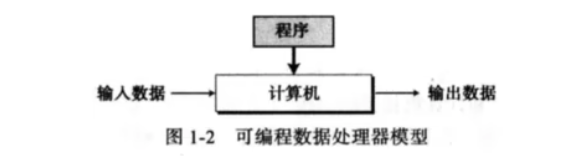

# 视频

## 1

### 图灵机

计算机设想：所有的计算机都都能在一种特殊的机器上执行。

* 数据描述
* 不是一台真实的机器

#### 数据处理器

计算机可以被看做一种接收数据输入、处理数据并产生数据输出的黑盒。

#### 可编程数据处理器

图灵模型：可编程计算机



程序：告诉计算机对数据处理的指令集合。

#### 通用图灵机

该机器只要提供合适的程序就能做任何运算。

### 冯-诺依曼模型

* 基于通用图灵机建造的计算机都是在存储器(内存/寄存器)上存储数据
* 鉴于程序和数据在逻辑上是相同的，因此程序也能存储在计算机的存储器中

#### 四个子系统

* 存储器：用来存储数据和程序的区域
* 算术逻辑单元（ALU）：用来计算和逻辑运算的地方
* 控制单元：对存储器、算术逻辑单元、输入/输出等子系统进行控制操作
* 输入/输出单元：输入子系统负责从计算机外部接收输入数据，输出子系统负责从计算机处理结果输出到计算机外部

#### 存储程序概念

* 冯-诺依曼模型要求程序也必须存储在存储器（内存）中
* 现代计算机的存储单元用来存储程序和数据，这意味着程序和数据应该有相同的格式，实际上它们都是以位模式（0和1序列）存储在内存中

#### 指令执行顺序

* 冯-诺依曼模型中的一段程序是由一组数量有限的指令组成
* 控制单元从内存中提取一条指令，解释指令，接着执行指令，也就说指令是一条接着一条顺序执行的

### 计算机组成部分

* 计算机硬件
* 计算机数据
* 计算机软件

#### 数据

冯-诺依曼模型将计算机定义为一台数据处理机，它接收输入数据，处理数据，最后输出数据。

## 数字系统

### 位置化数字系统

数字符号所占据的位置决定了其表示的值。

### 十进制转其他进制

**十进制转16进制**

`178.6`转16进制

* 整数: 178 除以 16 求余
* 小数: 0.6 乘以 16 求商

```
## 整数部分
178/16 商为 11 余数为 2 :  2
11/16 商为0 余数为 11: B

所以整数部分为 B2
```

```
## 小数部分
0.6 x 16 商为9 余数为 0.6: 9
0.6 x 16 商为9 余数为 0.6: 9

保留小数点后2位结果为 0.99
```

最终为`B2.99`

### 二进制转十六进制

二进制的四位 等于 十六进制的 一位

## 数据存储

### 计算机内部的数据格式

* 位 (bit, binary digit) 存储在计算机中的最小单位: 0或1, 代表设备的某一种状态
*  位模式(位流): 表述数据的不同类型，多个位组成一个位模式，由16个位组成的位模式
*  字节：长度为8的位模式，称为1字节
*  字：更长位模式，可以表示1个字=2字节，或 1个字=4字节

### 无符号整数

计算机定义了一个常量，称为最大无符号整数，它的值是(2^n-1)。n就是计算机中分配用于表示无符号的二进制位数。

### 补码

* 从右边复制位，直到有1被复制，直接反转其余位
* 先取整数的反码，再加1（取反加1）

### 浮点表示法
 
 允许小数点浮动：可以在小数点的左右有不同数量的数码。极大地增加了可存储的实数范围。三部分组成：
 
 * 符号：正负
 * 位移量：显示小数点应该左右移动构成实际数字的位移量
 * 定点数：小数点位置固定的定点表示法

 科学计数法（用于十进制）和浮点表示法（用于二进制）都在小数点左边使用了唯一的非零数码，这称为**规范化**。
 
### 余码
 
[32位ieee 754的阶码偏移量为何用127?而不是128](https://www.zhihu.com/question/24784136)
