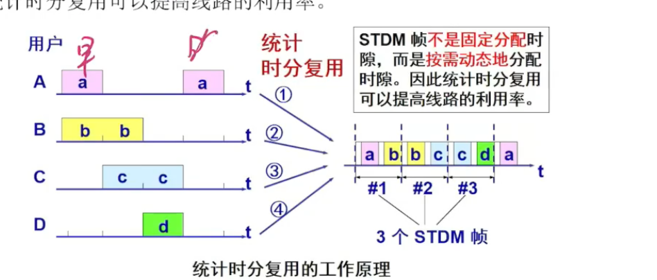

## 备注

## 计算机网络

两台以上具有独立操作系统的计算机通过某些介质连接成的相互共享软硬件资源的结合体。

* 连通性
* 共享性

**网络边缘**

* 主机：客户机和服务器

**接入网络，物理介质**

* 有线通信链路
* 无线通信链路

**网络核心**

* 互联的路由器
* 网络组成的网络

### 接入网络的方式

* 局域网，通过网线和WiFi上网
* 广域无线接入网络，手机信号

### 路由器之间如何传输数据

**1. 电路交换**

一根线连起来, 每个主机都要连根线，早期电话。

**2. 报文转发**

把完整的报文发送到下一个路由器，依次转发

**3. 分组交换(目前使用)**

提高线路利用率，拆分包。

### 分组交换带来的问题

1. 分组在各节点存储转发时需要排队，就会造成一定的延时
2. 分组必须携带的首部（如目的地址等）也造成了一定的开销

### 三种交换的比较

1. 需要连续传送大量的数据，且其传送时间远大于建立的时间，则电路交换的传输速率较快
2. 报文交换和分组交换不需要预先分配传输带宽，在传送突发数据时可提高整个网络的信道利用率
3. 由于一个分组的长度往往远小于整个报文的长度，因此分组交换比报文交换的时延小，同时也具有更好的灵活性

### 计算机网络的性能指标

* 速率: `bit/s`，网速
* 带宽: `bit/s` ，最大网速
* 吞吐率: 单位时间内通过某个网络（或信道，接口）的数据量
* 时延：指数据从网络的一端传送到另一端所需的时间
* 时延带宽积：时延带宽积 = 传播时延 X 带宽
* 往返时间RTT: 从发送方传送数据开始，到发送方收到来自接收方的确认，总共经历的时间
* 利用率：信道利用率和网络利用率
* 发送时延：数据帧长度(bit)/发送速率(bit/s)
* 传播时延: 信道长度(米)/信号在信道上的传播速率(米/秒)

## 物理层

物理层考虑的是怎样才能在连接各种计算机的传输媒体上传输数据，而不是指具体的传输媒体。

物理层的主要特点：机械特性、电气特性、功能特性、过程特性。

**数据通信系统的模型**

* 源系统
* 传输系统（传输网络）
* 目的系统

**常用术语**

* 数据：运送消息的实体
* 信号：数据的电气或电磁表现
* 模拟信号：代表消息的参数的取值是连续的
* 数字信号：代表消息的参数的取值是离散的
* 码元(code): 在使用时间域(或简称为时域)的波形表示数字信号时，代表不同离散数值的基本波形

### 信道

* **信道**：通信的道路，一般用来表示向一个方向传送消息的媒体。如网线
* 单向通信(单工通信): 只能有一个方向的通信而没有反方向的交互
* 双向交替通信(半双工通信): 通信的双方都可以发送信息，但不能双方同时发送（或接收）
* 双向同时通信(全双工通信)：通信的双方可以同时发送或接收信息 
* 基带信号：来自信源的信号

**调制**

* 基带调制：仅对基带信号的波形进行变换，使它能够与信道特性相适应。变换后的信号仍然是基带信号。这种过程称为编码(coding)
* 带通调制：使用载波(carrier)进行调制，把基带信号的频率范围搬移到较高的频段，并转换为模拟信号，这样就能够更好地在模拟信道中传输（即仅在一段频率范围内能够通过信道）。
* 带通信号：经过载波调制后的信号。

**常用编码方式**

* 不归零制: 正电平代表1，负电平代表0
* 归零制：正脉冲代表1，负脉冲代表0
* 曼彻斯特编码：位周期中心的向上跳变代表0，位周期中心的向下跳变代表1。也可反过来定义
* 差分曼彻斯特编码：在每一位的中心处始终都有跳变。位开始边界有跳变代表0，而位开始边界没有跳变代表1

从信号波形可以看出，曼彻斯特编码和差分曼彻斯特编码产生的信号频率比不归零制高。

从自同步能力来看，不归零制不能从信号波形本身中提取信号时钟频率（这叫做美欧自同步能力），而曼彻斯特编码和差分曼彻斯特编码具有自同步能力。

**带通调制方法**

基带信号往往包含有较多的低频成分，甚至有直流成分，而许多信道并不能传输这种低频分量或直流分量。为了解决这一问题，就必须对基带信号进行调制

* 调幅（AM）：载波的振幅随基带数字信号而变化
* 跳频（FM）：载波的频率随基带数字信号而变化
* 调相（PM）：载波的初始相位随基带数字信号而变化

**信道的极限容量**

限制码元在信道上传输速率的因素有以下两个：

* 信道能够通过的频率范围
* 信噪比：就是信号的评价功能和噪声的平均功率之比

香农公示：信道的带宽或信道中的信噪比越大，则信息的传输速率就越高。

### 传输媒体

* 导引型传输媒体，电磁波导引沿着固体媒体（铜线或光纤）传播
* 非导引型传输媒体，无线传输

### 信道复用技术

允许用户使用一个共享信道进行通信，降低成本。

**频分复用FMD**

频分复用FMD：将整个带宽分为多份，不同的频带。

**时分复用TDM**

将时间划分为一段段等长的时分复用帧（TDM帧）。每一个时分复用的用户在每一个TDM帧中占用固定序号的时隙。

每一个用户所占用的时隙是周期性地出现（其周期就是TDM帧的长度）。

TDM信号也称为等时（isochronous）信号。

时分复用的所有用户是在不同的时间占用同样的频带宽度。

**统计时分复用STDM**

STDM帧不是固定分配时隙，而是按需动态地分配时隙。

**波分复用WDM**

光的频分复用。是用一根光纤来同时传输多个光载波信号。

**码分复用CDM**

常用的名词是码分多址CDMA（Code Division Multiple Access）。各用户使用经过特殊挑选的不同码型，因此彼此不会造成干扰。

每个站分配的码片序列不仅必须各不相同，并且还必须互相正交。

在实用的系统中使用伪随机码序列。

## 链路层

数据链路层使用的信道：

1. 点对点信道
2. 广播信道

**链路(link)** 是一条无源的点到点物理线路段，中间没有任何其他的交换节点。

**数据链路(data link)** 除了物理线路外，还必须有通信协议来控制这些数据传输。若把这些协议的硬件和软件加到链路上，就构成了数据链路。

**三个基本问题** 

1. 封装成帧
	* 帧定界符
		* SOH 放在一帧的最前面
		* EOT 放在一帧的最后面 
2. 透明传输
	* 如果数据中的二进制位恰好和 SOH 和 SOT 一样，数据链路层会错误地找到帧的边界。所以需要在前面加一个转义字符"ESC"(十六进制编码是 1B)
3. 差错控制

### 点对点协议 PPP

**PPP协议的三个组成部分**

1. 一个将IP数据报封装到串行链路的方法
2. 链路控制协议 LCP (Linke Control Protocol), 对下层（物理层）协议
3. 网络控制协议 NCP (Network Control Protocol)，对上层（网络层）协议
4. 鉴别数据