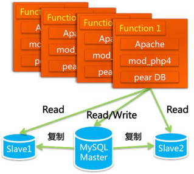
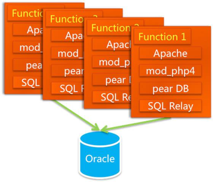
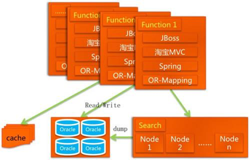

# 09 | 架构设计原则案例

## 笔记

* 需求驱动创新

### 淘宝

#### 1.0

php

#### 2.0

mysql -> oracle

#### 3.0

php -> java

#### 4.0

EJB -> spring

### 总结

首先采取了简单的方式(简单原则), 满足了当时的业务需要(合适原则), 随着业务的发展逐步演化而来的(演化原则).

## 扩展